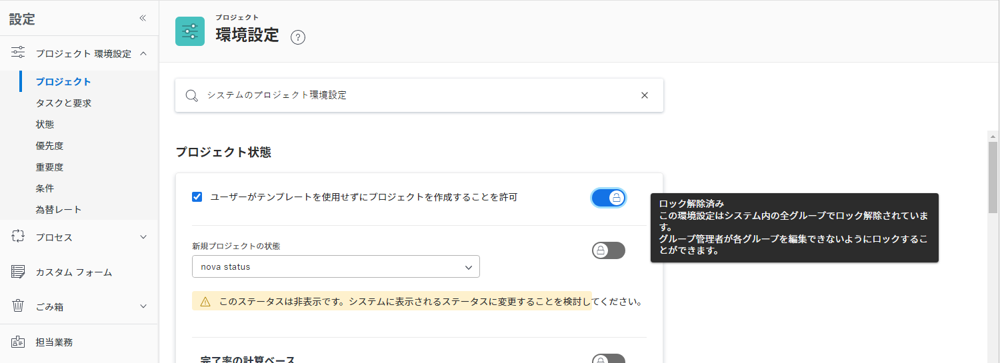
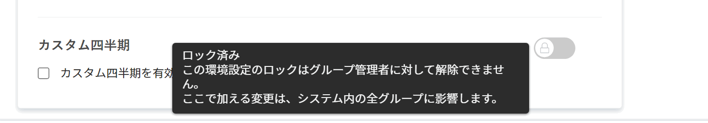

# グローバルなデフォルトのプロジェクト設定の指定

<!--
21.4 updates have been made
-->

このビデオでは、次の方法を学習します：

* カスタムステータスの変更
* グローバルプロジェクト環境設定の指定
* スケジュールの作成と使用

>[!VIDEO](https://video.tv.adobe.com/v/3423350/?quality=12&learn=on&enablevpops=1&captions=jpn)

## グローバルおよびグループのプロジェクト、タスク、イシューの設定

[!DNL Workfront] で[!UICONTROL プロジェクト]設定を開くと、ウィンドウ上部の検索バーに「[!UICONTROL システムプロジェクト環境設定]」と表示されていることがわかります。これにより、これらの設定が [!DNL Workfront] システム内の全員に影響することがわかります。これはグローバル設定です。

![[!UICONTROL [!UICONTROL 設定]](assets/admin-fund-system-project-preferences-1.png)のプロジェクト環境設定]ページ

[!UICONTROL タスクとイシュー]設定を開くと、同様のものが表示されます。

![[!UICONTROL [!UICONTROL 設定]](assets/admin-fund-task-issue-preferences-2.png)のタスクとイシューの環境設定]

ただし、[!DNL Workfront] のすべてのグループが同じプロジェクト、タスク、イシューの環境設定を必要とするわけではありません。例えば、マーケティンググループは新しいプロジェクトのステータスを「計画中」することを望んでいますが、プロジェクトマネージャーグループはステータスを「リクエスト」とすることを望んでいるとします。

[!DNL Workfront] を使用すると、グループ管理者はグループの特定のプロジェクト、タスク、イシューの環境設定を調整できます。調整する環境設定は、[!DNL Workfront] システム管理者がロック／ロック解除の切替スイッチを使用して決定します。

最初に、[!UICONTROL 設定]エリアに移動します。

1. **[!UICONTROL メインメニュー]**&#x200B;で「**[!UICONTROL 設定]**」を選択します。
1. 左側のメニューで「**[!UICONTROL プロジェクト環境設定]**」を展開します。
1. 変更する設定に応じて、「**[!UICONTROL プロジェクト]**」または「**[!UICONTROL タスクとイシュー]**」を選択します。

グループ管理者がグループの設定を調整できないように環境設定をロックします。

環境設定のロックを解除し、グループ管理者がカスタマイズできるようにします。

一部の設定は、ロックを解除できず、グローバルシステム設定のままになります。

### グループとサブグループの環境設定の指定

システム管理者がロック解除した設定について、グループ管理者は、管理するグループとそれらのグループの下にネストされたサブグループを調整できます。さらに、グループ管理者は、サブグループ管理者が変更できる設定を制御できます。

1. **[!UICONTROL メインメニュー]**&#x200B;で「**[!UICONTROL 設定]**」を選択します。
1. 左側のメニューで **[!DNL Groups]** をクリックします。
1. グループまたはサブグループの名前をクリックして開きます。
1. 左側のメニューで「**[!UICONTROL プロジェクト環境設定]**」または「**[!UICONTROL タスクとイシューの環境設定]**」を選択します。
1. ロック解除された環境設定ごとに必要な変更を行います。
1. 「**[!UICONTROL 保存]**」を選択します。

![[!UICONTROL [!UICONTROL グループ]ページの「プロジェクトステータス]」セクション](assets/admin-fund-group-preferences.png)

組織がグループ管理者を使用していない場合、システム管理者は様々なグループの環境設定を管理できます。

<!--
learn more URLs and guides
Create or edit a group status 
Group administrators 
Configure system-wide project preferences 
Configure project preferences for a group 
Configure task and issue preferences for a group 
Create and modify a group’s schedule 
-->
