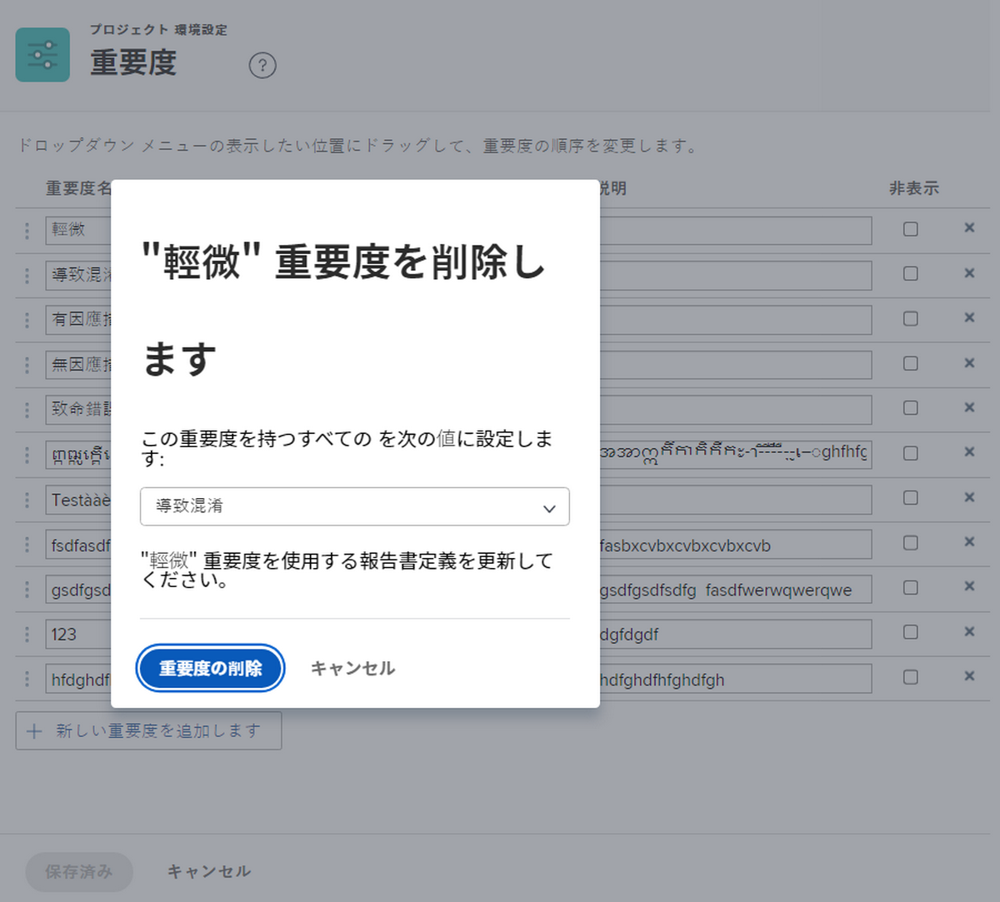

# イシューの重要度の作成と管理

## イシューの重要度の概要

重要度を使用して、イシューの重要度や、実行中の作業に与える影響を示すことができます。

![[!UICONTROL イシューの詳細]ウィンドウの重要度メニュー](assets/admin-fund-severity-issue-details.png)

「[!UICONTROL 重要度]」フィールドは、[!UICONTROL イシューの詳細]でアクセスできます。また、リストの列表示やカスタムレポートに含めることもできます。

[!DNL Workfront] には 5 つのデフォルトの重要度があります。

* [!UICONTROL 一時回避]
* [!UICONTROL 混乱を招く]
* [!UICONTROL 対処策のあるバグ]
* [!UICONTROL 対処策のないバグ]
* [!UICONTROL 致命的なエラー]

システム管理者は、必要に応じて、これらのデフォルトの重要度の名前を変更したり、新しい重要度を作成したりできます。

重要度は、[!DNL Workfront] のイシューに対してのみ使用できます。

## イシューの重要度の作成と管理

システム管理者は、必要に応じて新しい重要度を作成し、イシューのワークフローを完了できます。

![[!UICONTROL 設定]の重要度ページ](assets/admin-fund-severity-section.png)

1. **[!UICONTROL メインメニュー]**&#x200B;の&#x200B;**[!UICONTROL 設定]**&#x200B;をクリック します。
1. 左側のメニュー パネルで「**[!UICONTROL プロジェクト環境設定]**」セクションを展開します。
1. 「**[!UICONTROL 重用度]**」を選択します。
1. 「**[!UICONTROL 新しい重要度を追加]**」をクリックします。
1. 重要度に、目的に合った名前を付けます。
1. この **[!UICONTROL 重要度]**&#x200B;番号は、イシューの重要度に一致します。 最大の数は、最も大きい重要度に対応します。[!UICONTROL 重要度]番号は一意である必要があります。
1. 優先度の色を選択します。 これは、[!DNL Workfront] のチャートレポートやその他の場所で使用されます。
1. 重要度オプションの 1 つを&#x200B;**[!UICONTROL デフォルトの重要度]**&#x200B;として指定します。これは、Workfront のすべての新しいイシューに自動的に適用されます。
1. 重要度の説明（使用方法など）を含めます。
1. フィールドの外側をクリックして保存します。

![[!UICONTROL 重要度]リスト](assets/admin-fund-severity-new.png)

### 重要度の変更

重要度がイシューのワークフローに関連しなくなった場合は、名前の変更、非表示、削除が可能です。

重要度が不要になった場合は、 [!DNL Workfront] では、重要度を非表示にすることをお勧めします（設定エリアで隣にある「[!UICONTROL 非表示] 」ボックスをクリック）。これにより、イシューのドロップダウンメニューから重要度が削除されますが、履歴データの重要度は保持されるので、レポートで引き続き使用できます。

![設定の[!UICONTROL 重要度]ページで強調表示された列を非表示にする](assets/admin-fund-severity-hide.png)

[!DNL Workfront] では、過去のイシューで使用された重要度を削除&#x200B;**しない**&#x200B;ことを推奨しています。重要度を削除すると、別の重要度を置き換えるように求められます。 削除することで履歴データが変更され、レポートに影響を与える可能性があります。

<!---
learn more URLs
Create and customize issue severities
Update issue severity
--->
