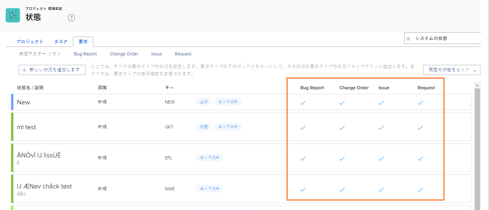

# システム全体のステータスのカスタマイズ

[!DNL Workfront] では、組織のイシュー管理ワークフローに対応するための様々な既定のステータスを提供します。これらのステータスは、組織の用語に合わせて名前を変更できます。また、特定のイシュータイプにステータスを割り当てることができます。

必要に応じて、追加のステータスを作成できます。システム管理者のみが、システム全体のステータスを作成できます。また、システム管理者は、グループ管理者が編集できるステータスを制御します。

![設定の[!UICONTROL ステータス]ページにある「イシュー」タブ](assets/admin-fund-all-issue-statuses.png)

## 既存のステータスの変更

[!DNL Workfront] では、最小数のステータスをお勧めします。これにより、ユーザーにとって適切なステータスの選択が容易になり、保持するステータスのリストが短くなります。

既存のステータスを編集して、名前、割り当て先のイシュータイプ、関連するカラーなどを変更できます。

![「[!UICONTROL 編集]」オプションがハイライト表示されたイシューステータスリスト](assets/admin-fund-edit-issue-status.png)

1. **[!UICONTROL メインメニュー]**&#x200B;で「**[!UICONTROL 設定]**」をクリックします。
1. 左側のメニューパネルで「**[!UICONTROL プロジェクト環境設定]**」セクションを展開します。
1. 「**[!UICONTROL ステータス]**」を選択します。
1. 「**[!UICONTROL イシュー]**」タブを選択し、右上隅に[!UICONTROL システムステータス]が表示されていることを確認します。
1. 「**[!UICONTROL マスターリスト]**」を選択して、すべてのイシュータイプのステータスを表示します。ここで、イシューステータスを作成または変更します。
1. 名前を変更するステータスの右側にポインタを合わせ、「**[!UICONTROL 編集]**」をクリックします。
1. 必要に応じて、ステータスに新しい名前を付けるか、その他の情報を変更します。
1. これらの設定を [!DNL Workfront] インスタンスのすべてのユーザーに適用する必要がある場合は、ステータスをロックします。
1. ステータスのロックを解除して、グループ管理者が自分のグループのステータスのみを編集できるようにします。
1. ステータスを適用するイシュータイプのチェックボックスをオンにします。
1. 「**[!UICONTROL 保存]**」をクリックします。

### ステータスの割り当て

すべてのイシュータイプにすべてのステータスが割り当てられるわけではありません。 [!UICONTROL ステータス]ページには、各ステータスを使用できるイシュータイプを示す列があります。

特定のイシュータイプに割り当てられたステータスのみを表示するには、ウィンドウの上部にあるイシュータイプ名をクリックします。

![列がハイライト表示された[!UICONTROL ステータス]ページの「イシュー」タブ](assets/admin-fund-statuses-issue-type.png)

ここから、「[!UICONTROL ステータス]」ドロップダウンメニューに表示する順序でイシューをドラッグ＆ドロップできます。

ステータスを編集するには、[!UICONTROL メインリスト]に戻る必要があります。
