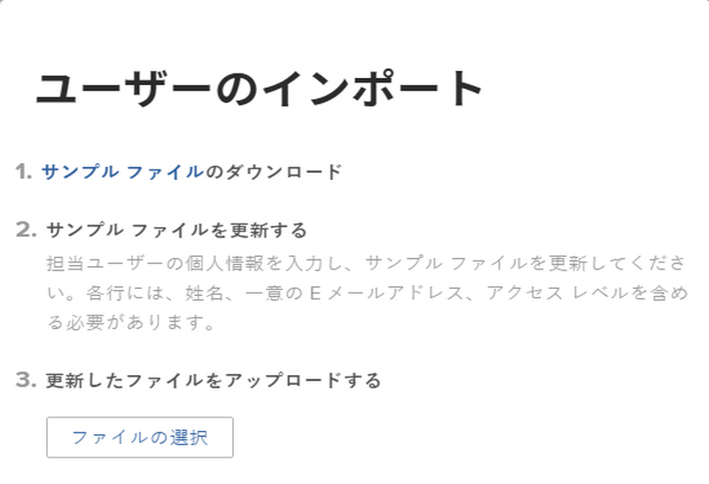
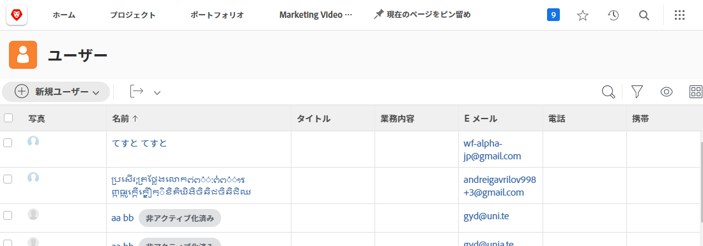

# ユーザーの一括追加

一度に 1 人ずつユーザーを追加するのは、時間がかかり、めんどうな場合があります。 [!DNL Workfront] を使用すると、システム管理者は読み込み機能を使用して複数のユーザーを同時に追加することができます。

![[!UICONTROL ユーザーを読み込み]メニューオプション](assets/admin-fund-adding-users-5.png)

1. [!UICONTROL メインメニュー]から&#x200B;**[!UICONTROL ユーザー]**&#x200B;を選択します。
1. 「**[!UICONTROL 新規ユーザー]**」ボタンとの矢印を選択し、「**[!UICONTROL ユーザーを読み込み]**」を選択します。
1. 読み込むユーザーのスプレッドシートを作成する方法について、順を追って説明するウィンドウが開きます。
1. サンプルファイル（[!DNL Excel] スプレッドシート）をダウンロードします。
1. ファイル内の説明に従って、ユーザー情報（名、姓、メール アドレス、アクセスレベル）でスプレッドシートを更新します。
1. ユーザーリストを保存したら、「**[!UICONTROL ファイルを選択]**」ボタンを選択します。
1. ユーザースプレッドシートファイルに移動して選択します。

読み込まれたユーザーが、[!UICONTROL ユーザー]リストに表示されます。必要な場合は、個々のユーザーまたは複数のユーザーに関する情報を編集します。

## ユーザーを読み込み：キックスタートの使用

[!DNL Workfront] は、システムにデータを読み込むためのキックスタートテンプレートを提供しています。また、ユーザーの読み込みにも使用できます。 注意すべき考慮事項があるため、キックスタートを使用する前に、[!DNL Workfront] では、組織の [!DNL Workfront] コンサルタントと協力することをお勧めします。

<!---
paragraph below needs URL to article
--->

詳しくは、キックスタートを使用した Workfront へのデータの読み込みを参照してください。

![[!UICONTROL 設定]領域内のデータの読み込み（[!UICONTROL キックスタート]）ウィンドウ](assets/admin-fund-adding-users-8.png)

<!--
Learn more URLs
Import users
Import data into Workfront via Kick-Starts
-->
