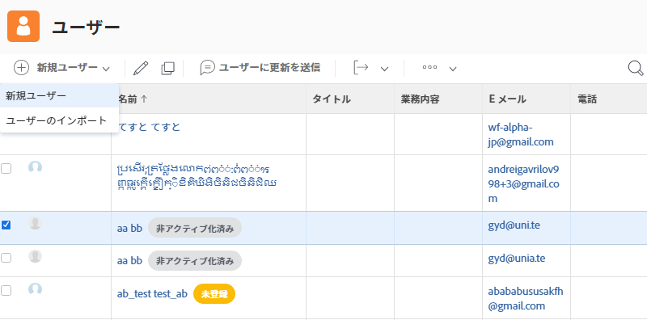

# 個々のユーザープロファイルの作成

新規従業員が採用されたとき、または誰かが [!DNL Workfront]を使用する場合、システム管理者は 1 人のユーザーのみを作成する必要があります。 これは、 [!UICONTROL ユーザー] 領域 [!DNL Workfront].

1. **[!UICONTROL メインメニュー]**&#x200B;から&#x200B;**[!UICONTROL ユーザー]**&#x200B;を選択します。
1. 次をクリック： **[!UICONTROL 新規担当者]** 」ボタンをクリックします。
1. ユーザーの姓と名を [!UICONTROL 新規担当者] ウィンドウ
1. ユーザーの電子メールアドレスを入力します。 これが彼らの [!DNL Workfront] ログインし、次のインスタンス内で一意である必要があります： [!DNL Workfront].
1. 新しいログインに関する電子メールをユーザーに送信する場合は、「招待を送信」ボックスをオンにします。
1. 担当者にアクセスレベルを割り当てます。 これにより、 [!DNL Workfront].
1. ユーザーをホームグループに割り当てて、適切な作業に確実にアクセスできるようにします。
1. 選択 **[!DNL Add this Person]** をクリックして、ユーザーの作成を完了します。

![[!UICONTROL 新規担当者] window](assets/admin-fund-adding-users-1.png)

この [!UICONTROL アドバンスオプションを表示] 「 」リンクをクリックすると、ユーザーの詳細ウィンドウが開きます。 これにより、システム管理者は、チームや職務の役割など、追加の組織やリソース計画情報を設定したり、ユーザーに関する個人情報（電話番号、職位など）を入力したりできます。

![[!UICONTROL 新規担当者] クリック後のウィンドウ [!UICONTROL アドバンスオプションを表示]](assets/admin-fund-adding-users-2.png)

この情報の一部はユーザーが変更でき、一部は変更できません（ユーザーのアクセスレベル権限によって異なります）。

## 既存のユーザーをコピーして新しいユーザーを作成

システム内の既存のユーザーを、新しいログインを作成する際のベースとして使用します。 既存のユーザーの情報の一部はコピーされますが、一部の情報は最初から入力する必要があります。

1. **[!UICONTROL メインメニュー]**&#x200B;から&#x200B;**[!UICONTROL ユーザー]**&#x200B;を選択します。
1. コピーするユーザーを、名前の横にあるボックスをオンにして選択します。
1. 「 **[!UICONTROL 新規担当者]** ボタンと選択 **[!UICONTROL 選択した担当者から新規作成]**.
1. 次の項目に入力： **[!UICONTROL 個人情報]** セクションに新しいユーザーの情報を入力します。
1. 一部のフィールドは元のユーザーからコピーされます。 必要に応じて、情報を変更します。
1. 選択 **[!UICONTROL この担当者を追加]**.

![[!UICONTROL 新規担当者] window](assets/admin-fund-adding-users-4.png)

<!--
Learn more URLs
Add users
-->
