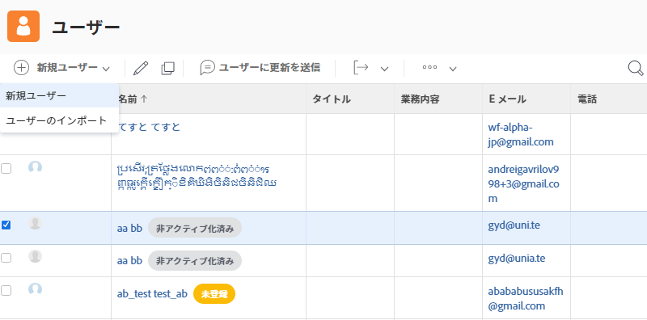

# 個人ユーザープロファイルの作成

新規従業員が採用されたとき、または、[!DNL Workfront] を使用する部門に誰かが異動する場合、システム管理者はユーザーを 1 人だけ作成する必要があります。 この操作は、[!DNL Workfront] の[!UICONTROL ユーザー]エリアからすばやく簡単に実行できます。

1. **[!UICONTROL メインメニュー]**&#x200B;から&#x200B;**[!UICONTROL ユーザー]**&#x200B;を選択します。
1. 「**[!UICONTROL 新規ユーザー]**」ボタンをクリックします。
1. [!UICONTROL 新規ユーザー]ウィンドウにユーザーの姓名を入力します。
1. ユーザーのメールアドレスを入力します。 これはユーザーの [!DNL Workfront] ログインであり、[!DNL Workfront] のインスタンス内で一意である必要があります。
1. 新しいログインに関するメールをユーザーに送信する場合は、「招待を送信」ボックスをオンにします。
1. ユーザーにアクセスレベルを割り当てます。 これにより、[!DNL Workfront] での主要な権限が付与されます。
1. ユーザーをホームグループに割り当てて、適切な作業に確実にアクセスできるようにします。
1. **[!DNL Add this Person]** を選択して、ユーザーの作成を完了します。

![[!UICONTROL 新規ユーザー]ウィンドウ](assets/admin-fund-adding-users-1.png)

「[!UICONTROL 詳細オプションを表示]」リンクをクリックすると、完全なユーザーの詳細ウィンドウが開きます。 ここから、システム管理者は、チームや担当業務など、追加の組織やリソース計画情報を設定したり、ユーザーに関する個人情報（電話番号、役職など）を入力したりできます。

[!UICONTROL 詳細オプションを表示]](assets/admin-fund-adding-users-2.png)をクリックした後の![[!UICONTROL 新規ユーザー]ウィンドウ

ユーザーはこの情報の一部を変更できますが、ある部分は変更できません（ユーザーのアクセスレベル権限に応じて異なります）。

## 既存のユーザーをコピーしてユーザーを新規作成する

システム内の既存のユーザーを、新しいログイン作成のベースとして使用します。 既存のユーザーの情報の一部はコピーされますが、ある部分の情報は最初から入力する必要があります。

1. **[!UICONTROL メインメニュー]**&#x200B;から&#x200B;**[!UICONTROL ユーザー]**&#x200B;を選択します。
1. コピーするユーザーを、名前の横にあるボックスをオンにして選択します。
1. 「**[!UICONTROL 新規ユーザー]**」ボタンの矢印を選択し、「**[!UICONTROL 選択したユーザーからの最新アイテム]**」を選択します。
1. 「**[!UICONTROL 個人情報]**」セクションに新規ユーザーの情報を入力します。
1. 一部のフィールドは元のユーザーからコピーされます。 必要に応じて、情報を変更します。
1. 「**[!UICONTROL このユーザーを追加]**」を選択します。

![[!UICONTROL 新規ユーザー]ウィンドウ](assets/admin-fund-adding-users-4.png)

<!--
Learn more URLs
Add users
-->
