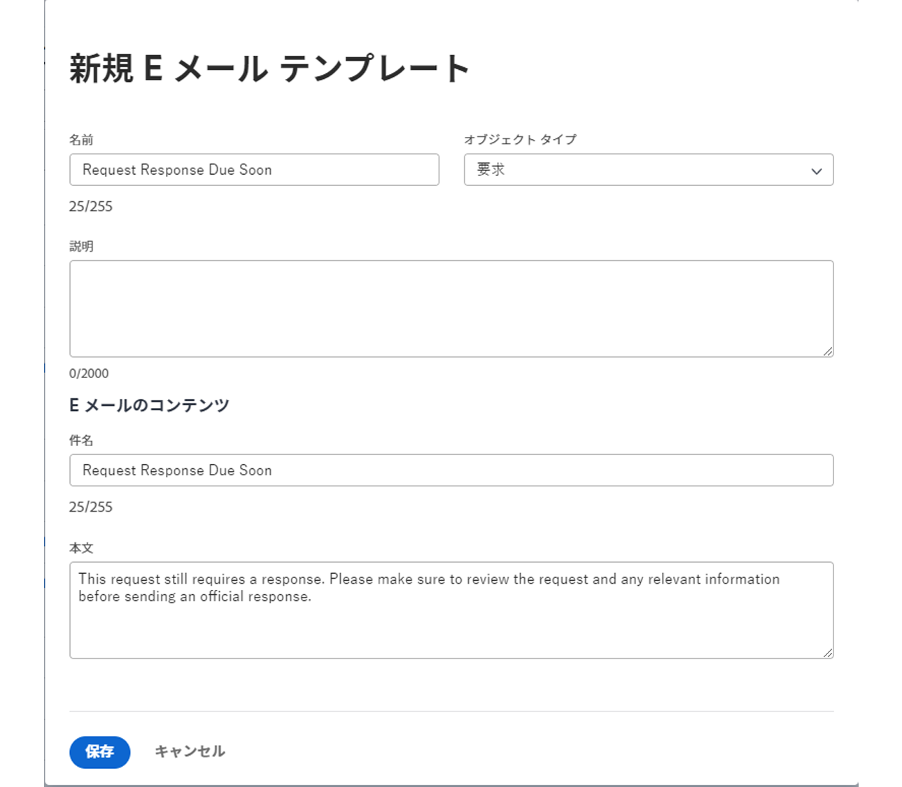

<!---
this has the same content as the system administrator notification setup and mangement section of the email and inapp notificiations learning path
--->

# リマインダー通知の設定

リマインダー通知は、 [!UICONTROL 設定] 領域 その後、プロジェクト、タスク、および発行者が、作業の期限が近いか期限が切れているかをリマインダーとして添付して使用できます。

リマインダーはオブジェクト固有で、通知を送信できるように、対応する作業項目に手動で添付する必要があります。

**リマインダー通知の作成**

1. クリック **[!UICONTROL 設定]** 内 **[!UICONTROL メインメニュー]**.
1. 次をクリック： **[!UICONTROL 電子メール]** 」セクションに入力します。
1. 次をクリック： **[!UICONTROL 通知]** 」セクションに入力します。
1. 次をクリック： **[!UICONTROL 新しいリマインダー]** タブをクリックします。
1. 次をクリック： **[!UICONTROL +新しいリマインダー通知]** 」ボタンをクリックします。
1. ドロップダウンメニューで目的のオブジェクトを選択します。
1. 必要な情報を入力します。
1. クリック **[!UICONTROL 保存]**.

![[!UICONTROL 新しいリマインダー通知] window](assets/admin-fund-reminder-notification-1.png)

リマインダーを設定する際に考慮すべき点がいくつかあります。

* **[!UICONTROL リマインダー通知名] —** これは、プロジェクトマネージャがリマインダーをオブジェクトに付加する際に表示される名前です。 名前の簡潔さは説明的であることを確認します。
* **[!UICONTROL 認定期間] —** 「タイミング」セクションで選択した日付の前後の時間、日、週、月の数。
* **[!UICONTROL タイミング] —** リマインダーを、オブジェクトの計画日、推定日、実際の開始日/完了日の前または後のどちらに送信するかを選択します。 タイムシートのオプションは、開始日、終了日、または最終更新日に関連します。
* **[!UICONTROL 条件] —** 送信するリマインダーを絞り込むための条件を指定します。 オプションは、オブジェクト固有のリマインダーによって異なります。
* **[!UICONTROL 受信者] —** リマインダーの送信先を選択します。 関係者のオプションは、リマインダー用に選択したオブジェクトタイプによって異なります。

リマインダーの設定が確立され、保存されると、オブジェクトの所有者は、内でリマインダー通知を使用できます [!DNL Workfront].

## メールのカスタマイズ

リマインダー通知では、デフォルトの E メール形式とメッセージが使用されます。 E メールをカスタマイズする場合は、テンプレートを作成できます。

<!---
paragraph above needs a hyperlink to an article
--->

<!---
learn more URLs
--->
