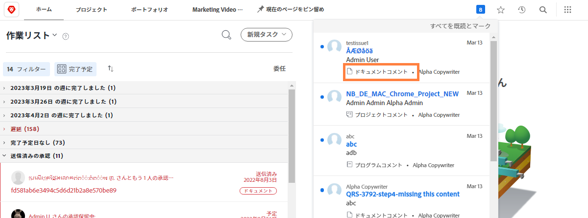
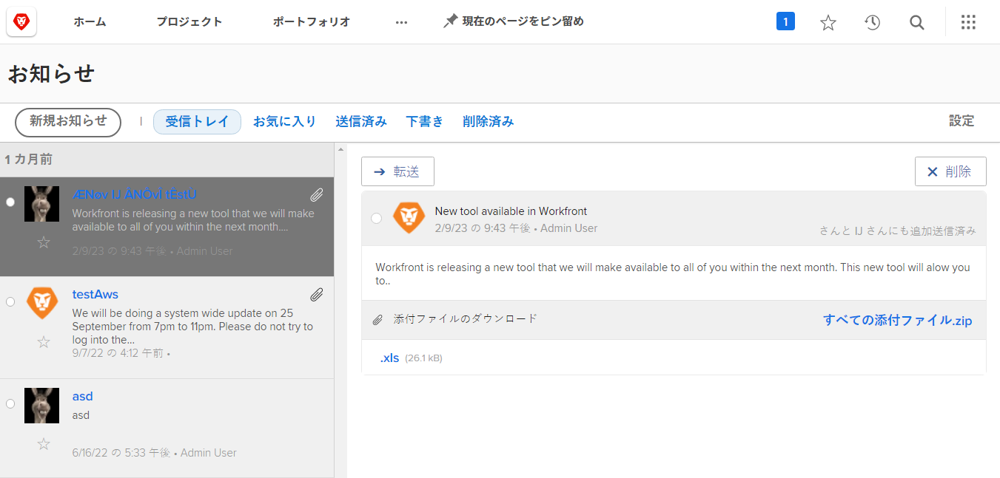

<!---
this has the same content as the system administrator notification setup and mangement section of the email and inapp notificiations learning path
--->

# [!UICONTROL 通知センター]メッセージの送信

[!UICONTROL お知らせセンター]では、システム管理者が一か所でまとめて [!DNL Workfront] からの通信を受信したり、お知らせを組織の [!DNL Workfront] ユーザーに送信したりできます。

[!DNL Workfront] はソフトウェアリリース、今後のウェビナー、システムメンテナンスなどに関するお知らせをシステム管理者に送信します。[!UICONTROL お知らせセンター]では、この重要な情報がすべて 1 か所にまとめられるので、メールの受信トレイ内の他のメッセージに紛れてしまうことはありません。

通知アイコンには、[!DNL Workfront] 経由で送信された未読の通知とお知らせが表示されます。リスト内のお知らせにはラベルが付けられ、クリックして開くことができます。

システム管理者は、[!UICONTROL お知らせセンター]を使用して、[!DNL Workfront] 全体のメッセージをユーザーに送信することもできます。誰にサポートを依頼するか、「今日のヒント」などを提供するようリマインダーを送信できます。

![[!UICONTROL すべてのお知らせ]リンク](assets/admin-fund-announcements-2.png)

**お知らせを送信するには**

1. **通知アイコン**&#x200B;をクリックします。
1. 「**[!UICONTROL すべてのお知らせ]**」をクリックします。
1. 「**[!UICONTROL 新規お知らせ]**」ボタンをクリックします。デフォルトでは、[!UICONTROL 送信先]行に「[!UICONTROL 全員]」と入力され、すべての [!DNL Workfront] ユーザーにメッセージが送信されます。これを削除して、ユーザー、担当業務、チーム、グループまたは会社の名前を入力できます。
1. 件名を入力します。
1. 次に、必要に応じて編集ツールを使用して、お知らせのテキストを入力します。
1. 必要に応じて、「**[!UICONTROL 添付ファイルを追加]**」ボタンをクリックして、共有するファイルを添付します。
1. 「**[!UICONTROL 送信]**」をクリックします。

![[!UICONTROL お知らせ] ページにお知らせを書く](assets/admin-fund-announcements-3.png)

お知らせエリアは、左側のパネルに受信したメッセージが表示され、インボックスのように見えます。メッセージをクリックして読みます。

