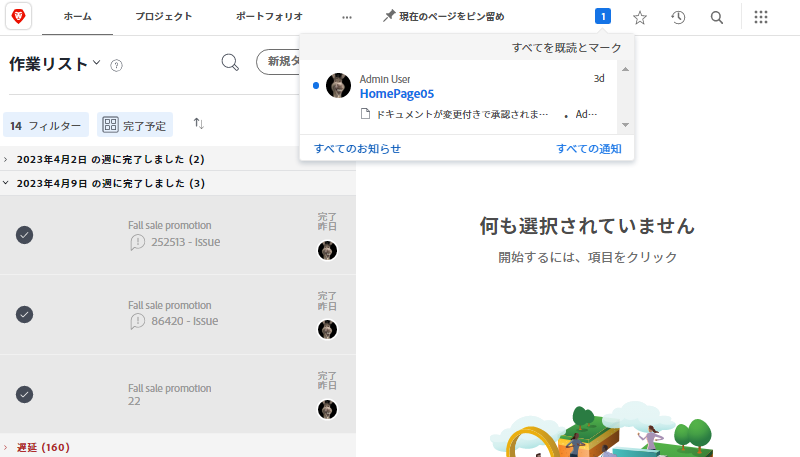
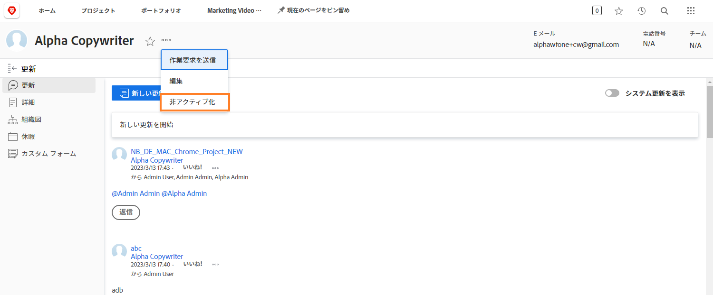

# アプリ内通知およびメールイベント通知の管理

メールは日常業務の一部であり、受信するメールの量が膨大になる日もあります。[!DNL Workfront] を使用すると、自分が関わっている作業に関する適切で有用なメールを、すべての人が確実に受け取れるように、システム管理者は設定することができます。

Workfront からユーザーに送信できる通知には、いくつかの種類があります。これらの通知の一部はシステムレベルで制御され、すべてのユーザーに影響します。一部の通知では、1 日のダイジェストで即座にメールを送信する、またはメールを無効にして Workfront 内でのみ通知するよう設定できます。

## イベント通知

イベントとは、ステータスの変更、投稿されたコメント、または割り当てのようなもので、[!DNL Workfront] でアプリ内通知をトリガーできます。

ただし、環境設定のオプションを選択または選択解除することで、メール通知を受け取るイベントを決定できます。

これらの変更を行うには、[!UICONTROL メインメニュー]から自分の名前をクリックします。

![メインメニュー[!UICONTROL のユーザー名 ]](assets/admin-fund-user-notifications-02.png)

[!UICONTROL 詳細]メニューから「[!UICONTROL 編集]」をクリックします。

[!UICONTROL 担当者を編集]ポップアップボックスで「[!UICONTROL 通知]」をクリックします。

![[!UICONTROL 担当者を編集]ウィンドウ](assets/admin-fund-user-notifications-04.png)

ここから、通知を即座に受信する、毎日受信する、まったく受信しないに指定できます。 ここで行った変更は、ユーザーに固有のもので、Workfront の他のユーザーには影響しません。

**[!UICONTROL 日次]**

デフォルトでは、メールはすぐに送信されるように設定されています。 ただし、メール通知の頻度を「[!UICONTROL 即時]」から「[!UICONTROL 毎日]」に切り替えることで、必要な情報を必要に応じて取得できるようにします。

[!UICONTROL 担当者を編集]ウィンドウの![[!UICONTROL 通知]セクション](assets/admin-fund-user-notifications-05.png)

「毎日」のオプションを選択すると、その日のイベントのダイジェストが 1 通のメールで送信されます。ユーザーは、「[!UICONTROL 通知]」セクションに表示されるグループごとに 1 件のメールを受け取ります。

例えば、「[!UICONTROL 所有するプロジェクトに関する情報]」セクションでは、1 日に 1 件のメールが生成され、「[!UICONTROL 必要なアクション]」セクションでは、1 日に 1 件のメールが生成されます。

![[!UICONTROL 所有するプロジェクトに関する情報の 1 日のダイジェスト][!UICONTROL メール]](assets/admin-fund-user-notifications-06.png)

![[!UICONTROL 必要なアクションの 1 日のダイジェスト][!UICONTROL メール]](assets/admin-fund-user-notifications-07.png) 

「毎日」のオプションを選択する以外に、メールを送信する時間を設定します。 何が最適かに応じて、ダイジェストメールを朝の出勤前または退社直前に送信できます。

![[!UICONTROL 担当者を編集]ウィンドウの 1 日のダイジェストメール送信後のドロップダウンメニュー](assets/admin-fund-user-notifications-08.png)

**通知しない**

最後のオプションは、メール通知を完全に無効にすることです。

![[!UICONTROL 担当者を編集]ウィンドウで選択した通知を無効化](assets/admin-fund-user-notifications-09.png)

これを行う場合は、メールを受信していなくても、[!DNL Workfront] 内で作業の割り当て、コメント、更新が行われていることに注意が必要です。すべての通知をオフにすると、注意が必要な重要な情報を見逃す可能性があります。

[!DNL Workfront] では、ユーザーがメール通知をオフにしている例がいくつかあります。例えば、ほとんどの作業を [!DNL Workfront] モバイルアプリで行っている場合は、メール通知をオフにて、アプリからのみ通知を受け取ることができます。

受け取ることにした[!UICONTROL イベント通知]に関係なく、組織の目標のために行われている作業を成功させるためには通知は重要です。

## 推奨事項

即時メールか 1 日のダイジェストかに関わらず、[!DNL Workfront] でチェックをオンのままにしておくことを推奨する通知がいくつかあります。

ほとんどのユーザー向け：

* [!UICONTROL 担当タスクの先行タスクが完了した]
* [!UICONTROL 自分が更新を受信する対象者として追加された]
* [!UICONTROL 誰かが自分の作業アイテムにコメントを投稿した]
* [!UICONTROL 自分に割り当てられているタスクの完了予定日が変更になった]

プロジェクトマネージャー専用：

* [!UICONTROL 自分が参加するプロジェクトの状況がアクティブになった]
* [!UICONTROL 自分が所有するプロジェクトに遅延が発生した]
* [!UICONTROL 自分が所有するプロジェクトにイシューが追加された]
* [!UICONTROL 自分が所有するプロジェクトのタスクが完了した]

<!---
learn more URLs
Email notifications
guide: manage your notifications
--->
