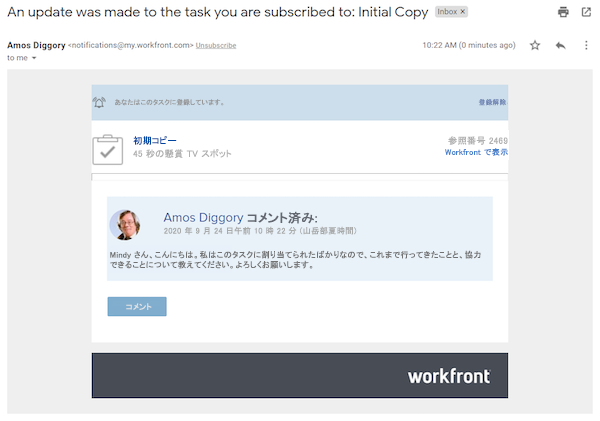
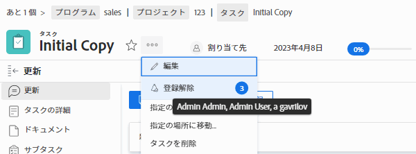

# 作業アイテムの購読

イベント通知を使用すると、割り当てられた作業についての更新情報を受け取れます。ただし、割り当てられていない作業アイテムをフォローしたい場合もあります。これは、自分の作業に影響を与える可能性があるためです。特定のアイテムを購読することが、最適な解決策になります。

例えば、「最初のコピー」タスクの進捗に関心があるとします。自分はこのタスクに割り当てられていませんが、最初のコピーの編集を担当しているので、何が行われているか知りたいと考えています。タスクに登録し、更新時にメール通知を受け取ると、その作業の進捗をリアルタイムに把握することができます。

サブスクリプションメールとアプリ内通知は、アイテムにコメントが付いた場合にのみ送信されることに注意が必要です。 期限の変更や割り当ての変更など、他のアクションではメールや通知は送信されません。

作業アイテムを購読するには、少なくともそのアイテムを共有できる「表示」権限が必要です。

![[!UICONTROL タスクアクセス]画面](assets/admin-fund-user-notifications-11.png)

作業アイテムにアクセスできるようになったら、次の方法で通知を登録します。

1. プロジェクト、タスクまたはイシューのランディングページに移動します。
1. 「**[!UICONTROL アクション]**」メニューをクリックします。
1. 「**[!UICONTROL 購読]**」をクリックします。

![[!UICONTROL タスクメニューの購読]オプション](assets/admin-fund-user-notifications-12.png)

メニューの[!UICONTROL 購読/購読解除]の横の番号にカーソルを合わせると、作業アイテムを購読している他のユーザーを確認できます。

作業アイテムに対する[!UICONTROL 管理]権限または[!UICONTROL 共有]権限がある場合、次の方法で他のユーザーに対してプロジェクト、タスク、イシューの通知を登録できます。

1. 「**[!UICONTROL 購読]**」オプションの横の数字をクリックします。
1. 作業アイテムを購読する人の名前を追加します。
1. 「**[!UICONTROL 保存]**」をクリックします。

![[!UICONTROL 購読]画面](assets/admin-fund-user-notifications-15.png)

あなたが購読操作を行ったユーザーには、購読の通知は送信されません。すべてのサブスクライバーには、その項目に対する表示権限が付与されます。ただし、サブスクライバーが既にそのアイテムに対する[!UICONTROL 投稿]権限または[!UICONTROL 管理]権限を持っている場合、それらの権限は変更されません。

個々のアイテムの「[!UICONTROL 更新]」タブのエントリにも、誰がいつ購読したかが示されます。「[!UICONTROL 更新]」タブには、ユーザーが他のユーザーによって購読を登録したタイミングも記録されます。

![[!UICONTROL 購読を表示するタスクの更新]ページ](assets/admin-fund-user-notifications-16.png)

ユーザーの登録を解除するには、バブルを再度クリックして[!UICONTROL サブスクライバー]ウィンドウ次に、人物の名前の横にある「X」をクリックします。購読が解除されたことはそのユーザーに通知されません。

![[!UICONTROL プロジェクトの登録解除]メニューオプション](assets/admin-fund-user-notifications-14.png)

<!---
learn more URL: Subscribe to items in Workfront
--->
