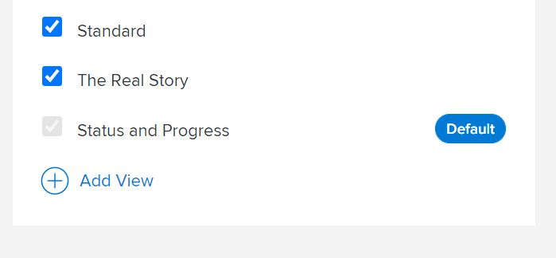

# レイアウトテンプレートを使用したレポートリストのカスタマイズ

このビデオでは、以下の方法を説明します。

* レイアウトテンプレートのレポートリスト設定へのナビゲーション
* フィルター、ビュー、グループの削除
* フィルター、ビュー、グループ化の追加

>[!VIDEO](https://video.tv.adobe.com/v/335079/?quality=12&learn=on&enablevpops=1)

## リストのデフォルトの設定

ユーザーにデフォルトのフィルター、ビュー、グループ化を設定すると、重要な情報に素早くアクセスできるようになり、作業をより迅速に進めることができます。

システム管理者またはグループ管理者は、レイアウトテンプレートを使用してデフォルトのフィルター、ビュー、グループ化を設定することで、プロジェクト、タスク、イシューなどの一覧を参照するときに最初に表示するユーザーを決定できます。

![レイアウトテンプレート[!UICONTROL リスト]ウィンドウ](assets/admin-fund-layout-template-default-lists-1-1.JPG)

>[!NOTE]
>
>デフォルトのフィルター、ビュー、グループ化を設定できますが、システムは固定であり、ユーザーが最後に使用したフィルター、ビュー、グループ化が表示されます。

リストのデフォルトを設定する場合は、次のいずれかを実行できます。

* 既にリストされているオプションの上にポインタを合わせ、「[!UICONTROL デフォルトとして設定]」をクリックします。

![[!UICONTROL デフォルトとして設定]が表示されたレイアウトテンプレート[!UICONTROL リスト]ウィンドウ](assets/admin-fund-layout-template-default-lists-1-2.JPG)

* または、カスタムフィルター、ビュー、グループ化を追加して、[!UICONTROL デフォルトとして設定]の横にあるチェックボックスをオンにします。

![[!UICONTROL 既存のビューを追加]ウィンドウ](assets/admin-fund-layout-template-default-lists-1-3.JPG)

完了すると、[!UICONTROL デフォルト]タグが表示されます。

