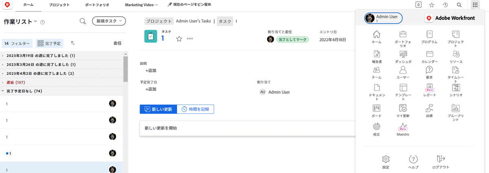
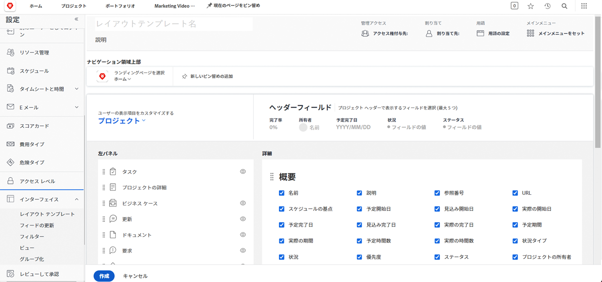
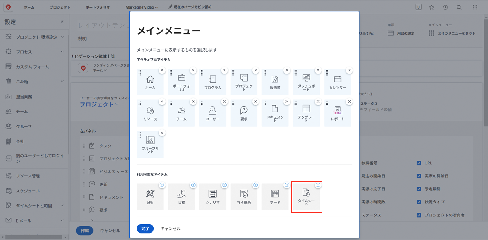
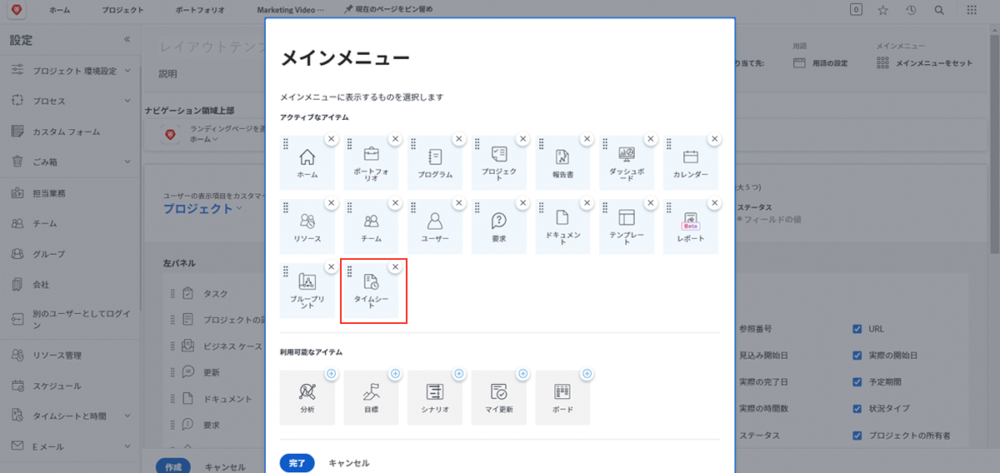

# レイアウトテンプレートとは

Workfront には、作業の完了に役立つ優れたツールが多数用意されています。 ですが、たとえ良いものであっても、多すぎると圧倒されてしまうことがあります。

レイアウトテンプレートを使用すると、システム管理者とグループ管理者はユーザーのエクスペリエンスをカスタマイズして、ユーザーが自分にとって重要なことに集中できるようになります。

例えば、組織の大半は時間をログ記録しません。 ただし、コンサルタントチームはクライアントに請求するので、正確な請求を行うために時間をログ記録する必要があります。 レイアウトテンプレートを使用すると、タイムシートを必要としないユーザーには非表示にし、必要なユーザーには表示することができます。

## 作成の前に

Workfront では、レイアウトテンプレートを作成する前にユーザーと話し合うことをお勧めします。 グループ管理者など、レイアウトテンプレートを使用するユーザーを関与させることで、適切な情報とツールを適切な人物の前に配置することがよりスムーズになります。

また、テンプレートを作成した後に変更を行うことを恐れないでください。 必要な内容、確認する内容、アクセスする内容に関するフィードバックを継続して取得します。 レイアウトテンプレートは、ユーザーにとってクリーンで簡単なエクスペリエンスを提供することを目的としています。
