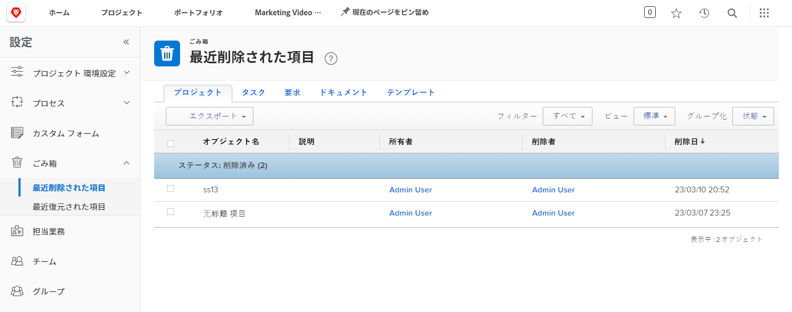
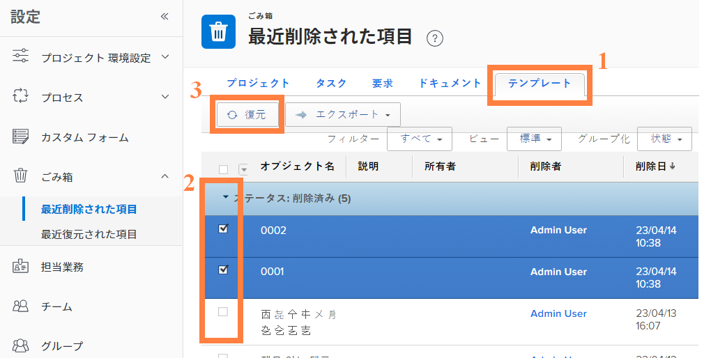

# ごみ箱からオブジェクトを復元する

プロジェクトの作業は、多くの変更を加えます。 何かを削除する場合は、タスクが必要であったこと、または解決しようとしている問題にドキュメントが不可欠であったことを 30 分後に認識する必要があります。

ごみ箱を使用して、オブジェクトが削除されると、Workfrontはオブジェクトをに最大 30 日間保存します。 システム管理者は、オブジェクトをWorkfrontの元の位置に、すべての情報（更新、ログに記録された時間、ドキュメントなど）と共に復元できます。

## オブジェクトの復元

1. を選択します。 **設定** 領域 **メインメニュー**.
1. クリック **ごみ箱** をクリックします。
1. 選択 **最近削除された項目**.

復元可能な各オブジェクトには、復元する特定の項目を見つけやすくするためのタブがあります。

1. 目的のオブジェクトのタブをクリックします。
1. 復元するオブジェクトの横のボックスをオンにします。
1. 次をクリック： **復元** 」ボタンをクリックします。

復元中のオブジェクトが、 [!UICONTROL 処理中] 」セクションに入力します。 画面が更新されると、オブジェクトは復元されているので、画面に表示されなくなります。 項目は、以前の場所に表示されます [!DNL Workfront]を使用して、 [!UICONTROL 最近復元] 画面

![[ セットアップ ] 領域のごみ箱の最近復元されたセクション](assets/admin-fund-recycle-bin-3.png)

グループ管理者は、管理するグループに関連付けられたプロジェクトを、そのプロジェクトに関連付けられたタスク、問題、ドキュメントと共に復元できます。

<!---
learn more URL
Restoring deleted items
Viewing items that have been recently restored
--->
