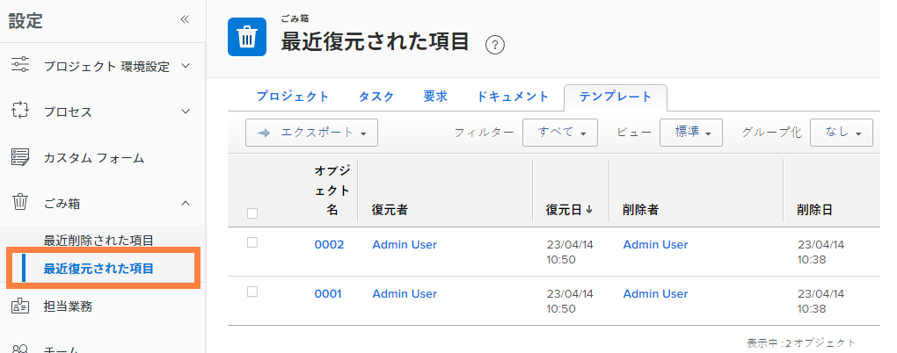

# ごみ箱からのオブジェクトの復元

プロジェクトの作業には、多くの変更が伴います。何かを削除しても、30 分後にそのタスクが必要であったことや、解決しようとしているイシューにとってドキュメントが不可欠であったことに気付く場合があります。

ごみ箱を使用して、オブジェクトが削除されると、Workfront では最大 30 日間保存します。システム管理者は、すべての情報（アップデート、ログ記録された時間、ドキュメントなど）と共に、オブジェクトを Workfront の元の位置に復元できます。

## オブジェクトの復元

1. **メインメニュー**&#x200B;の&#x200B;**設定**&#x200B;エリアを選択します。
1. 左側のパネルで「**ごみ箱**」をクリックします。
1. 「**最近削除された項目**」を選択します。

復元可能な各オブジェクトには、復元する特定の項目を検索しやすくするためのタブがあります。

1. 目的のオブジェクトのタブをクリックします。
1. 復元するオブジェクトの横にあるチェックボックスをオンにします。
1. 「**復元**」ボタンをクリックします。

復元中のオブジェクトが「[!UICONTROL 処理中]」セクションに一時的にポップアップされます。画面が更新されると、オブジェクトは復元されているので、画面に表示されなくなります。項目は、[!DNL Workfront] の以前の場所に表示され、[!UICONTROL 最近復元された項目]画面で確認できます。

グループ管理者は、管理するグループに関連付けられているプロジェクトを、プロジェクトに関連付けられているタスク、イシューまたはドキュメントと共に復元できます。

<!---
learn more URL
Restoring deleted items
Viewing items that have been recently restored
--->
