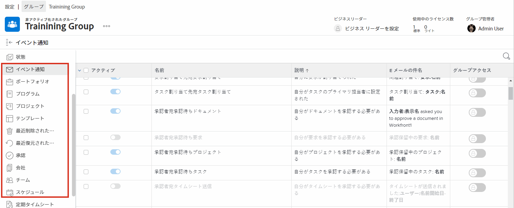

# グループ管理者の必要性について

<!---
21.4 updates have been made
--->

大企業や多数の [!DNL Workfront] ユーザーを抱える企業のシステム管理者の場合、[!DNL Workfront] の設定を各グループやサブグループに対して維持するのは時間がかかるものです。

[!DNL Workfront] でグループ管理者を任命して、自分のグループを管理できる一部の機能を実行できるようにすると、システムの更新と保守に関して負荷のバランスを取ることができます。

グループ管理者は、グループの日常の課題に対してより適切に対応できるようになり、グループのニーズを管理できます。 これにより、システム管理者は、組織全体に利益をもたらす [!DNL Workfront] 設定に集中できます。

グループ管理者が [!DNL Workfront] でできることには、次のようなものがあります。

* サブグループを作成し、サブグループにユーザーを追加する。
* グループのレイアウトテンプレートを作成する。
* グループの承認プロセスを作成する。
* グループレベルのワークフローステータスを作成する。
* グループページから、グループに関連付けられたプロジェクト、プログラム、ポートフォリオにアクセスする。
* グループレベルのプロジェクト、タスク、イシューの環境設定を管理する。
* グループレベルのタイムシートの環境設定を管理する。
* グループレベルのイベント通知を管理する。
* 他のグループメンバーとしてログインする。
* ビジネスリーダーをグループに割り当てる。
* 会社を管理する。

システム管理者またはグループ管理者は、管理するグループとサブグループ内にサブグループを作成できます。 これらのサブグループは、独自のグループ管理者に割り当てることができます。

>[!NOTE]
>
>1 つのグループの下にあるサブグループのレベルは 14 までです。

**グループ管理者の詳細**

<!---
bullet points below need hyperlinks
--->

システム管理者、グループ管理者、サブグループ管理者が [!DNL Workfront] でできることのリストについては、記事「様々なタイプの管理者に許可されるアクション」を参照してください。

## グループの管理

[!DNL Workfront] のグループページから、グループメンバー、サブグループ、グループステータス、グループプロジェクト設定などを簡単かつ効率的に管理できます。

1. **[!UICONTROL メインメニュー]**&#x200B;から「**[!UICONTROL 設定]**」を選択します。
1. 左パネルの&#x200B;**[!UICONTROL グループ]**&#x200B;に移動します。
1. グループの名前を選択して開きます。
1. 左パネルで更新したいセクションをクリックして開きます。

<!---
learn more URLs
Create and manage groups 
Create and manage subgroups 
Business leader overview 
--->
