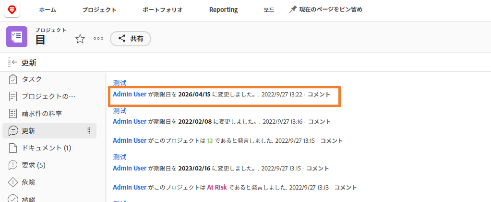

# 別のユーザーとしてのログイン

Workfront管理者がユーザーエクスペリエンスを設定する際に役立つ機能の 1 つは、「ログイン名」機能です。 この関数 ( [!UICONTROL 設定] 「 」領域にある場合は、自分のアカウントからログアウトしなくても、別のユーザーとしてログインできます。

![[!UICONTROL ログイン名] ページ内 [!UICONTROL 設定] 領域](assets/admin-fund-log-in-as-1.png)

## としてログインするメリット

この機能は、様々な理由で役立ちます。

* 管理者は、ユーザーに割り当てられたレイアウトテンプレートをプレビューして、メニュー項目やダッシュボードが正しく表示されることを確認できます。
* ワークフローのテスト中に、ユーザーの権限が正しく設定されていることを確認すると便利です。
* 管理者は、この機能を使用して、タスクを完了とマークしたり、実行できないユーザーに対して承認を行ったりすることもできます。

## ログイン名にアクセス

1. 選択 **[!UICONTROL 設定]** から **[!DNL Main Menu]**.
1. クリック **[!UICONTROL ログイン名]** をクリックします。
1. ログインに必要なユーザー名を入力します。

![[!UICONTROL アクセスログ] タブ [!UICONTROL ログイン名] ページ](assets/admin-fund-log-in-as-3.png)

ログインすると、画面の上部に、自分が誰としてログインしているかが通知されます。

![[!UICONTROL 現在、次のユーザーとしてログインしています：] 次のメッセージ： [!DNL Workfront] window](assets/admin-fund-log-in-as-2.png)

## アクティビティを追跡する更新タブ

管理者が別のユーザーとしてログインし、そのユーザーに代わって変更/更新をおこなうと、その変更がその特定の項目の [ 更新 ] 領域に表示されます。 以下の例は、Joan Harris が Roy Campbell の代理で期限を変更したことを示しています。

