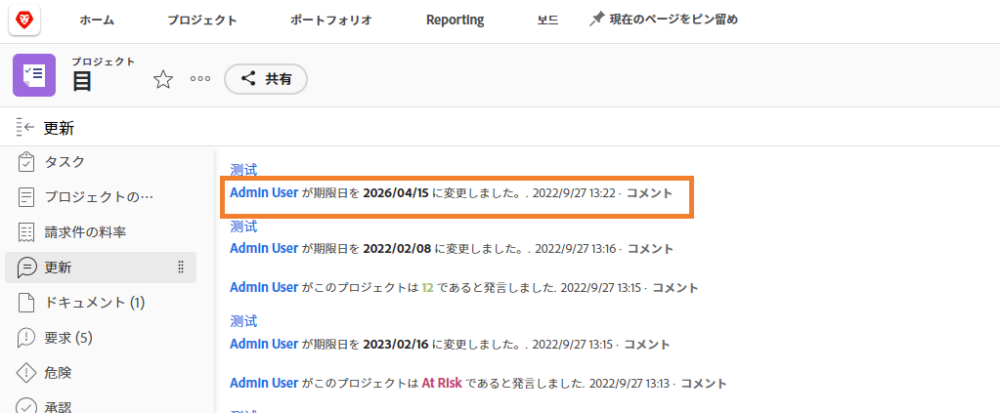

# 別のユーザーとしてログイン

Workfront 管理者がユーザーエクスペリエンスを設定する際に役立つ機能の 1 つに、別のユーザーとしてログインする機能があります。 [!UICONTROL 設定]エリアのこの機能は、自分のアカウントからログアウトしなくても、別のユーザーとしてログインできます。

[!UICONTROL 設定]エリア](assets/admin-fund-log-in-as-1.png)の![[!UICONTROL 別のユーザーとしてログイン]ページ

## 別のユーザーとしてログインするメリット

この機能は、さまざまな理由で役立ちます。

* 管理者は、ユーザーに割り当てられたレイアウトテンプレートをプレビューして、メニュー項目やダッシュボードが正しく表示されることを確認できます。
* ワークフローのテスト中に、ユーザーの権限が正しく設定されていることを確認すると便利です。
* 管理者は、この機能を使用して、タスクを完了とマークしたり、実行できないユーザーに対して承認を行ったりすることもできます。

## 別のユーザーとしてログインへのアクセス

1. **[!DNL Main Menu]** から「**[!UICONTROL 設定]**」を選択します。
1. 左側のパネルで「**[!UICONTROL 別のユーザーとしてログイン]**」をクリックします。
1. 別のユーザーとしてログインするのに必要なユーザー名を入力します。

[!UICONTROL 別のユーザーとしてログイン]ページ](assets/admin-fund-log-in-as-3.png)の「![[!UICONTROL アクセスログ]」タブ

ログインすると、画面の上部に、自分のログイン名が何かを示す通知が表示されます。

[!DNL Workfront] ウィンドウ](assets/admin-fund-log-in-as-2.png)の上部の![[!UICONTROL 現在のログイン名]メッセージ

## 「アップデート」タブでアクティビティを追跡

管理者が別のユーザーとしてログインし、そのユーザーに代わって変更や更新を行うと、その変更がその特定の項目の更新エリアに表示されます。 以下の例は、Joan Harris が Roy Campbell の代わりに期限を変更したことを示しています。

