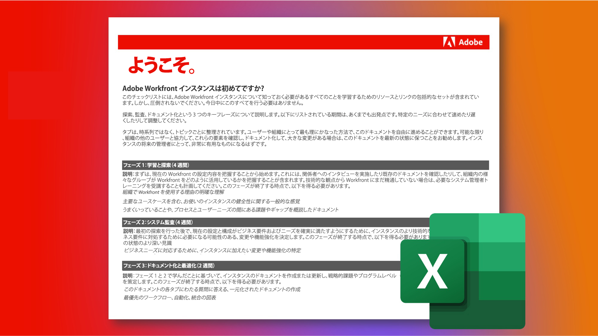

# 既存のAdobe Workfrontインスタンスを担当する

Workfrontの素晴らしい点はカスタマイズ可能だということです Workfrontの難しい点は、カスタマイズが可能だということです。 また、既存のWorkfrontインスタンスを引き継ぐ新しいシステムまたはグループの管理者の場合、そのシステムが最初にどのように設定され、セットアップされたかを把握するのは、圧倒的に難しい場合があります。

ただし、継承されたインスタンスのチェックリストを通じて、インスタンスに関して知る必要のあるすべてを学ぶことができます。\
 
 
<a href="assets/adobe-workfront-system-admin-playbook-inherited-instance.xlsx" class="spectrum-Button spectrum-Button--outline spectrum-Button--primary spectrum-Button--sizeM">
継承されたインスタンスのチェックリストをダウンロード 
</a>

このチェックリストでは、質問、リソース、リンクの包括的なセットを確認して、その設定方法を明確に理解します。

さらに、検出、監査、ドキュメントという 3 つの主なフェーズを、推奨される期間と共に概要を説明しました。 これらは、特定のニーズに合わせて調整でき、1 回ですべてを行う必要はありません！

スプレッドシートのタブは、タイムラインではなくトピック別に整理されているので、自分や組織にとって最も意味のある方法でドキュメントを進めることができます。

可能な限り、組織内の他のユーザーと協力して、これらの要素を確認および文書化し、大きな変更がある場合はこのドキュメントを最新の状態に保つことをお勧めします。 今後のインスタンス管理者の皆様には、ありがとうございます。

 
 

## フェーズ 1:ラーニングと発見

<b>推奨期間：4 週間</b>

最初に、Workfrontのインスタンスが現在どのように設定されているかを理解します。

これには、関係者へのインタビューを実施し、既存のドキュメントをレビューして、組織内の様々なグループがWorkfrontをどのように活用しているかを理解することが含まれます。

技術的な観点からWorkfrontに詳しくない場合は、システム管理者向けのトレーニングを受けてください。 これにより、Workfrontでの様々な設定の機能と各ツール（場合によっては各ユーザー）に対する影響に関して、必要なインサイトを得ることができます。

このフェーズを終えるまでに、次の内容になるはずです。

* 組織がWorkfrontを使用する背後にある理由の明確な理解

* 主要な使用例を含む、インスタンスの状態の一般的な感覚

* 何がうまく機能しているか、およびプロセスとユーザーのニーズをまたいだ課題やギャップ（あるいはその両方）を概説したドキュメント

 
 

## フェーズ 2:システム監査

<b>推奨期間：4 週間 </b>

最初の検出の後、インスタンスの技術的な監査をおこなうことをお勧めします。 つまり、現在のセットアップと構成がビジネス要件とニーズを満たすようにするために必要な変更や機能強化を決定する必要があります。

このフェーズを終えるまでに、次の内容になるはずです。

* インスタンスの現在の状態に関する詳細

* ビジネスニーズに対応するためにインスタンスに加えたい変更や機能強化を特定しました。

 
 

## フェーズ 3:ドキュメントと最適化

<b>推奨期間：初期= 2 週間継続的な更新 </b>

フェーズ 1 および 2 で学習した内容に基づいて、インスタンスの作成、更新、ドキュメント化を行い、戦略的かつプログラムレベルの課題に対応するロードマップを作成します。

このフェーズは継続中ですが、次の点が考慮されます。

* このドキュメントのタブ全体にわたる質問に回答する、一元化されたドキュメントです

* 優先度の最も高いワークフロー、自動化、統合を視覚的に示した図

* 組織と戦略の課題を改善するための将来の機能強化に関するバックログまたはロードマップ

 
各段階を進め、継承されたインスタンスのチェックリストを活用することで、新しいシステム管理者またはグループ管理者は、Workfrontインスタンスの設定方法、調整や機能強化の必要性、ドキュメントの最適化に関する理解を深める必要があります。

 
 

追加情報は以下のとおりです。
* [Workfront実装の目標の定義](https://experienceleague.adobe.com/docs/workfront/using/administration-and-setup/get-started-administration/define-wf-goals-objectives.html?lang=en)
* [ブログ投稿：エグゼクティブ・スポンサーシップとリーダーシップに対する価値](https://experienceleaguecommunities.adobe.com/t5/workfront-blogs/customer-success-tips-executive-sponsorship-and-value-to/ba-p/518353)
* [ブログ投稿：Adobe Workfront KPI の概要 ](https://experienceleaguecommunities.adobe.com/t5/workfront-blogs/kpi-dashboards-in-the-new-workfront-experience-introduction-to/ba-p/549001)
