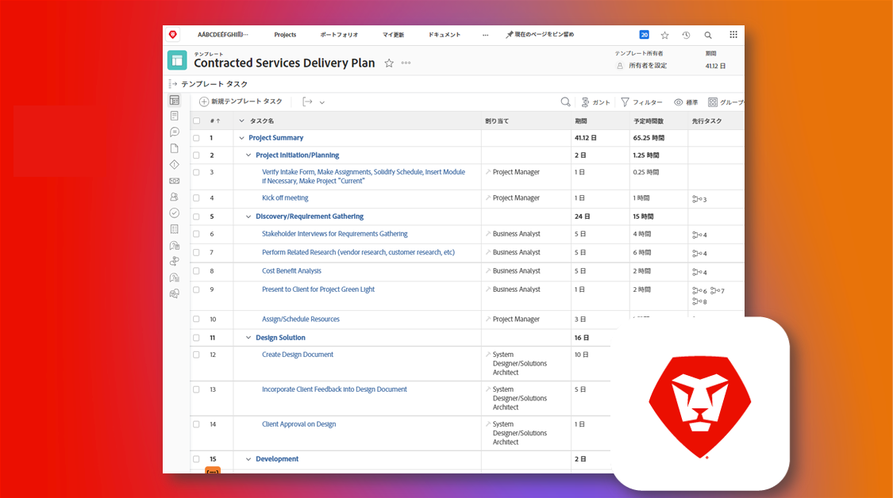

# 既存の Adobe Workfront インスタンスの管理

Workfront の優れた点として、カスタマイズ可能なことがあります。Workfront の難しい点として、カスタマイズ可能なことがあります。既存の Workfront インスタンスを引き継ぐ新規システム（またはグループ）管理者であれば、それが元々どのように構成され、設定されていたかを把握するのは大変なことでしょう。

しかし、継承されたインスタンスのチェックリストを使用すると、お使いのインスタンスについて知る必要があるすべてのことを学ぶことができます。

  

この継承されたインスタンスのチェックリストでは、質問、リソース、リンクの包括的なセットを確認して、どのように構成されているかを明確に把握できます。

このチェックリストは、Workfront のブループリントとして、またダウンロード可能な Excel スプレッドシートとして作成されています。ブループリントを使用して、Workfront で直接作業を管理およびドキュメント化することをお勧めします。

ブループリントとスプレッドシートはどちらも時系列ではなくトピックごとに整理されているので、ユーザーや組織にとって最も理にかなった方法で進めることができます。提供されている期間は一例であり、具体的なニーズに合わせて調整する必要があります。1 回ですべてを行う必要はありません。

可能な限り、組織の他のユーザーと協力してこれらの要素の確認とドキュメント化を行い、大きな変更があった場合にはこのドキュメントを最新の状態に保つようにしてください。インスタンスの将来の管理者にとって、非常に有用なものになるはずです。

* <b>ブループリントをダウンロードするには</b>、自分の Workfront インスタンスのメインメニューに移動して、「ブループリント」を選択します。「Inherited Instance Basics | Checklist」というタイトルのブループリントを見つけて、インストールをクリックします。実稼動環境またはサンドボックス環境を選択し、設定を続けます。ブループリントのインストールと設定の詳細については、[こちら](https://experienceleague.adobe.com/docs/workfront/using/administration-and-setup/blueprints/blueprints-install.html?lang=ja)をご覧ください。

* <b>Excel チェックリストをダウンロード</b>するには、[こちら](assets/adobe-workfront-system-admin-playbook-inherited-instance.xlsx)をクリックしてください。

ブループリントや Excel チェックリストを使用する場合でも、このプロセスは、検出、監査、ドキュメント化という 3 つの主要なフェーズで考えることができます。以下に説明と理想的な結果を示します。

 
 

## フェーズ 1：学習と探索

<b>推奨期間：4 週間</b>

まず最初にすべきことは、Workfront のインスタンスが、現在、どのように設定されているかを把握することです。

これには、関係者へのインタビューを実施したり既存のドキュメントを確認したりして、組織内の様々なグループが Workfront をどのように活用しているかを把握することが含まれます。

技術的な観点から Workfront に精通していない場合は、システム管理者トレーニングを受講してください。このトレーニングでは、様々な設定がどのように Workfront の各ツール（そして潜在的に各ユーザー）で機能し、影響するかについて、必要なインサイトを得ることができます。

このフェーズが終了するまでに、以下を得る必要があります。

* 組織で Workfront を使用する理由の明確な理解

* 主要なユースケースを含む、お使いのインスタンスの健全性に関する一般的な感覚

* うまくいっていることや、プロセスとユーザーニーズの間にある課題やギャップを概説したドキュメント
 
 

## フェーズ 2：システム監査

<b>推奨期間：4 週間 </b>

最初の探索の後で、インスタンスのより技術的な監査を実行することをお勧めします。つまり、現在の設定と構成がビジネス要件およびニーズを確実に満たすようにするために必要になる可能性のある、変更や機能強化を決定する必要があります。

このフェーズが終了するまでに、以下を得る必要があります。

* インスタンスの現在の状態のより深い見識

* ビジネスニーズに対応するために、インスタンスに加えたい変更や機能強化の特定
 
 

## フェーズ 3：ドキュメント化と最適化

<b>推奨期間：2 週間（以後、継続的に更新） </b>

フェーズ 1 と 2 で学んだことに基づいて、インスタンスのドキュメントを作成または更新し、戦略的課題やプログラムレベルの課題に対処するためのロードマップを策定します。

このフェーズが進行中の間、以下を得る必要があります。

* このドキュメントの各タブにわたる質問に答える、一元化されたドキュメントの作成

* 最優先のワークフロー、自動化、統合の図表

* 組織的課題や戦略的課題を改善するための将来の機能強化をドキュメント化したバックログまたはロードマップ

 
各フェーズを経ることで、また、継承されたインスタンスのチェックリストを活用することで、新規システムまたはグループ管理者として、Workfront インスタンスがどのように構成されているか、どのような調整や機能強化を行う必要があるかをより深く把握し、組織の Workfront エクスペリエンスを最適化するためのドキュメントを固めることができます。

 
 

追加情報については、以下を参照してください。
* [ウェビナー：継承されたインスタンスを引き継ぐためのヒント](https://experienceleaguecommunities.adobe.com/t5/workfront-discussions/webinar-system-admin-essentials-tips-for-taking-over-an-existing/td-p/571873)
* [Workfront 実装の目標の定義](https://experienceleague.adobe.com/docs/workfront/using/administration-and-setup/get-started-administration/define-wf-goals-objectives.html?lang=ja)
* [ブログ投稿：エグゼクティブスポンサーシップとリーダーシップへの価値](https://experienceleaguecommunities.adobe.com/t5/workfront-blogs/customer-success-tips-executive-sponsorship-and-value-to/ba-p/518353)
* [ブログ投稿：Adobe Workfront KPI の概要](https://experienceleaguecommunities.adobe.com/t5/workfront-blogs/kpi-dashboards-in-the-new-workfront-experience-introduction-to/ba-p/549001)
