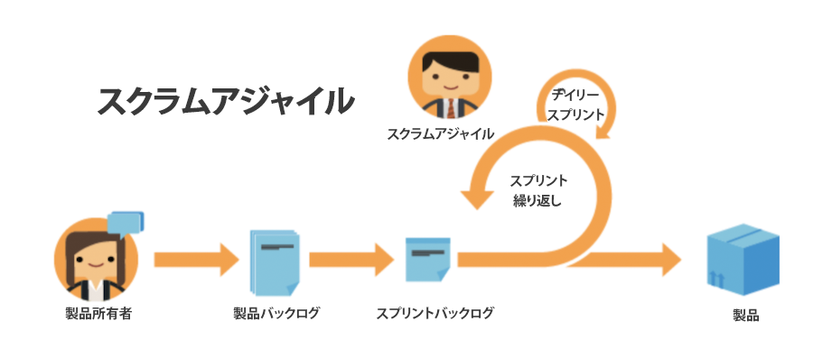

# アジャイルを使用するメリット

## 迅速な調整とピボット機能

名前が示すように、アジャイル手法を使用すると、チームは方向を迅速に変更し、フォーカスを集中できるように、より適切な設備を整えることができます。 ソフトウェアやマーケティング企業は、需要の変化が週から週へと起こる傾向を特に認識しています。 アジャイルを使用すると、チームは作業中の作業を再評価し、所定の単位で調整して、作業や顧客の状況が変化すると、チームに対してもフォーカスが変化するようにします。

## チームの仕事への透明性

アジャイルチームは「スタンドアップ」と呼ばれる毎日のミーティングを使用して、開発する機能や製品の優先順位付けされたリストにチームが注目し続けていることを確認します。 もはや、チームの他の全員が何に取り組んでいるのか分からないという混乱を感じることはありません。 前日からチームが達成したこと、対処する必要のある問題や障害、その日に何が機能するかに関する定期的なタブを保持します。

この透明性と統一された方向性を持つことで、誰もがより早く前に進むことができます。

## 頻繁なフィードバック

Agile を採用する最大のメリットは、各反復の終了時に組み込まれるフィードバックループです（次の点に注意してください）。繰り返しとは、チームが特定の成果物の完了に向けて作業する必要がある一定の時間のことです )。 フィードバックループを使用すると、チームは過去数週間の過去を振り返り、何が発生したか、計画がどのように変化しているか、お客様が以前のニーズが変わった場合に必要とするもの、チームとして学んだ教訓を特定できます。
