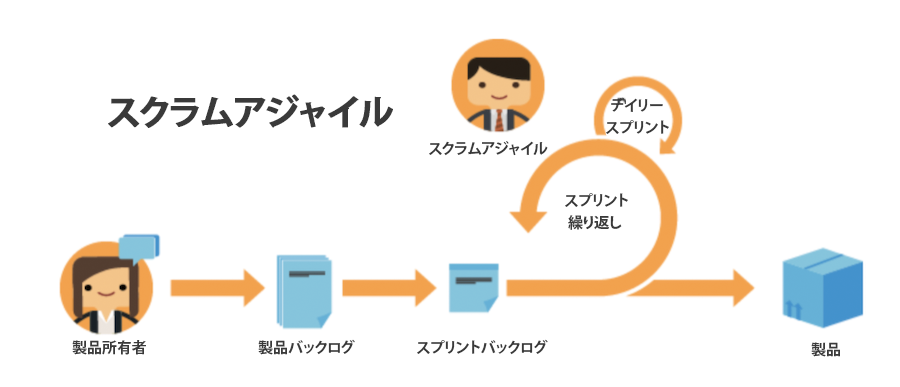

# アジャイルを使用するメリット

## 迅速な調整とピボット機能

名前が示すように、アジャイル方法論を使用すると、チームは方向性と焦点を迅速に変更できるようになります。 ソフトウェアやマーケティング企業は、需要が週ごとに変化する傾向を特に認識しています。 アジャイルを使用すると、チームは現在行っている作業を再評価し、特定の増分で調整して、作業や顧客の状況が変化するにつれて、チームの焦点も変化することを確認できます。

## チーム作業の透明性

アジャイルチームは、「スタンドアップ」と呼ばれる毎日のミーティングを活用して、開発する機能や製品に優先順位を付けたリストにチームが焦点を当てていることを確認します。 自分以外のメンバーが何に取り組んでいるのか分からないという混乱を感じることがなくなります。 チームがその前日からの一日で達成したこと、対処する必要のあるイシューや障害、その日に取り組む予定内容を定期的にチェックします。

この透明性と統一された方向性を持つことで、誰もが作業をより迅速に進めることができます。

## 頻繁なフィードバック

アジャイルを採用する最大のメリットは、各イテレーションの終了時に組み込まれるフィードバックループです（イテレーションとは、チームが特定の成果物を完成させるために作業する必要がある、一定の時間のことです）。 フィードバックループを使用すると、チームは過去数週間を振り返って、どのようなイシューが発生したか、計画が今後どのように変更される可能性があるか、以前のニーズが変わった場合に顧客が現在必要としているものは何か、チームとして学んだ教訓を判断できます。
