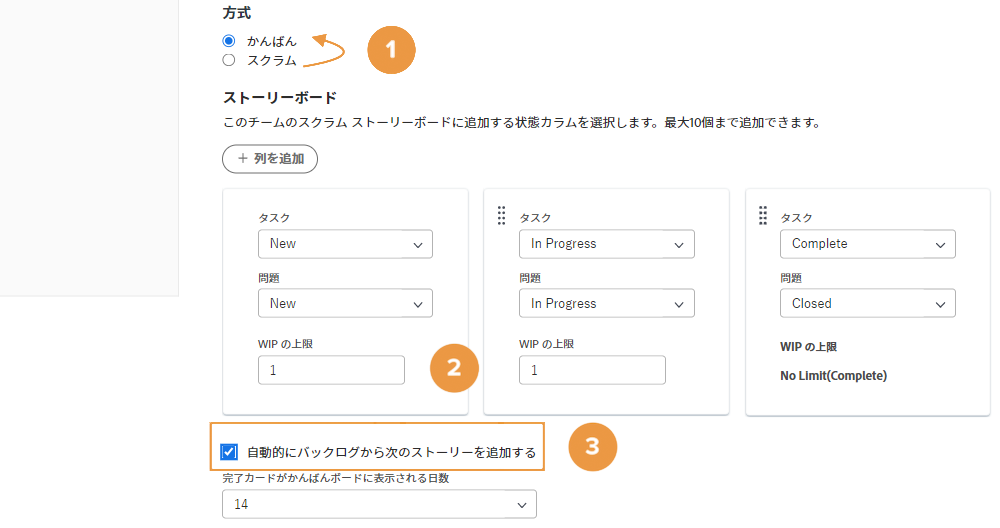
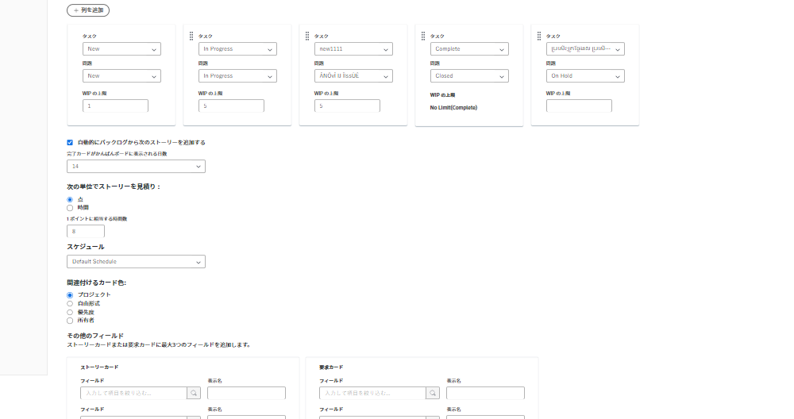
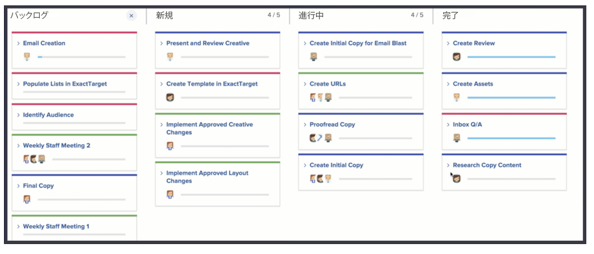
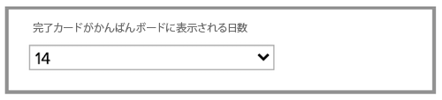

# かんばんチームの作成

クリエイティブマーケティングチームは、長い間スクラムを使用してきました。 アジャイルチームの柔軟な環境を評価しているものの、チームの優先順位が頻繁に変わるため、特定の期間にストーリーをコミットすることが難しいと感じています。

そこでスクラムの代わりに使用できるのが かんばんです。

かんばんは、スクラムベースのイテレーションで必要となる期間内で、作業内容を定義したくないチームに適しています。 代わりに、かんばんを使用して、チームはバックログを通じて継続的に作業を行うことができます。

クリエイティブマーケティングチームをスクラムチームから、かんばんチーム [1] に切り替えましょう。 この変更は、チーム設定の「アジャイル」セクションで行います。

方法論を変更した後、「WIP制限」を調整して、カンバンチームが各列で一度に持つことができるストーリー数を指定する必要があります。[2]。 WIP は「作業中（Work in Progress）」を表します。 ここに入力する数は、チームが処理できるアクティブな項目の数によって異なります。 チームのストーリーボードに表示されるので、割り当て超過になっていないかどうかを確認できます。 ユーザー（および編集権限を持つチームのメンバー）は、ストーリーボードから直接 WIP 制限を変更することもできます。

ステータス列をドラッグ＆ドロップして、任意の順序で配置できます。

かんばんチームは、ストーリーの完了時に、バックログの次のストーリーがストーリーボードに自動的に表示されるように選択することもできます（[上の画像の 3 を参照]）。 これは、継続的な作業サイクルを好むチームに適しています。

下の図は、ストーリーが完了したときに、ストーリーボードに新しいストーリーが自動的に表示された場合の外観を示しています。

完了した作業をより効率的に管理するために、ストーリーはデフォルトで 14 日間ボードに表示されます。

必要に応じて、チーム設定ウィンドウで 1～30 日の間に設定を調整できます。

これは別の方法ですが、アジャイル環境で作業する場合は、ストーリーの要件について話し合い、ストーリーの優先順位を調整して、バックログを継続的に調整することが重要です。 バックログを再優先順位付けする場合は、1 つのタブを「バックログ」タブに移動して並べ替える必要があります。
