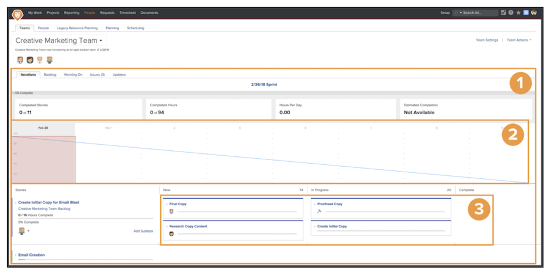

# スクラムアジャイルチームの作成

## スクラムチームの設定

Workfrontのアジャイルチームが反復ページから作業を完了する [1]. バーンダウンチャート [2] ページの上部には、この反復で行われた進捗の概要が表示されます。 燃え下がり図の下に物語がある [3] チームはこの反復に対してコミットしました。

このビデオでは、アジャイルチームの作成、スクラム手法の選択、スクラムチームの設定の決定方法について学びます。

### スクラムチームをゼロから設定する

設定後の表示がわかったので、Workfrontでの設定方法にすぐに進むことができます。 Swains という会社のケーススタディを使用して、設定を順を追って説明します。 クリエイティブチームのオペレーションを担当し、クリエイティブマーケティングチームがアジャイルに移行するのに OK を与えました。

このチームはスクラムの手法を採用することに決めましたストーリーボードは、誰が何をし、何のステータスやステージの作業項目があるかをより明確に把握できるようにするのを好むからです 短い繰り返しを計画できることは、現在の作業要求に適しています。 通常、チームには 2～3 週間のマーケティングキャンペーンが実施され、チームが実行できる操作や処理を短期間で優先順位付けする必要があります。

## Workfrontで Scrum Agile チームを作成する

このビデオでは、次の方法を学習します。

- アジャイルチームの作成
- スクラム手法を選択します。
- スクラムチームの設定を決定する

>[!VIDEO](https://video.tv.adobe.com/v/346281/?quality=12&learn=on)

アジャイルチームに変換するチームをWorkfrontに既に存在しますか？ 問題ない！ チーム設定に移動し、「アジャイルチームです」ボックスをオンにします。

## スクラムチームの設定変更

[ 問題 ] タブでは、[ 問題 ] タブはアジャイルチームに必要なくなったので、[ 問題 ] タブの [ 表示 ] オプションはチーム設定ページに含まれなくなりました。 チームに割り当てられた問題は [ バックログ ] タブに表示され、タスクと問題の両方を含む反復計画が容易になります。
