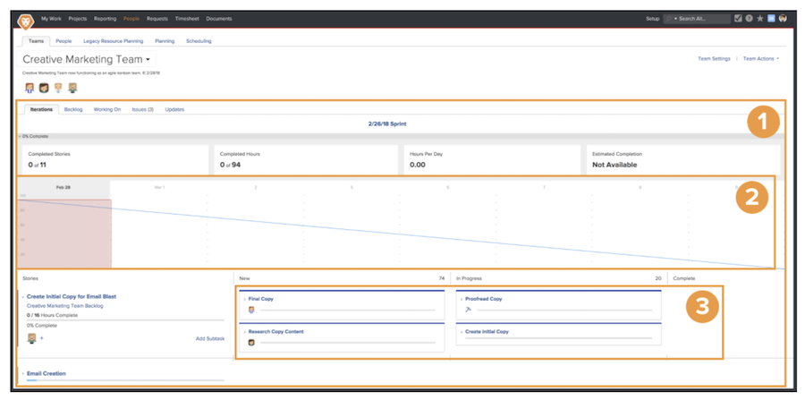

# アジャイルチームのスクラムを作成

## スクラムチームの設定

Workfront でのアジャイルチームは、イテレーションページ [1] から作業を完了します。 ページの上部のバーンダウンチャート [2] には、これまでにこのイテレーションで行われた進捗の概要が表示されます。 バーンダウンチャートの下には、チームがこのイテレーションでコミットしたストーリー [3] があります。

このビデオでは、アジャイルチームの作成、スクラム手法の選択、スクラムチームの設定の決定方法について学びます。

### スクラムチームをゼロから設定する

設定後の表示がわかったので、Workfront での設定方法にすぐに進むことができます。 Swains という会社のケーススタディを使用して、設定を順を追って説明します。 あなたは、クリエイティブチームのオペレーションを担当しています。クリエイティブマーケティングチームがアジャイルに移行することについて OK を出しました。

このチームは、スクラム手法を採用することに決めました。ストーリーボードを利用すると、誰が何をし、作業アイテムがどうのような状態や段階にあるかを明確に把握できるからです。 短いイテレーションを計画できることは、現在の作業の要件に適しています。 通常、チームは 2～3 週間のマーケティングキャンペーンを任されるため、そのような短期間でチームができることや処理できることに優先順位を付ける必要があります。

## Workfront でアジャイルチームのスクラムを作成する

このビデオでは、次の方法を学習します：

- アジャイルチームの作成
- スクラム方式の選択
- スクラムチームの設定の決定

>[!VIDEO](https://video.tv.adobe.com/v/346281/?quality=12&learn=on&enablevpops=1)

アジャイル チームに変換したい Workfront のチームが既にありますか？ 問題ありません。 チーム設定に移動し、「アジャイルチームです」ボックスをオンにします。

## スクラムチームの設定変更

アジャイルチームでは「イシュー」タブが不要になったため、「イシュータブで表示」オプションがチーム設定ページに含まれなくなりました。 チームに割り当てられたイシューは「バックログ」タブに表示され、タスクとイシューの両方を含むイテレーションを容易に計画できるようになりました。
