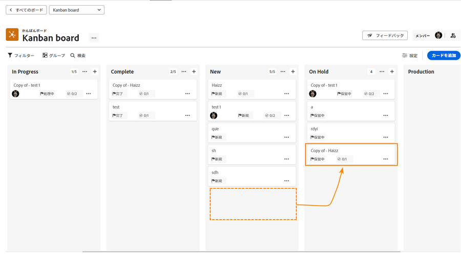
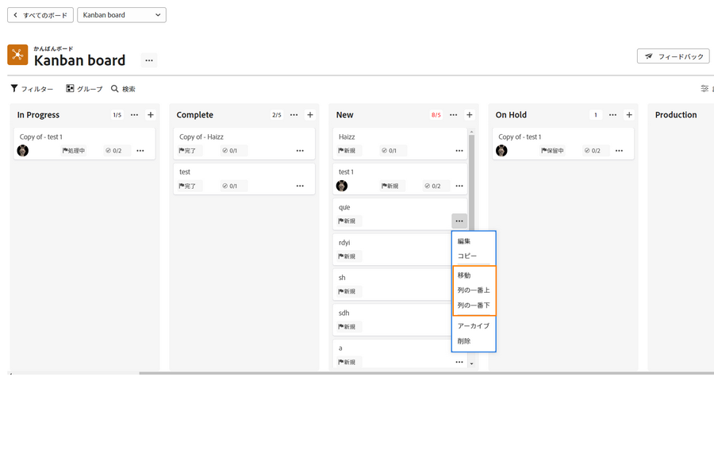
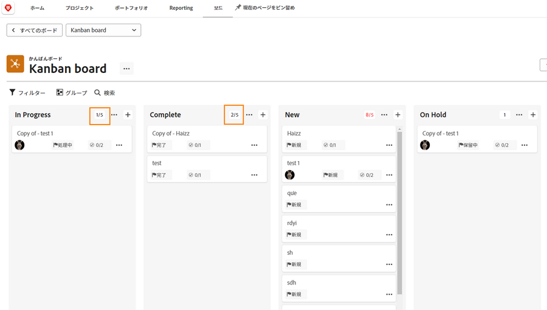
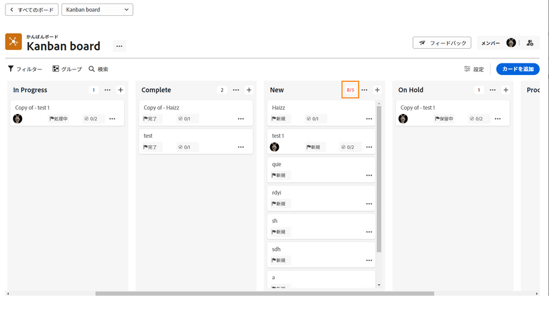

# かんばんチームとしての作業の管理

かんばんチームとしての作業の管理
カンバンバックログへのストーリーの追加
Creativeマーケティング部門のバックログに、ストーリーを追加する方法はいくつかあります。

チームは、バックログから直接ストーリーを追加できます。
また、プロジェクトにタスクを割り当てることもできます。 クリエイティブマーケティングチームにルーティングされたリクエストがある場合、リクエストはチームの「リクエスト」タブに表示されます。 チームがリクエストを選択してストーリーに変換すると、これらはチームのバックログに表示されます。

## かんばんボードの使用

バックログのストーリーに優先順位を付けた後、かんばんボードに移動します。 そのストーリーに取り組むチームメンバーのアバターをストーリーカードにドラッグ＆ドロップすることで、割り当てを行うことができます。

ストーリーの進捗に応じて、チームはストーリーボードの適切なステータスに移動します。 チームメンバーは、かんばんフラグを使用して、ストーリーが順調か、ブロックされているか、取り込む準備が整っているかを示すことができます。 これにより、どの作業アイテムが順調に進んでいるか、作業の準備が整っているかどうかを他のチームメンバーに伝えることができます。

また、チームメンバーは、ストーリーボード上で直接カードを更新して、説明、ステータス、優先度などの変更を反映させることもできます。 これを行うには、ストーリーカードのドロップダウンメニューをクリックし、適切なフィールドを編集します [1]。

## かんばんストーリーの実行

あなたは処理中の作業の上限である 5 つのストーリーを使用しています。 ボードを見ると、タスクをステータス列に移動する際に、各レーンのタスク数が各ステータス列の右上に表示されていることがわかります。

新規または処理中と同等のステータス列の上限を超えると、処理中の作業の上限を超えたことを示すエラーメッセージが表示されます。

チームが一度に処理できるアイテムの数を増やせる／減らせると判断した場合、ユーザー（および編集権限を持つ他のチームメンバー）は、WIP 番号をクリックし、新しい決定を反映させるように編集することで、ストーリーボードから処理中の作業の数を直接変更できます。
