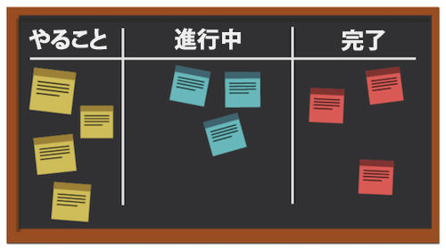
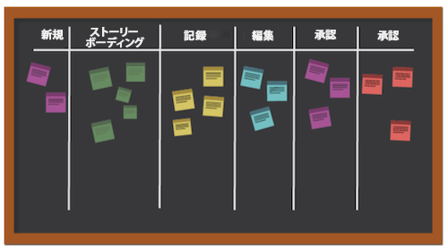

# かんばん手法とは何ですか？また、その仕組みは何ですか？

循環プロセスに焦点を当てる他のアジャイルメソドロジーとは異なり、かんばんメソドロジーは最適化されたワークフローに焦点を当てます。 かんばんは、かんばんボードを利用した作業を視覚化し、作業を進める作業量の制限を設定し、フローを分析して継続的な改善を行うことで、作業の流れを改善します。

かんばんの主要な要素をいくつか見てみましょう。

## 主要なプレーヤー

かんばんチームの主要なプレーヤーは、Scrum マスターが存在しない点を除き、Scrum チームの主要なプレーヤーと似ています。 誰かがプロジェクトマネージャーや監督者として働くのも理にかなっているかもしれませんが、理論的には、必要が生じるにつれ、この役割は自然に生じるはずです。

## ビジュアライゼーション：かんばんボード

かんばんボードをフォーマットする方法は多数あります。 チームは、任意の数の列を持つことができるボードを操作します。 各列は、実行中の作業のステータスを表します。

最も単純なボードでは、最初の列は「to do」、2 番目の列は「in progress」、3 番目の列は「complete」です。

多くの企業は、列名に対して独自の用語を持っています。また、プロセスの各ステップをリストアップする場合もありますが、目的は同じです。 チームメンバーは、作業状況に応じて、ストーリーを列から列へと移動します。

## 優先順位付け

チームメンバーは、プロダクトマネージャまたはプロジェクトマネージャと協力して、バックログやその他のステータス列のストーリーが優先され、作業が完了に向かって進み続けることを確認します。 製品マネージャーは、お客様の声が聞こえ、製品が正しい方向に動くことを確認する責任を負います。

## 作業中の作業を制限

かんばんのユニークな側面の 1 つは、チームがいつでも処理できるストーリーの量に対して、チームの能力に制限がある点です。 チームは、「やる」と「進行中」の欄に掲載するストーリーをいくつか選び、燃え尽きを防ぐためにその数を超えない。 ストーリーが「完了」に移されると、バックログのストーリーが「タスク」の列に置き換えられます。

## 継続的な改善

かんばんは、チームがその有効性を測定するためのシステムを提供することで、継続的な改善を可能にします。 ワークフローの動作、ワークフローの各部分の所要時間、成果物を時間通りに外に出す頻度を明確に確認できます。 これにより、さまざまな方法で実験を行い、出力を最適化することが容易になります。
