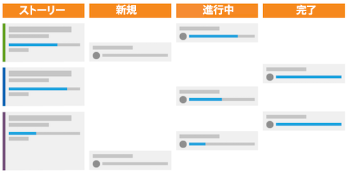

# スクラム方式の概要と仕組み

スクラム方式は柔軟性モデルを取り入れていますが、他の方式と異なるのは、製品所有者やスクラムマスターなどのように、チームのメンバーの役割を定義している点や、作業を定義し完了するための方法を定義している点です。

## スクラムチームの概要

スクラムに切り替えるかどうかを決める際は、チームの構造に着目して、新しい方式に簡単に移行できるかどうかを確かめる必要があります。スクラムチームには、製品所有者、スクラムマスター、チームメンバーの 3 種類のメンバーがいます。

### 製品所有者

製品所有者は、製品を所有し、製品の現在および将来の状態に関するビジョンを持っています。 彼らは、お客様のための声であり、ビジネス上の意思決定の主な推進者であり、製品の機能の優先順位付けです。

### スクラムマスター

スクラムマスターは、必要なリソースを見つけ、チーム間で合意を形成して、チームができるだけ効率的に作業を進められるようにすることで、チームが作業を完了させるのを助けます。また、プロセス全体を通じてコミュニケーションと合意形成を促進します。

### チームメンバー

チームは通常、複数の部門を横断しており、様々な担当業務やスキルセットを持つメンバーがいます。彼らは、製品の増分の計画、実行、提供を担当します。 彼らは、物理的に同じ場所に配置されることから恩恵を得ます。また、1 日を通じてのお互いのやり取りや、日々のチームでのスタンドアップミーティングで、迅速かつ容易なコラボレーションを実現するツールを利用できることからも恩恵を得ます。

## スクラムチームとしての作業

これらの主要なプレーヤーを集めたら、新しいスタイルのワークフローに従って、作業を完了し、顧客に製品を届けます。繰り返しになりますが、従来の方式やウォーターフォール方式と比較すると、最終製品の計画を考えてから、その製品の提供に必要なステップやフェーズを進めていくという、一直線のプロセスに従う必要がなくなりました。代わりに、スクラムチームはまず、バックログを構築します。

### バックログの作成

スクラムチームは、ストーリーと呼ばれる、優先機能や望ましい機能のリストを確認し、お客様に質問したり、構築するシステムまたは製品に何を求め、何を必要とするかをチームとして話し合ったりする必要があります。

主なストーリーを作成したら、バックログを調整する必要があります。チームとしては、4 つの主なステップを踏む必要があります。

* 各ストーリーで何を行う必要があるかを話し合い、大きなストーリーを小さな増分に分割します。

* ストーリーに優先順位を付け、最初に開発する機能を決定します。

* ストーリーが完了とみなされるための要件と許容基準を明確にします。

* 各ストーリーとバックログを完了させるためにチームが費やす必要がある作業量を見積もります。これは、時間単位またはポイント単位で見積もることができます。ポイントを使用すると、ストーリーの各コンポーネントに要する時間を計画する代わりに、ストーリーの難易度や複雑さを表すことができます。

### イテレーションの計画

バックログが調整され、優先順位が付けられたら、次はイテレーションを計画します（多くの組織では、「スプリント」と「イテレーション」が同じ意味で使用されています）。チームは、取り掛かる準備が整ったと見なされるストーリーに基づいて、完了させるストーリーを決定します。チームが割り当てを行い、イテレーションの期間を決定します。

### イテレーションの実行

次に、イテレーションを実行します。チームメンバーは従来のチームと同じように作業を始めますが、スタンドアップミーティングと呼ばれる、毎日の簡単なミーティングを今は取り入れています。

チームのメンバーは、この短いミーティングにその名の通り立ったまま参加し、次の 3 つの質問に答えます。

* 昨日完了させたこと
* 今日完了させること
* 彼らが陥っていて、割り当ての進行を妨げている障害は何か

これらのミーティングは、全員の見解を一致させ、迅速に前進させ続けます。

## バーンダウンチャートとストーリーボードを使用した進捗の追跡

スタンドアップミーティングでチームが 3 つの主な質問に答える際は、イテレーションの完了に向けた進捗を監視し、追跡することが重要です。そうすることで、チームは、十分な速さでストーリーを経過しているか、イテレーションの最後にすべての機能を時間通りに提供できるかどうかを判断できます。スクラムプロセスには、これを行うための 2 つのコンポーネントがあります。

### ストーリーボード

チームはストーリーボードを使用して、ストーリーをステータス列から移動し、作業アイテムが「新規」、「進行中」、または「完了」したことを示します。

### バーンダウンチャート

バーンダウンチャートを使用すると、チームが適切な速さでストーリーを完了しているかどうかを監視できます。バーンダウンチャートは、個々のイテレーションまたは製品リリース全体で使用できます。

