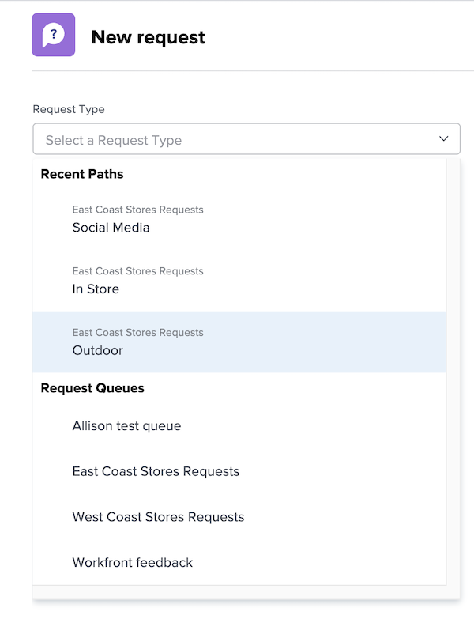

# リクエストする

このビデオでは、次の方法を学習します：

* リクエストエリアに移動する
* リクエストする
* 送信されたリクエストを表示する
* リクエストの下書きを検索する

>[!VIDEO](https://video.tv.adobe.com/v/336092/?quality=12&learn=on)

## リクエストキューのパスに迅速かつ容易にアクセスする

「[!UICONTROL リクエストタイプ]」フィールドをクリックすると、最近送信した 3 つのリクエストパスが自動的にリストの一番上に表示されます。同じキューに別のリクエストを送信するオプションを選択します。

リストの下部には、アクセス権のあるすべてのリクエストキューが表示されます。リクエストにどのキューを使用するか不明な場合は、キーワード検索を使用すると、必要なキューをすばやく簡単に見つけることができます。

キーワードを入力すると、[!DNL Workfront] に一致するものが表示されるので、ニーズに合ったリクエストキューのパスを見つけることができます。例えば、ソーシャルメディアへの投稿をリクエストするには、「[!UICONTROL リクエストタイプ]」フィールドに「ソーシャルメディア」と入力し始めると、リストが動的に更新されて一致するものが表示されます。

必要なオプションを選択し、リクエストフォームに入力して、リクエストを送信します。

<!---
Learn more
Requests area overview
Create and submit Workfront requests
Guides
Make a work request
--->
