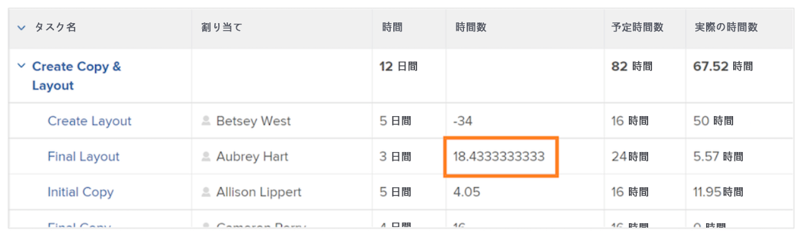

# SUB、SUM、DIV、PROD データ式の作成

このビデオでは、次のことを学習します。

* SUB、SUM、DIV、PROD 式の機能
* 計算フィールドで SUB データ式を作成する方法

>[!VIDEO](https://video.tv.adobe.com/v/335177/?quality=12&learn=on&enablevpops)

## 追加情報：ROUND 式

### ROUND 式の作成

ROUND 式は、任意の数を取り、特定の小数点以下の桁数に丸めます。

ほとんどの場合、ROUND データ式は別のデータ式と組み合わせて使用され、書式フィールドがテキストまたは数値のままになっている場合に使用されます。

タスクの予定時間数と実際に記録された時間数との差を特定する計算フィールドを作成してみましょう。これには SUB 式が必要で、次のようになります。

**SUB({workRequired},{actualWorkRequired})**

また、時間は分単位で追跡され、情報を時間単位で表示する形式が望ましいので、式を 60 で割って次のようにする必要があります。

**DIV(SUB({workRequired},{actualWorkRequired}),60)**

カスタムフォームで計算フィールドを作成する際に形式を「数値」に変更した場合は、ビューでフィールドを追加する際に数値の形式を変更できます。

ただし、カスタムフィールドを作成する際のフィールドの形式がテキストのままの場合は、ビュー内での形式の変更は簡単にはできません。プロジェクトで次のような数値が表示されないようにするために、ROUND 式を使用する必要があります。

<b>計算フィールドでの ROUND データ式の使用</b>

ROUND 式には、式の名前（ROUND）と、通常は 2 つのデータポイントが含まれます。Workfront ではこれらのデータポイントに式またはフィールドを使うことができ、その後に希望する小数点以下の桁数を示す数値を付けることができます。

式の構造は「ROUND(data point, #)」となります。

予定時間と実際の時間の差を計算する式では、最初のデータポイントとして「DIV(SUB({workRequired},{actualWorkRequired}),60)」を使用します。次に、その式から得られる数が何であっても、小数点以下の数が 2 桁を超えないようにします。

式は次のように記述できます：ROUND(DIV(SUB({workRequired},{actualWorkRequired}),60),2)。
