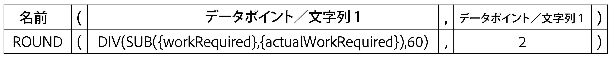

# SUB、SUM、DIV、PROD の各データ式を作成します。

このビデオでは、次のことを学習します。

* SUB、SUM、DIV、PROD 式の機能
* 計算フィールドで SUB データ式を作成する方法

>[!VIDEO](https://video.tv.adobe.com/v/335177/?quality=12)

## 追加情報：ROUND 式

### ROUND 式の作成

ROUND 式は、任意の数を取り、特定の小数点以下の桁数に丸めます。

ほとんどの場合、ROUND データ式は別のデータ式と組み合わせて使用され、書式フィールドが Text または Number のままになっている場合に使用されます。

SUB 式を必要とする計算フィールドを作成して、タスクの計画時間数と実際のログオン時間数との差を決定します。次に例を示します。

**SUB({workRequired},{actualWorkRequired})**

また、時間は分単位で追跡され、推奨される形式は情報を時間単位で表示することなので、式を 60 で割って次のようにする必要があります。

**DIV(SUB({workRequired},{actualWorkRequired}),60)**

カスタムフォームで計算フィールドを作成する際に形式を「数値」に変更した場合、ビューでフィールドを追加する際に数値の形式を変更できます。

ただし、カスタムフィールドを作成する際のフィールドの形式がテキストのままの場合は、ビュー内で書式を簡単に変更することはできません。 ROUND 式は、プロジェクトで次のような数値が表示されないようにするために使用する必要があります。

<b>計算フィールドで ROUND データ式を使用する</b>

ROUND 式には、式の名前 (ROUND) と、通常は 2 つのデータポイントが含まれます。 これらのデータポイントは、Workfrontの式またはフィールドで、その後に小数点以下の桁数を示す数値を付けることができます。

式の構造は次のようになります。ROUND（データポイント， #）

計画時間と実際の時間の差を計算する式では、最初のデータポイントとして —DIV(SUB({workRequired},{actualWorkRequired}),60) — を使用します。 その式から得られる数が小数点以下 2 桁以下でないことを確認します。

式は次のように記述できます。ROUND(DIV(SUB({workRequired},{actualWorkRequired}),60),2).
