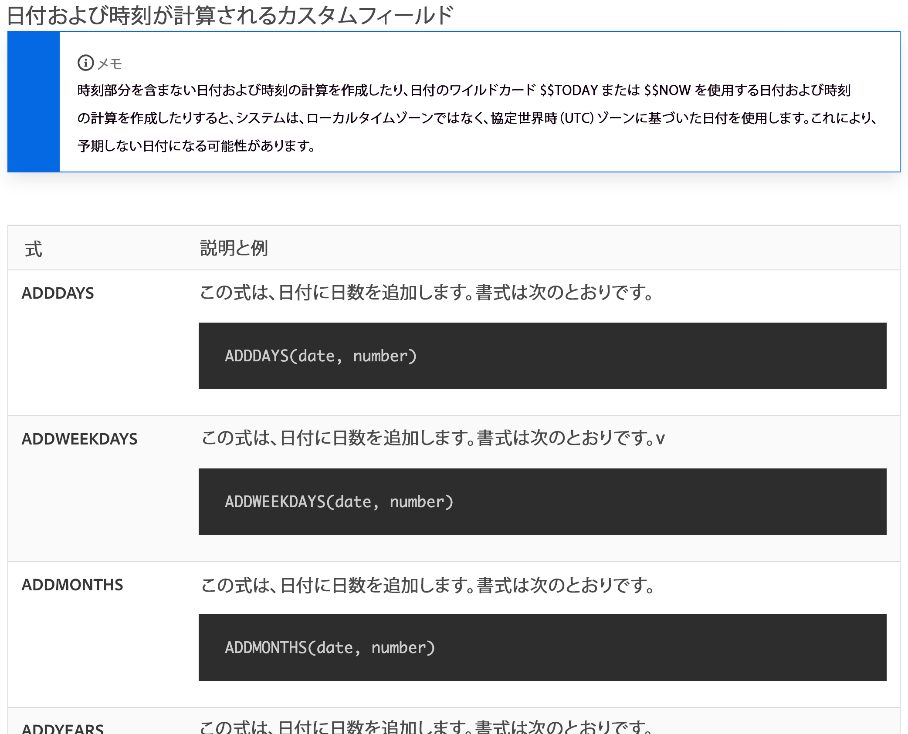
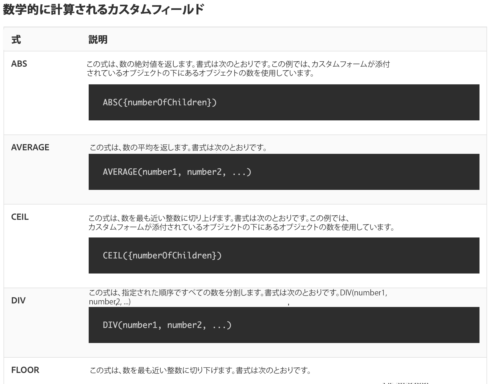

# 日付と時刻および数式について

## 日付と時刻の式

日付と時刻の式を使用すると、重要な日付をレポートの先頭に取り込んだり、タスクの完了に要した作業日数を自動的に計算したり、不要な場合にタイムスタンプを表示から削除したりできます。

利用可能な日付と時刻の式を見ると、いくつかのオプションを利用できることがわかります。

[!DNL Workfront] の顧客によって最も頻繁に使用される日付と時刻の式セットは 2 つあります。

* ADDDAYS／ADDWEEKDAY／ADDMONTHS／ADDYEARS および
* DATEDIFF／WEEKDAYDIFF

## 数式

数式を使用すると、単純なものから複雑なものまで、[!DNL Workfront] で自動的に計算を行うことができます。

利用可能な日付と時刻の式を見ると、いくつかのオプションを利用できることがわかります。

Workfront の顧客は、一般的に次の 2 つの数式セットを使用します。

* SUB、SUM、DIV、PROD
* ROUND

>[!NOTE]
>
>式の完全なリストと各式の詳細については、[計算データ式](https://experienceleague.adobe.com/ja/docs/workfront/using/reporting/reports/calculated-custom-data/calculated-data-expressions)のドキュメントページを参照してください。

