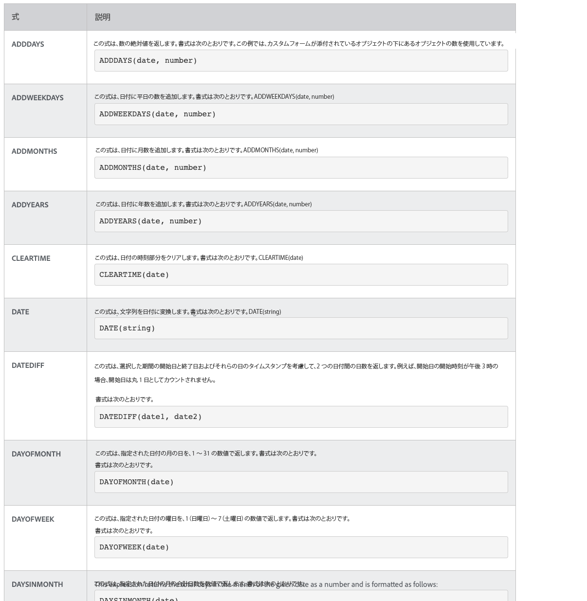

# 日付と時刻および数式について

## 日時式

日付と時間の式を使用すると、重要な日付をレポートの先頭に取り込んだり、タスクの完了に要した作業日数を自動的に計算したり、不要な場合にタイムスタンプを表示から削除したりできます。

利用可能な日付と時間の式を見ると、利用可能なオプションがいくつか表示されます。

最も頻繁に使用される日付と時間の式セットは 2 つあります。 [!DNL Workfront] のお客様：

* ADDDAYS/ADDWEEKDAY/ADDMONTHS/ADDYEARS と
* DATEDIFF / WEEKDAYDIFF

## 数式

数式を使用すると、 [!DNL Workfront] 単純か複雑かにかかわらず、自動的に計算を行う。

利用可能な日付と時間の式を見ると、利用可能なオプションがいくつかあることがわかります。

[!DNL Workfront] のお客様は、一般に、次の 2 つの数式セットを使用します。

* SUB、SUM、DIV、PROD
* ROUND
