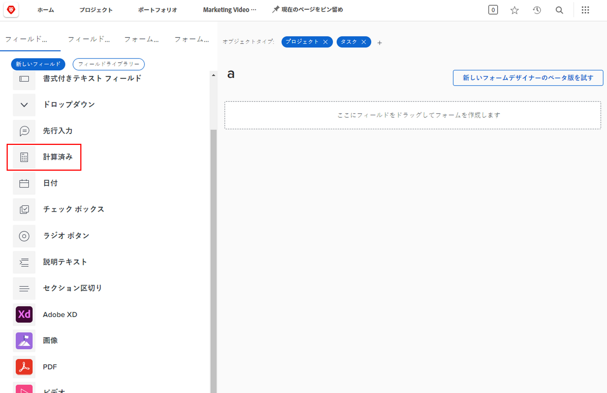
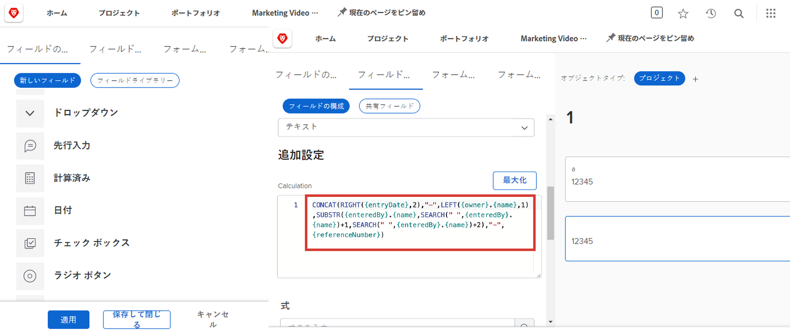
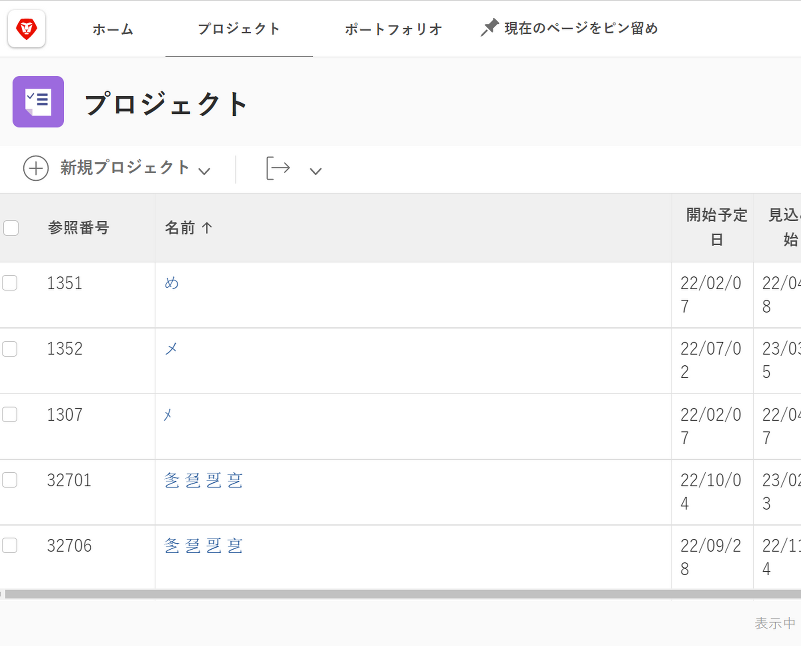
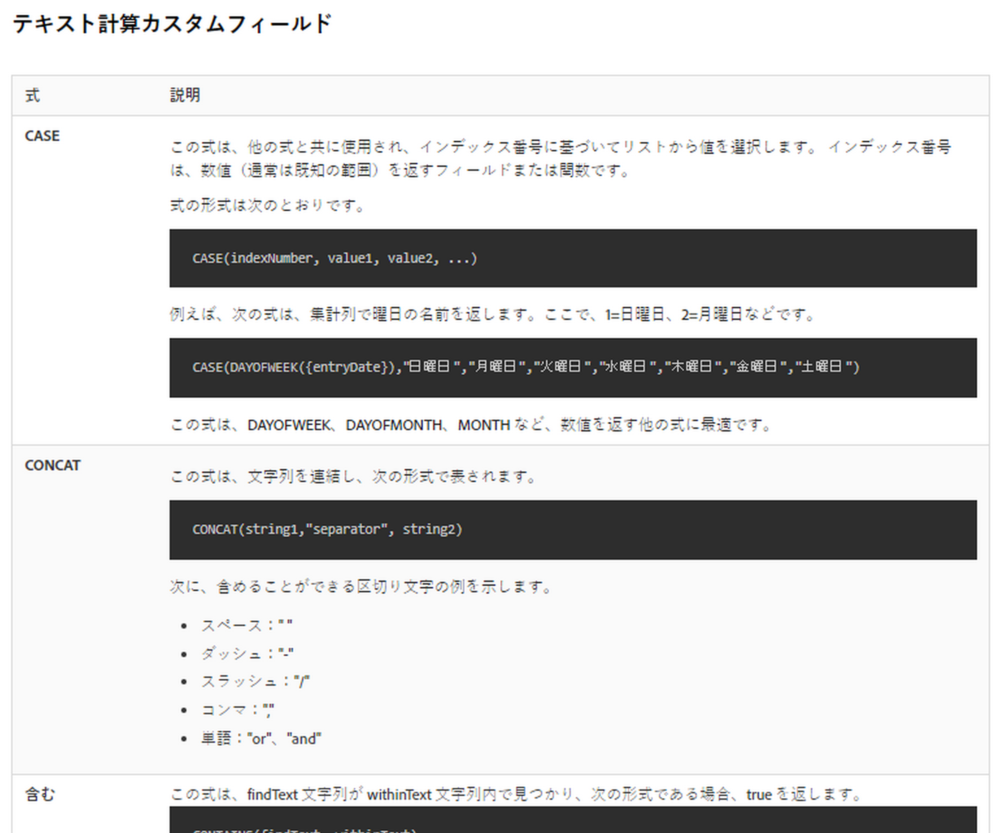

# 計算フィールドと式の基本を学ぶ

<!-- **Note**: The expression examples shown are simple and some may be mitigated by fields already supplied by  . However, the examples are used to illustrate the foundational knowledge needed in order to build expressions in Workfront.-->

Workfront は、複数のビジネス領域に共通する、作業管理に常に使用される様々なフィールドを提供します。予定完了日、プロジェクト予算、タスク担当者名などのフィールドです。

ただし、会社の目標が満たされているかどうかを把握するには、各組織は、それぞれの業界や会社に特有のデータを収集する必要があります。例えば、組織が次の情報をトラッキングするとします。

* プロジェクトが貢献する事業分野。
* 資金源がサプライヤー、社内、またはその両方であるかどうか。
* 使用する画像に必要な解像度。

これらのフィールドは本来 [!DNL Workfront] に組み込まれているわけではありませんが、カスタムのデータ入力フィールドや事前入力された複数選択の回答フィールドをカスタムフォームから作成できます。

この学習パスでは、計算フィールドに焦点を当てます。計算フィールドとは何か、データ式を使用して計算フィールドに取り込むことができる様々な種類の情報、およびこれらの計算フィールドを作成してデータの収集とレポートを強化する方法について説明します。

## 計算フィールドとは

計算フィールドには、データ式と既存の Workfront フィールドを使用して作成したカスタムデータが格納されます。

例えば、組織には、次のアイテムを含む特定のプロジェクト番号（作業番号）が割り当てられているとします。

* プロジェクトが作成された年
* プロジェクト所有者のイニシャル
* [!DNL Workfront] プロジェクト参照番号

計算フィールドで式を使用すると、[!DNL Workfront] に既に格納されている各情報を取得して、一意のプロジェクト ID（作業番号）を作成し、次のようにレポートに追加できます。

計算フィールドは、具体的に必要なデータに応じて、1 つか 2 つの式を使用した単純なものにすることも、複数の埋め込み式を使用してより複雑にすることもできます。ただし、Workfront が計算フィールドに使用できるのは、既に保存されているか、システムに取り込まれているデータだけです。

## テキスト式

テキスト式は、[!DNL Workfront] で見つかった情報を検索、分析、結合して、より意味のあるデータを作成したり、組織のために行われている作業についてより深い洞察を得たりします。

例えば、テキスト式を使用して次のことができます。

* プロジェクトの費用が $5,000 を超える場合は「$5,000 超」、費用が $5,000 を下回る場合は「$5,000 未満」と、プロジェクトビューの列に表示します。

* 各プロジェクトに、プロジェクトが作成された年、プロジェクトの [!DNL Workfront] 参照番号、プロジェクト名、プロジェクト所有者のイニシャルを含む一意の番号を付けます。

* ポートフォリオやプログラムに割り当てられていないすべてのプロジェクトを一覧表示するレポートを作成して、これを管理者のミーティングで使用できます。

カスタムフィールドでテキスト式を使用して、Workfront でこのようなタイプの検索や組み合わせを行うことができます。

使用可能なテキスト式を確認すると、いくつかのオプションが表示されます。

最も頻繁に使用されるテキスト式は 6 つあります。

* CONCAT
* LEFT / RIGHT
* CONTAINS
* IF
* ISBLANK