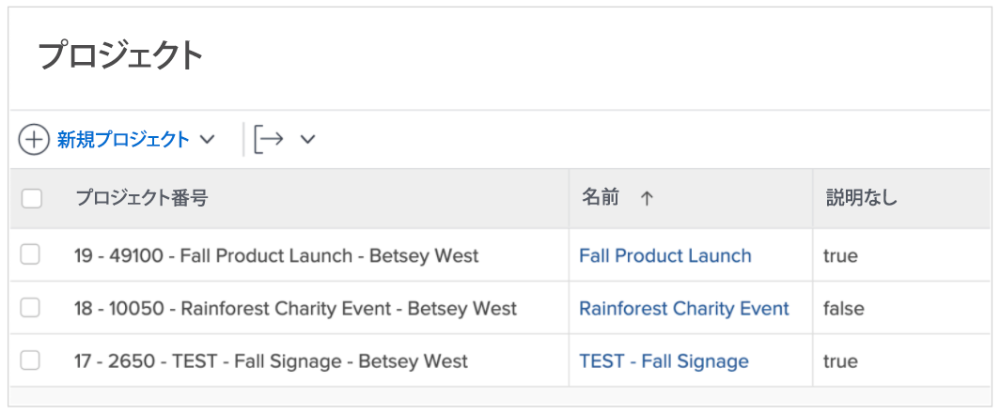
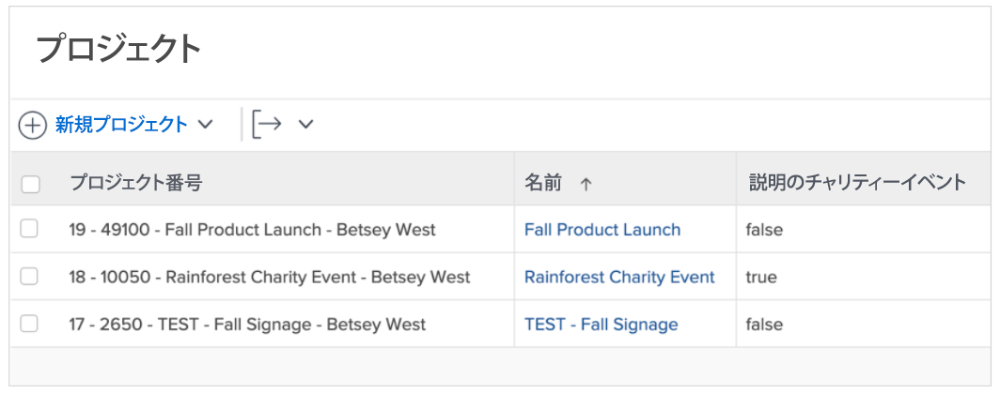
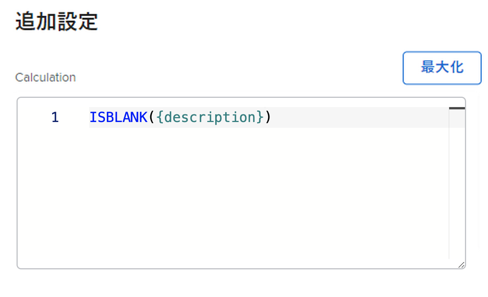
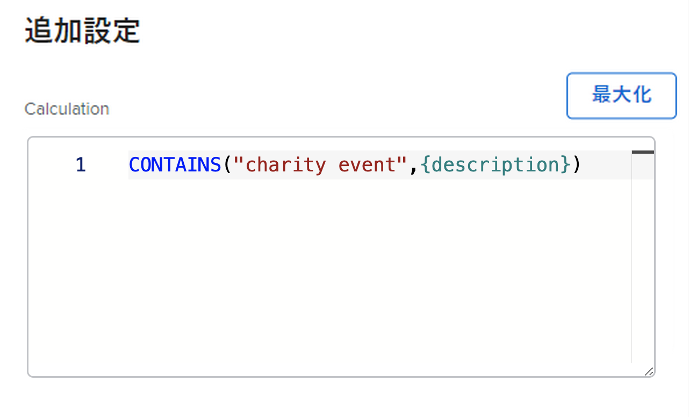

# ISBLANK 式と CONTAINS 式の使用

CONTAINS 式と ISBLANK 式の両方を使用して、単純な true または false 値を指定します。 違いは、ISBLANK 式がフィールドに値を保持しているかどうかをチェックし、CONTAINS 式がフィールド内の特定の文字列を検索しているかどうかを確認する点です。

たとえば、プロジェクトに説明が含まれているかどうかを確認するには、ISBLANK 式を使用します。 説明フィールドが空白の場合、式は true の値を返します。 説明フィールドが空白でない場合は、値 false を返します。

説明内の特定の値（「チャリティイベント」など）を検索するには、「次を含む」というテキスト式を使用します。 説明に「チャリティイベント」が見つかった場合、計算フィールドには「true」と表示されます。 「チャリティーイベント」が見つからない場合は、「false」と表示されます。

## ISBLANK

ISBLANK テキスト式には、式の名前と 1 つのデータポイントが含まれます。

**ISBLANK({data point})**

上の例（プロジェクトに説明が含まれているかどうかを知りたい場所）では、式は次のようになります。

ISBLANK({description})

## 含む

「次を含む」のテキスト式には、式の名前、検索する単語または語句、検索するフィールドが含まれます。

**CONTAINS(&quot;phrase&quot;,{fields})**

探している単語やフレーズを必ず引用符で囲んでください。引用符を付けないと、式が無効になります。

上記の例（プロジェクトの説明で「チャリティーイベント」を探す場合）では、式は次のようになります。

**CONTAINS（&quot;チャリティイベント&quot;,{description}）**

**注意**:CONTAINS 式では大文字と小文字が区別されます。 例えば、「Charity Event」が説明フィールドで大文字になっている場合、式の中でそのフレーズを大文字にします。

**CONTAINS（&quot;チャリティイベント&quot;,{description}）**

ISBLANK 式と CONTAINS 式は、値が存在するかどうかを調べる場合に使用すると便利です。 ただし、値が何かを知ると、実際に値を確認したり、ある種の記述子を持ってより良いインサイトを提供したりすると、より有用な場合があります。

例えば、プロジェクトがリクエストから変換されたことを知るだけでなく、元のリクエストの名前を知る必要があります。

その場合は、CONTAINS 式を IF 式と共に使用します。

ISBLANK および CONTAINS テキスト式は、IF テキスト式と共に使用されます。
