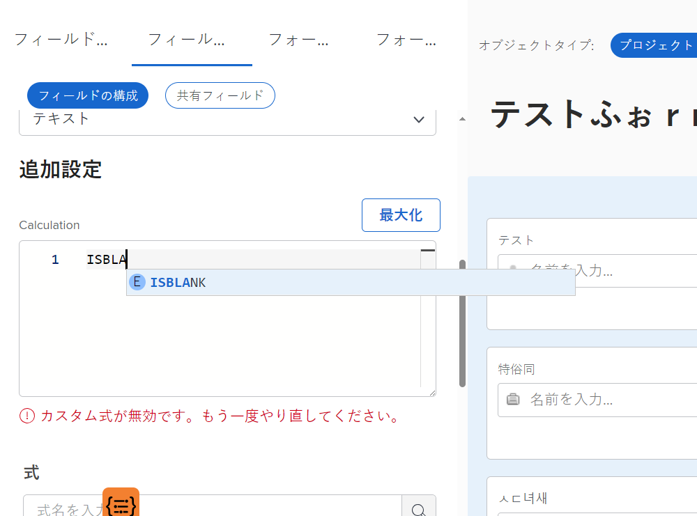
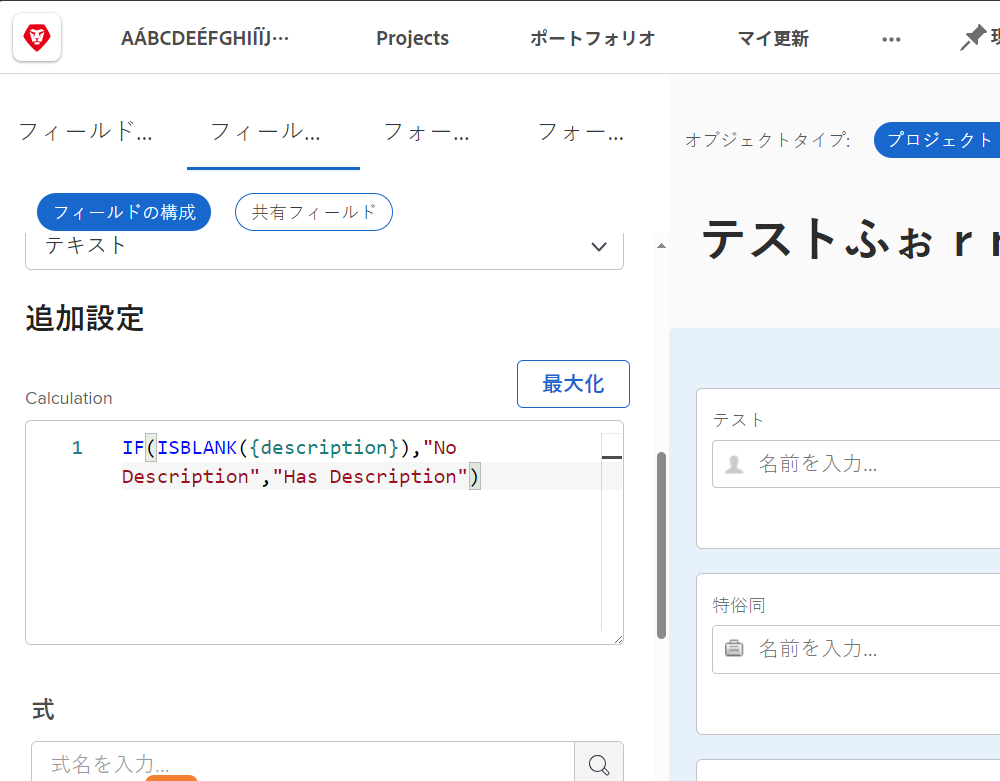
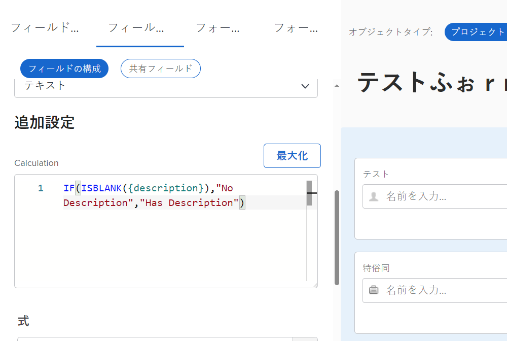
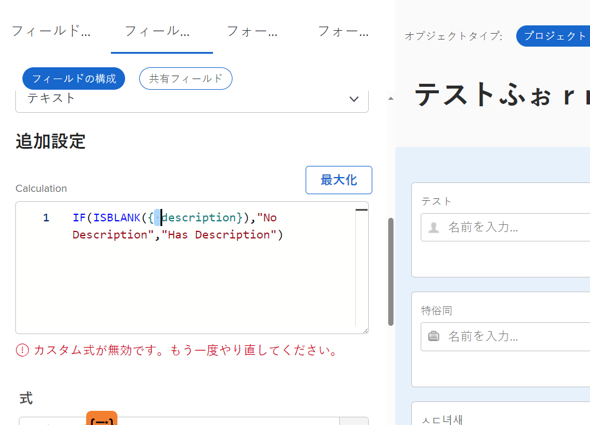
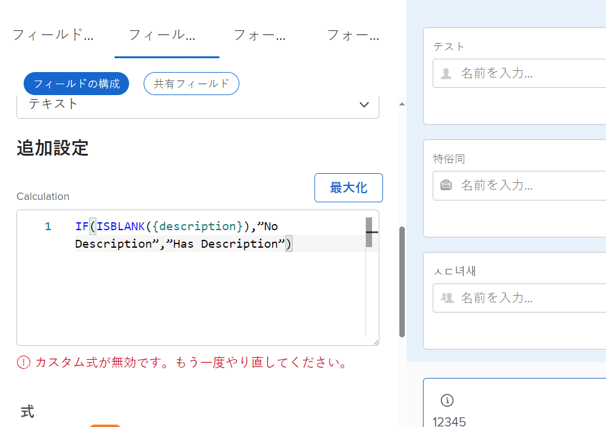
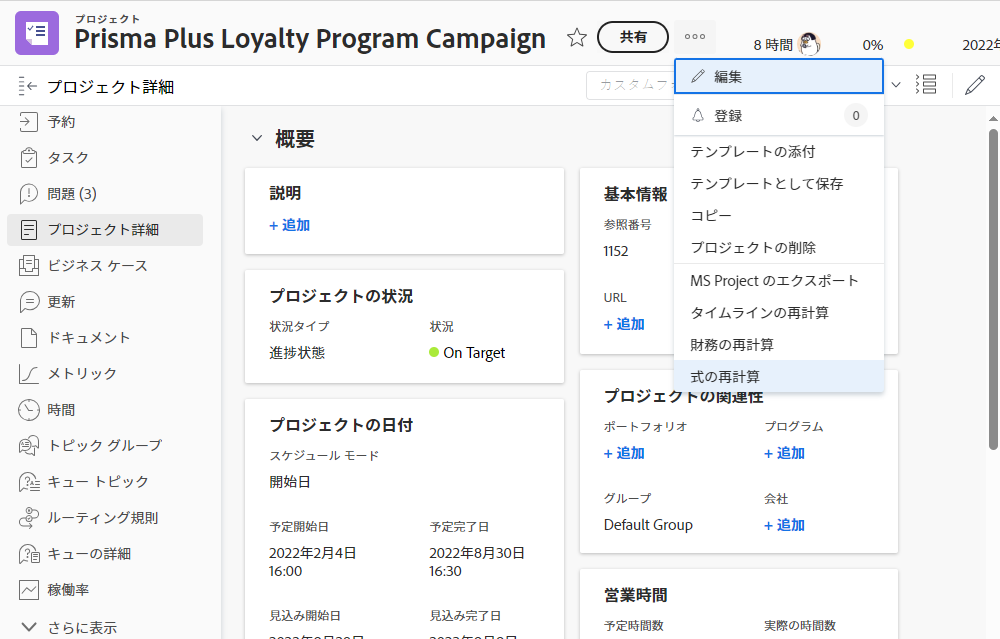
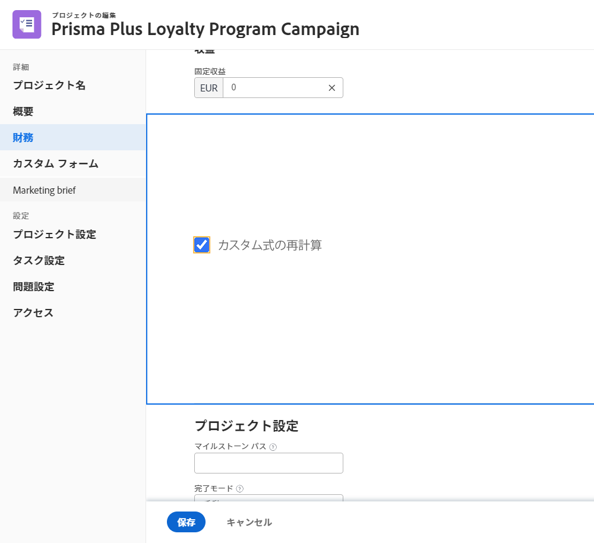

# 計算フィールドの式に関する注意事項

以下に、Workfront でカスタム計算フィールドを使用する際に知っておくと便利な概念を一覧で示します。

## 式名における大文字と小文字の区別

式名に関しては、大文字と小文字が区別されます。式の名前を最初に書くときは、大文字、小文字、またはその両方を使用できます。

ただし、式を認識してフィールドを保存するには、式をすべて大文字で記述する必要があります。

## 時間は分単位で保存されます

Workfront データベースの時間は、分単位で保存されます。「予定時間数」や「実際の時間数」などのフィールドを参照する場合は、60 で割って時間を分単位でなく時間単位で表示します。

## スペースは式に影響しません

式を記述する場合は、各式の間にスペースをほとんどあるいはまったくない方法を推奨します。

* IF(ISBLANK({description}),&quot;説明なし&quot;,&quot;説明あり&quot;)

ただし、スペースがあることで何が起こっているかわかりやすくなる場合は、式にスペースを追加できます。余分なスペースを指定しても、式は問題なく [!DNL Workfront] の値を収集したり計算したりできます。

* IF (ISBLANK ({description}), &quot;説明なし&quot; , &quot;説明あり&quot; )

間にスペースを配置できないのは、フィールドと中括弧だけです。スペースを入れてしまうとエラーメッセージが表示され、フィールドやカスタムフォームを保存できなくなります。

## 引用符は直線形を使用する必要がある

式で引用符を使用する場合は、引用符が直線形（&quot;）であることを確認してください。引用符が曲線形（&quot;）である場合、[!DNL Workfront] システムでは引き続き「カスタム式が無効です」というメッセージが表示されます。

## フォームの保存とオブジェクトの編集時の計算の更新

これは、計算フィールドを理解する上で重要な側面です。

カスタムフォームが再計算されない限り、計算フィールドに表示される情報は同じままで古くなります。

式は、オブジェクトの詳細メニューの「式を再計算」オプションを使用して更新できます。

イシューが未解決の日数を確認したいとします。式 DATEDIFF を使用して、「未解決の日数」という計算フィールドを作成します。

* フィールド名 = 未解決の日数
* 式 = DATEDIFF({entryDate},$$TODAY)

保存すると、イシューが最初に作成された日または Workfront に入力された日から今日の日付までの日数が、オブジェクトの詳細ページまたはレポートビューに表示されます。

次の日に同じ詳細ページまたはレポートビューを表示すると、その数値が 1 ずつ増えると予想されます。今日の数値が 5 の場合、明日は 6 になります。翌日は 7、8 などになります。

ただし、フィールドには引き続き毎日 5 が表示されます。情報を更新するには、フィールドを「再実行」するか、再計算する必要があります。

「式を再計算」オプションを使用してフィールドを更新するには：

* オブジェクトの名前をクリックして開きます。
* 詳細メニューをクリックします。
* リストから「式を再計算」を選択します。

また、リストまたはレポートで「一括編集」機能を使用して、複数の式を同時に再計算することもできます。未解決の日数計算が列に表示されているイシューのリストを示すレポートを作成したとします。一度にすべてのイシューを再計算する場合：

* レポートですべてのイシューを選択します。
* 選択したすべてのイシューを一括編集するには、編集オプションを選択します。
* 左側のカスタムフォームラベルをクリックして、カスタムフォームセクションまで下にスクロールします。
* 「カスタムフォーム」セクションの下部にある「カスタム式を再計算」チェックボックスをオンにします。
* 「変更を保存」をクリックします。

画面が更新され、計算フィールドに更新された情報が表示されます。

**メモ**：計算フィールドの式を更新または再計算する方法は他にもありますが、これが最も速くて簡単な方法です。

## 計算は同じフィールド内のフォームごとに異なる場合がある

計算フィールドがカスタムフォームに保存され、カスタムフォームが保存されるとすぐに、計算フィールドがフィールドライブラリに追加され、他のカスタムフォームで使用できるようになります。

ただし、フォーム A に計算フィールドがあり、同じ計算フィールドフォーム B にもにある場合、最初は計算がまったく同じであると考えてしまいますが、常にそうであるとは限りません。フォーム A の計算フィールドは、フォーム B ではまったく異なる方法で計算されている可能性があります。

計算カスタムフィールドがフィールドライブラリから選択され、カスタムフォームに追加されると、フィールドは追加されますが、計算は空白になります。これが発生する理由の 1 つは、計算が別のオブジェクトタイプには存在しないフィールドを参照している可能性があることです。

例えば、計算フィールド「完了までの日数」を作成して、プロジェクトのタスクを完了するのにかかった時間を判断したとします。

* WEEKDAYDIFF({actualStartDate},{actualCompletionDate})

イテレーションに対して同じ手順を実行します。同じ式を使用できますが、タスクオブジェクトで使用できるフィールドがイテレーションオブジェクトで常に使用できるとは限りません。 そのため、[!DNL Workfront] では、正しいオブジェクトフィールドを使用して計算を作成することができます。

**ヒント**：カスタムフィールドを作成する際は、計算式を「計算」チェックボックスから「説明」フィールドにコピーします。計算カスタムフィールドがフィールドライブラリからカスタムフォームに追加された場合、このフィールドは消去されません。

必要に応じて、カスタムフォームの計算フィールドは非常に単純な場合も、非常に複雑な場合もあります。式は、組織で行われている作業の状況をより深く把握するために必要な詳細レベルを提供するために、他の式や値を埋め込んだり、ネストしたりことができます。

<!--Depending on the need, calculated fields in custom forms can be quite simple or very complex. Expressions can embed, or nest, other expressions and values to provide the level of detail needed to get a better picture of what is going on with the work being done at your organization. 

Most of the examples and exercises in this course have been relatively simple to provide a base understanding of the expressions most commonly used and how to build those expressions in a custom calculated field. 

Now you’re ready to start building your own calculated custom fields.-->
