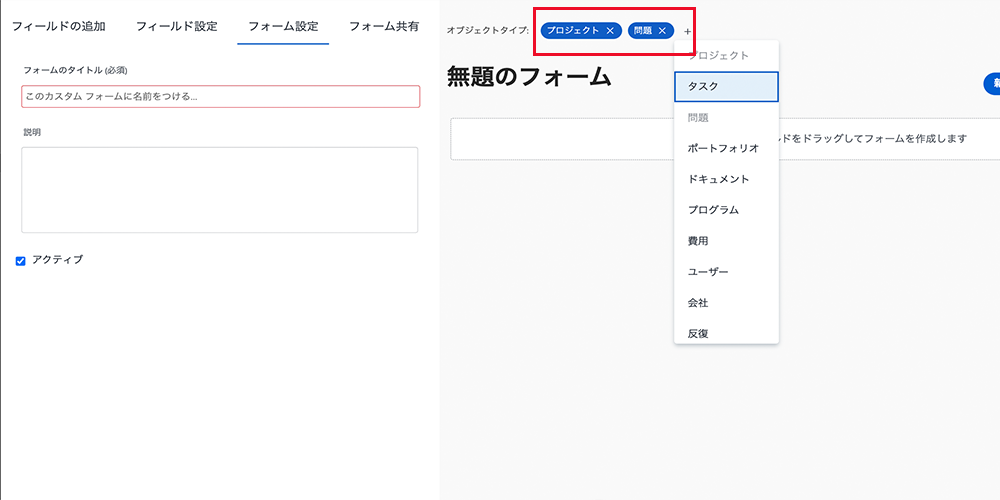

# カスタムフォームの作成と共有

このビデオでは、次の方法を学習します。

* フォームに使用するオブジェクトの指定
* 様々な形式で一意のフィールドを追加
* セクションとロジックを使用してフィールドを整理する
* 他のユーザーとフォームを共有する

>[!VIDEO](https://video.tv.adobe.com/v/335172/?quality=12)

## カスタムフォームは複数のオブジェクトタイプで動作します

をクリックしたとき、 [!UICONTROL 新規カスタムフォーム] ボタンをクリックすると、1 つのカスタムフォームで使用するオブジェクトをいくつでも選択できます。 このフォームに追加したすべてのフィールドは、カスタムフォームが添付されると、選択したオブジェクトに対して使用できます。

![カスタムフォームウィンドウに [!UICONTROL 新規カスタムフォーム] オブジェクトオプション](assets/create-custom-form.png)

カスタムフォームを編集すると、選択したすべてのオブジェクトタイプが表示されます。 このリストからオブジェクトタイプを追加または削除できます。

プロジェクトタイプとイシュータイプのカスタムフォームを作成する場合があります。 問題に添付されている場合、問題に関連する任意のフィールドに入力できます。 後で問題をプロジェクトに変換する場合、カスタムフォームはプロジェクトに自動的に読み込まれ、問題のカスタムフォームのフィールドに入力したデータは、プロジェクトのカスタムフォームで表示または編集できます。

## カスタムフィールドオプション

**[!UICONTROL ラベル] および [!UICONTROL 名前] フィールド**

この [!UICONTROL ラベル] および [!UICONTROL 名前] カスタムフィールドのフィールドは、異なる目的を果たします。 [!UICONTROL ラベル] は、ユーザーに表示されるフィールド名です [!DNL Workfront]. [!UICONTROL 名前] は、API などの統合で使用できる機能です。

![カスタムフォームウィンドウに [!UICONTROL ラベル] および [!UICONTROL 名前] フィールド](assets/custom-forms-field-label-and-name.png)

これにより、特定のフィールド名に依存する統合や他の接続に影響を与えることなく、組織の変更に合わせてユーザーに表示されるラベルを柔軟に変更できます。

**[!UICONTROL 書式付きテキスト フィールド]**

この [!UICONTROL 書式付きテキストフィールド ]には、ユーザーがカスタムフォームのフィールドへの入力時に、テキストに太字、斜体、下線を追加できる基本的なテキストマークアップツールが含まれています。

![カスタムフォームウィンドウに [!UICONTROL 書式付きテキストフィールド] オプション](assets/custom-forms-text-field-with-formatting.png)

また、このフィールドには 15,000 文字の制限があり、多くの領域で重要な情報を提供し、書式を使用して他のユーザーが読みやすくすることができます。

**[!UICONTROL Typeahead] フィールド**

この [!UICONTROL Typeahead] 「 」フィールドを使用すると、フィールドに選択したオブジェクトに基づいて、オプションのリストが自動的に入力されます。

![カスタムフォームウィンドウに [!UICONTROL Typeahead] フィールドオプション](assets/custom-forms-typeahead-1.png)

例えば、 [!UICONTROL Typeahead] 「マーケティングマネージャーの承認名」と呼ばれるフィールドを選択し、 [!UICONTROL ユーザー] 参照オブジェクトのタイプとして、ユーザーがカスタムフォームでそのフィールドに入力すると、ユーザー名のリストが表示されます。 この [!UICONTROL Typeahead] フィールドは、カスタムデータをシステムで取り込まれた情報に接続するためのもので、ドロップダウンフィールドの多くのオプションを手動で管理する必要がありません。

![カスタムフォームウィンドウに [!UICONTROL Typeahead] ドロップダウンメニュー](assets/custom-forms-typeahead-2.png)
