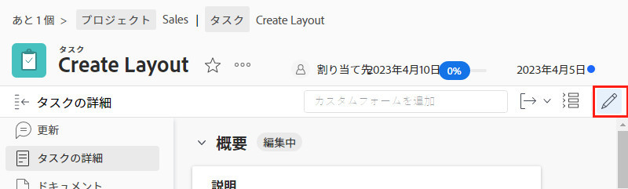

# カスタムフォームの編集

<!---
21.4 updates have been made here
--->

フォームをオブジェクトに添付した後に、カスタムフォームの情報を編集できます。

1. カスタムフォームの情報を編集するオブジェクトに移動します。
1. 左側のパネルで [オブジェクトタイプ] の「**[!UICONTROL 詳細]**」をクリックします。
1. 名前の横にある矢印をクリックして、カスタムフォームを展開します。
1. カスタムフォーム内の 1 つのフィールドをクリックして、そのフィールドの編集モードに入ります。また、右上隅の[!UICONTROL 編集]アイコンをクリックして、すべてのカスタムフォームを編集するか、カスタムフォームのセクションを編集することもできます。
1. オブジェクトの他のカスタムフォームの必須フィールドがまだ入力されていない場合でも、1 つのカスタムフィールドに情報を入力します。
1. 「**[!UICONTROL 変更を保存]**」をクリックします。

