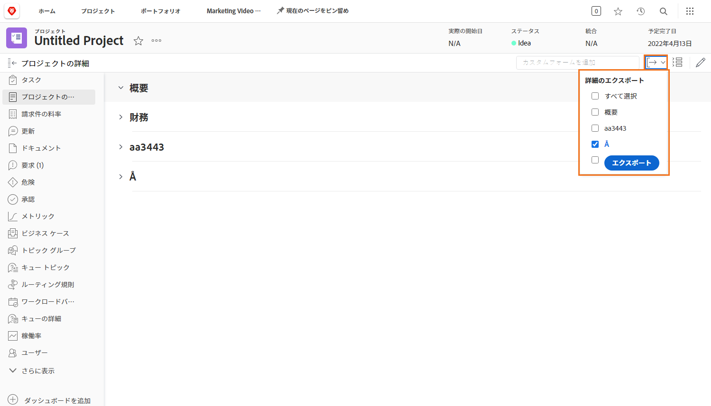
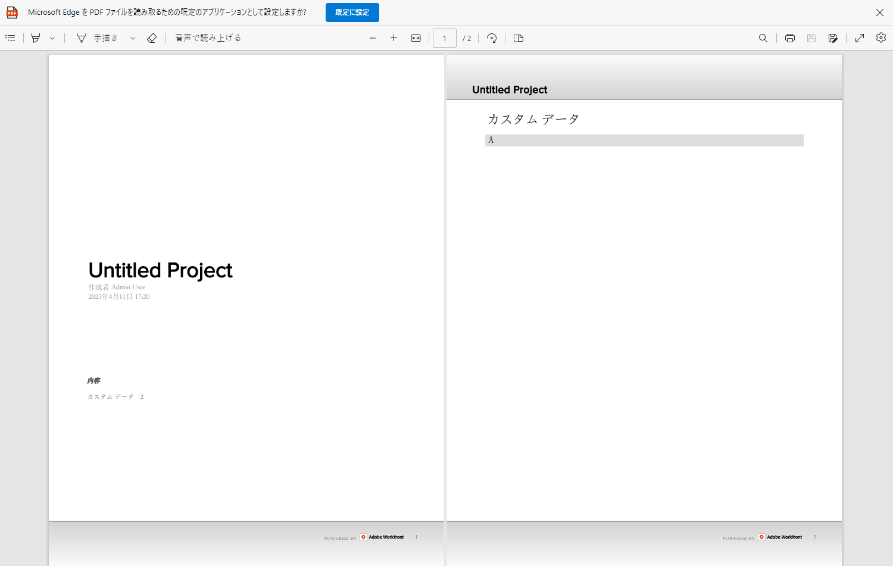

# カスタムフォームを PDF として書き出し

組織の固有のデータを取り込むことは、作業管理の重要な要素です。カスタムフォームは、この目的で一般的に使用されます。カスタムフォームを書き出すことで、簡単に配布および共有できます。オブジェクトの「[!UICONTROL 詳細]」セクションでフォームにアクセスすると、プロジェクト、タスクまたはイシューからカスタムフォームを書き出すことができます。

書き出された PDF に[!UICONTROL 概要]エリアを含めることもできます。

例えば、プロジェクトに添付されている「ビデオマーケティング情報」という名前のカスタムフォームを書き出すには、次の手順を実行します。

1. **[!UICONTROL 書き出し]**&#x200B;アイコンをクリックします。「[!UICONTROL 概要]」セクションを含め、プロジェクトに添付されているすべてのカスタムフォームがドロップダウンメニューに表示されます。
1. リストから「ビデオマーケティング情報」を選択します。
1. リストの下部にある「**[!UICONTROL 書き出し]**」をクリックします。

フォーマット済みの PDF ファイルがダウンロードされます。

