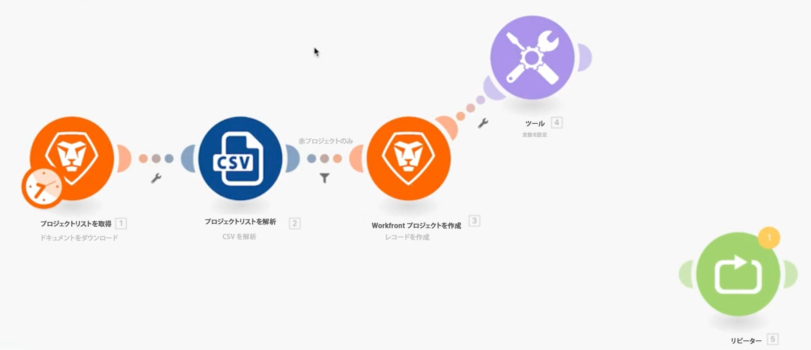
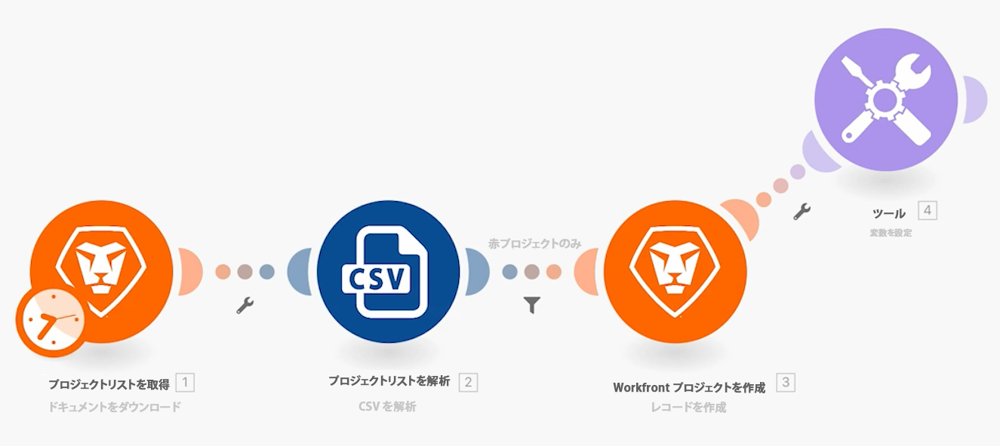
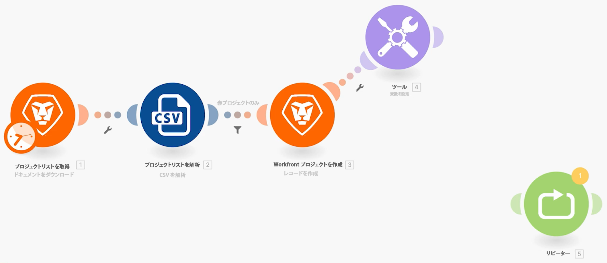

# 以前のバージョンへのアクセス

シナリオの以前のバージョンに戻る方法を説明します。

## 演習の概要

シナリオに変更を加えて複数回保存した後で、以前のバージョンを復元する方法を説明します。

## 手順

1. 強力なフィルターシナリオを使用して複製し、「以前のバージョンへのアクセス」という名前を付けます。
1. 「 Workfront プロジェクト作成」モジュールの後に、「変数設定」モジュールを追加します。 変数に「テスト」という名前を付けます。
1. 新しい位置にドラッグし、シナリオを保存します。

   

1. リピーターモジュールを追加し、前のモジュールからリンクを解除して、シナリオを再度保存します。

   

1. 次に、すべてのモジュールを削除して保存します。
1. ツールバーで「...」メニュー、「以前のバージョン」オプションの順にクリックします。 選択リストには、保存された各バージョンの日付とタイムスタンプが表示されます。

   

1. 以前のバージョンを選択すると、デザイナーのシナリオが保存した場所に戻ることに注意してください。
