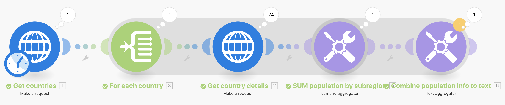
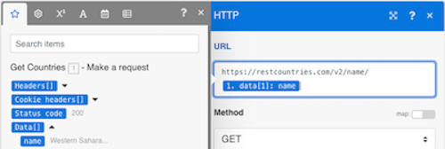
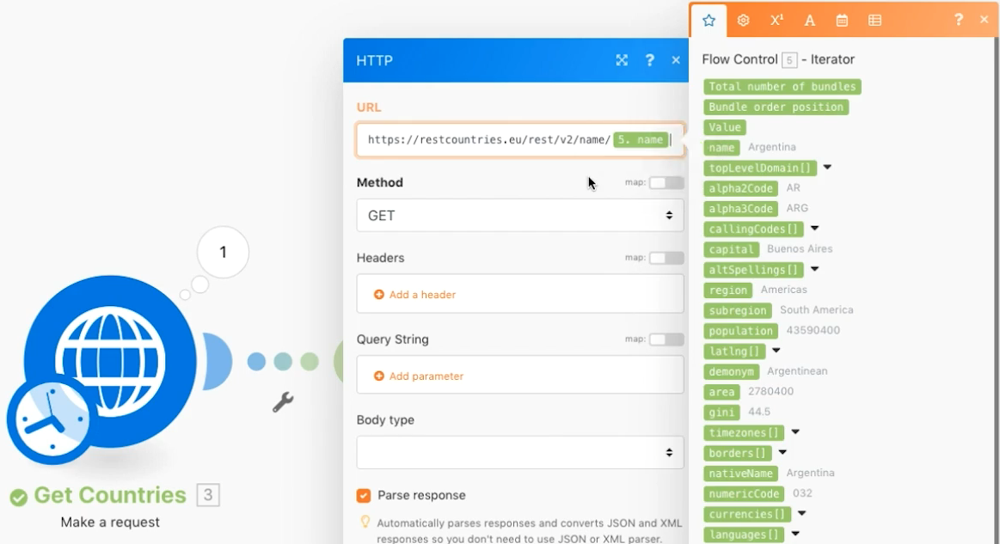

# 高度な集計

集計時のグループ化の使用方法を説明します。

## 演習の概要

Web サービスを呼び出して複数の国に関する詳細を返し、すべての国の総母集団をサブ地域ごとにグループ化します。

## 従う手順

**国の詳細を取得します。**

1. 新しいシナリオを作成し、「Advanced aggregation」という名前を付けます。
1. トリガーモジュールを HTTP に設定 — リクエストモジュールを作成します。
1. この URL を使用する。 `https://restcountries.com/v2/lang/es`：スペイン語が話されているすべての国のリストが表示されます。
1. 「メソッド」は「 Get 」のままにします。
1. 「応答を解析」チェックボックスをクリックします。
1. このモジュールの名前を「Get Countries」に変更します。
1. 「保存して実行」を 1 回クリックします。

   **出力は 1 つのバンドルですが、24 個のコレクションを含む配列で、スペイン語を話す国ごとに 1 個ずつ含まれます。**

   

   **各国のサブ地域情報を収集し、追加の HTTP リクエストを実行する必要があります。**

1. 別のリクエストを追加して、サブ地域情報を取得します。 最初の国しか返さないが、今は大丈夫だ。 別の HTTP Make リクエストモジュールを追加し、URL を使用します `https://restcountries.com/v2/name/{country name}`.
1. 最初の国の名前を取得するには、マッピングパネルに移動し、「 Data 」、配列内の「 Name 」の順にクリックします。 この [1] データフィールドでは、配列の最初の項目が返されます。

   + 数字をクリックし、必要に応じてインデックスを変更しますが、この場合は最初の項目だけを変更します。

1. マッピングパネルで「 Parse response 」をチェックし、「 OK 」をクリックします。
1. この名前を「国の詳細を取得」に変更します。
1. 「保存」をクリックし、「1 回実行」をクリックします。

   + 出力されるのは、1 つの国の情報です。

1. その他の国を取得するには、配列を繰り返し処理する必要があります。 反復子を追加します。反復子は物のリストを取り出し、リストの各項目のバンドルを出力します。

   **反復子と集約を追加します。**

1. HTTP モジュール間を右クリックし、Iterator Flow Control モジュールを追加します。
1. 「配列」フィールドで、「国を取得」モジュールから「データ」を選択します。

   

1. 「国の詳細を取得」モジュールで、「国の取得」モジュールではなくイテレーターから名前フィールドを取得するように、「 URL 」フィールドを更新します。

   

1. 次に、「国の詳細を取得」の後に数値集計を追加して、母集団をグループ化し合計します。
1. ソースモジュールは、イテレータモジュールです。
1. 集計関数は SUM です。
1. 値は [data:population] をクリックします。
1. 下部の「詳細設定を表示」オプションをクリックし、「グループ化の基準」をクリックします [data:subregion] をクリックします。

   

   **テキスト集約を使用して、数値集約内でグループ化した内容を集約します。**

1. テキスト集約を最後に追加します。
1. ソースモジュールは数値集約です。
1. 「テキスト」領域に、「 [キー] が [結果].&quot;

   

1. 保存して 1 回実行します。

   + 最終モジュールの出力を確認します。
