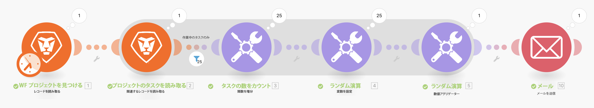
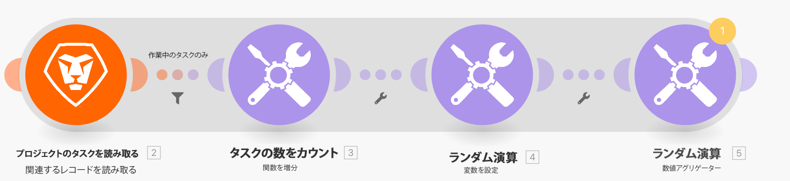

# 集計の演習

複数の情報バンドルを 1 つの値に集計する方法を説明します。

## 演習の概要

前の演習で作成した「イテレーションの概要」シナリオを使用して、プロジェクト内の各作業タスクの予定時間数を集計し、その情報を記載したメールを自分宛てに送信します。

## 手順

**フィルターを追加し、予定時間数を合計します。**

1. 前の演習で作成した「イテレーションの概要」シナリオのクローンを作成し、「集計の概要」という名前を付けます。
1. 「プロジェクトのタスクを読み取り」モジュールと「タスク数をカウント」モジュールの間にフィルターを追加します。 フィルターに「作業中のタスクのみ」という名前を付けます。
1. 条件を子の数[数値演算子：次と等しい] 0 に設定します。

   

1. ランダム計算モジュールの後に、数値アグリゲータツールモジュールを追加します。
1. ソースモジュールを「プロジェクトのタスクを読み取り」に設定します。
1. 集計関数を SUM に設定します。
1. 「プロジェクトのタスクを読み取り」モジュールの「作業」フィールドに値を設定します。
1. このモジュールの名前を「すべてのタスクの予定時間数の合計」に変更します。

   

   **集計がイテレーションを終了することを示すシャドウが表示されます。**

   

   **集計された時間をメールで送信**

1. 数値アグリゲータの後に、メールアプリから「メールを送信」モジュールを追加します。
1. メールを自分宛てに送信します。
1. 件名は「プロジェクト詳細」です。
1. 「コンテンツ」フィールドに、「[プロジェクト名]というプロジェクトがあり、その合計数は [結果]予定時間数です。」 「[プロジェクト名]」は「レコードを読み取り」モジュールから取得され、「[結果]」はアグリゲータモジュールから取得されます。

   

1. 保存して 1 回実行します。 インボックスでメールを検索します。

イテレーション内では、個々のバンドルにアクセスできます。 ただし、このイテレーション以外では、「メールを送信」モジュールでは、集計フィールドにのみアクセスできます。
