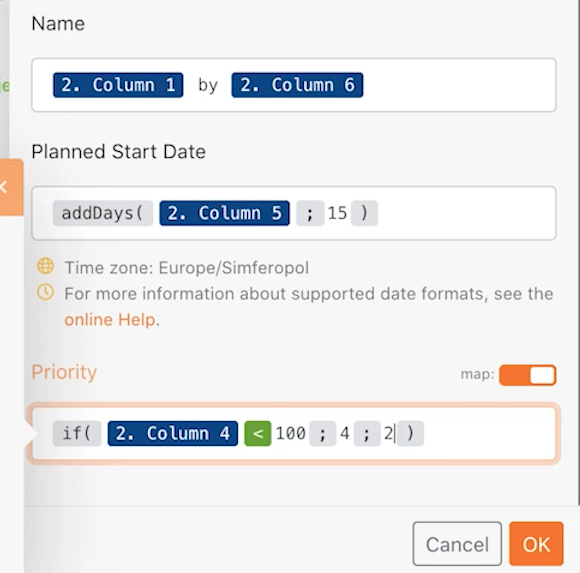

# 基本マッピングを超える演習

マッピングパネル数式を使用して、モジュールに送信されるフィールドを操作または変換する方法について説明します。

## 演習の概要

マッピングパネル数式を使用して、基本マッピングを超えるチュートリアルの演習から、プロジェクト名、予定開始日、優先度を変更します。

## 手順

**初期シナリオデザインのシナリオのクローンを作成します。**

1. 次に示すように、シナリオセクションの初期シナリオデザインの右側にある「クローン」オプションを選択します。「基本マッピングを超える」という名前を付けます。

   

   **次に、Workfront プロジェクトを作成モジュールのマッピングパネルを使用して、プロジェクト名、予定開始日、優先度の各フィールドを設定します。**

1. Workfront プロジェクトを作成モジュールをクリックして、設定を編集します。マッピングパネルを使用して、「名前」フィールドを「[スポンサー]による[マイプロジェクト名]」に変更します。

   + [マイプロジェクト名]は CSV を解析モジュールの列 1、[スポンサー]は列 6 です。「による」という単語は、2 つの間に入力します。

1. 次に、予定開始日に移動し、addDays 数式を使用してフィールドに 15 日を追加します。これについては、基本マッピングを超えるチュートリアルビデオを参照してください。
1. 「優先度」フィールドを見つけ、フィールドの右上にある「マップ」ボタンを切り替えます。選択リストメニューが数値に変わります。CSV ファイルの信頼性評価が 100 未満の場合は、プロジェクトに高（4）優先度のラベルを付ける if 文を作成します。それ以外の場合は、通常（2）を作成できます。

   + 信頼性評価は、列 4 です。

   **この時点で、マッピングパネルは次のようになります。**

   

1. 「OK」をクリックし、「1 回実行」をクリックします。
1. Workfront インスタンスでプロジェクトを見つけ、すべてが正しくマッピングされていることを確認します。
1. シナリオを保存します。
