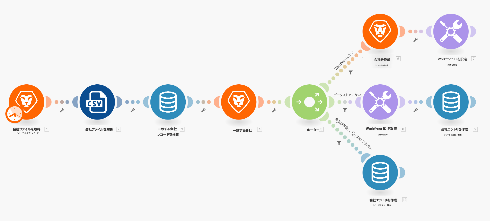
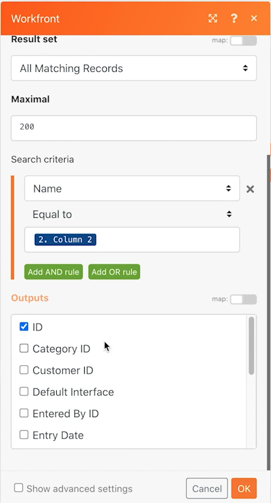
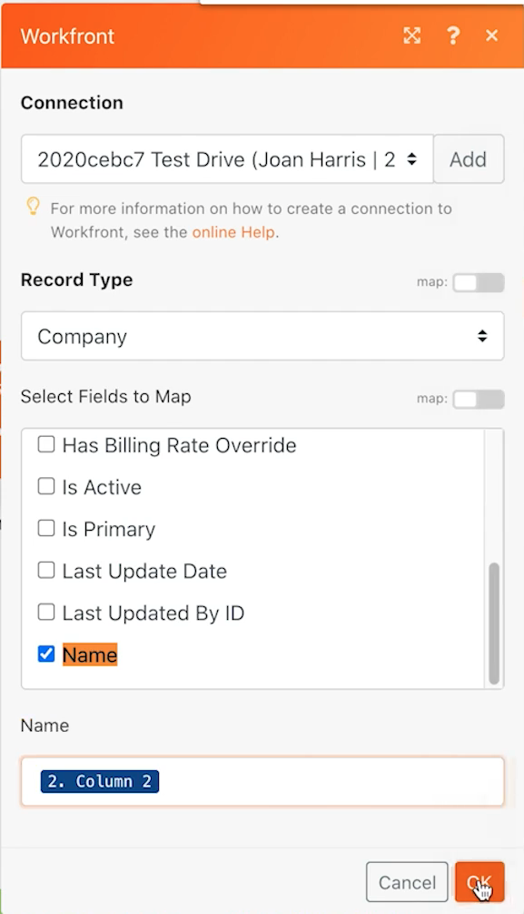
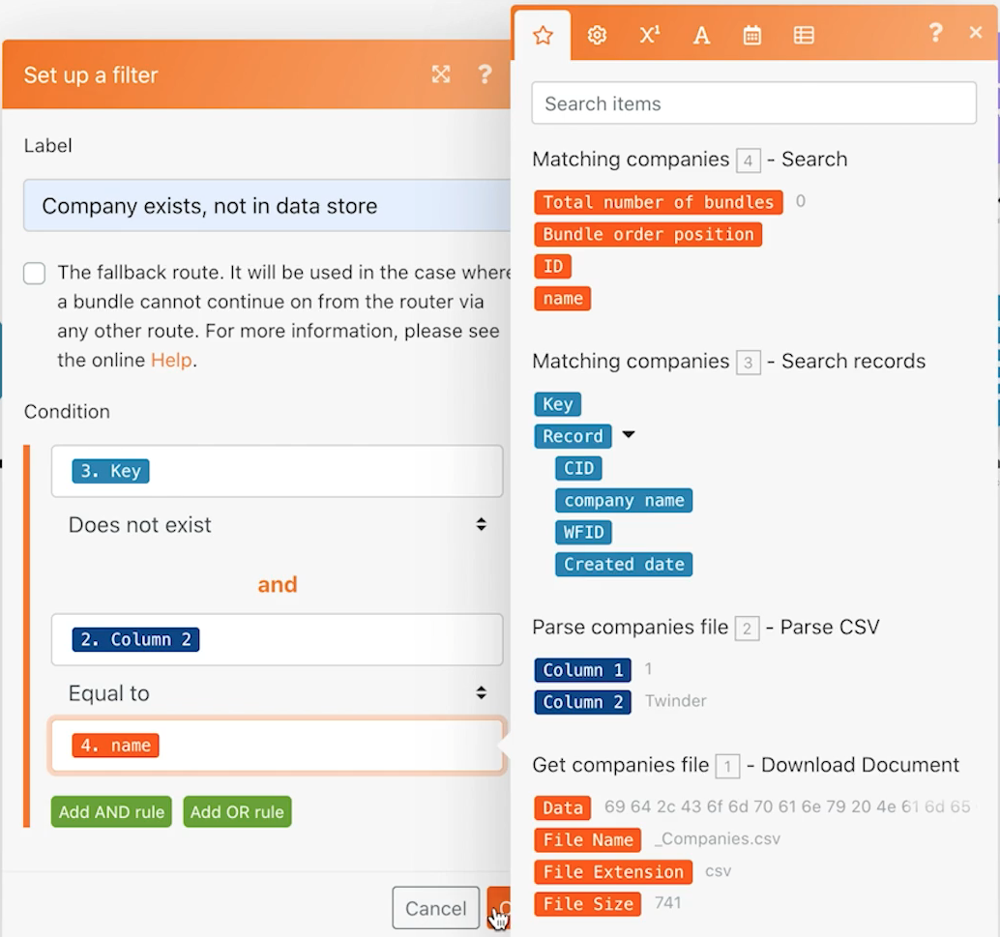

# データストアの演習

2 つのシステム間で会社名を同期する方法について説明します。

## 演習の概要

これは、Workfront と別のシステム内の会社の一方向同期の最初の部分です。現時点では、Fusion データ ストアと Workfront の間でのみ同期します。データストア内のテーブルでは、各会社の Workfront ID（WFID）と CSV ファイル内の会社 ID（CID）を追跡します。これにより、今後のある時点で双方向の同期が可能になります。

## 手順

**Workfront からファイルをダウンロードします。**

1. Workfront の「Fusion Exercise Files」フォルダーで「_Companies.csv」を選択し、「ドキュメントの詳細」をクリックします。
1. URL アドレスから最初の ID 番号をコピーします。
1. Fusion で、「データストアを使用してデータを同期する」という新しいシナリオを作成します。
1. トリガーモジュールには、Workfront のドキュメントをダウンロードモジュールを選択します。
1. Workfront 接続を設定し、Workfront URL からコピーしたドキュメント ID を含めます。
1. このモジュールに「会社ファイルを取得」という名前を付けます。
1. ここで、CSV を解析モジュールを追加します。
1. 「列数」フィールドに 2 と入力します。
1. 「CSV」フィールドのドキュメントをダウンロードモジュールからデータをマッピングします。
1. このモジュールに「会社ファイルを解析」という名前を付けます。
1. シナリオを保存し、「1 回実行」をクリックします。

   **データストアとデータ構造を作成します。**

1. データストアのレコードを検索モジュールを追加します。
1. 「会社の同期」という名前の新しいデータストアを作成します。
1. データストア内に、「会社の同期 (struc)」という名前のデータ構造を作成します。
1. 4 つのフィールドを作成します。

   + CID - CSV ファイル内の会社 ID
   + 会社名
   + WFID - Workfront 会社 ID
   + 作成日 - データタイプが日付であることを確認します

   

1. データ構造の「保存」をクリックし、データストレージのサイズを 1 に設定して、データストアを保存します。
1. データストアモジュールで続けて、CID が CSVを解析モジュール（列 1）からの会社の ID と等しいフィルターを設定します。
1. 「詳細設定を表示」をクリックし、「結果がない状態でこのモジュールが返された場合でも、シナリオまたはルートの実行を続行」するオプションを選択します。

   

1. このモジュールの名前を「一致する会社」に変更します。
1. Workfront のレコードを検索モジュールを追加します。
1. レコードタイプとして「会社」を選択します。
1. 検索条件は、Workfront 内の会社名が CSV ファイル内の会社名と等しいことです。
1. 出力には、会社名と ID を選択します。

   

1. 「OK」をクリックし、このモジュールの名前を「一致する会社」に変更します。

   **会社が Workfront またはデータストア内に存在するかどうかに基づいて、様々なパスを作成します。**

   **ルーティングパス 1 - 会社を作成する。**

1. Workfront のレコードを検索モジュールの右側にルーターモジュールを追加します。
1. 上部のパスに Workfront のレコードを作成モジュールを追加します。
1. レコードタイプを会社に設定します。
1. 「フィールドからマップへ」の「名前」を選択します。「CSV を解析」モジュール（列 2）からの出力に、名前フィールドをマッピングします。
1. このモジュールの名前を「会社を作成」に変更します。

   

1. 会社がまだ Workfrontにない場合、会社を作成するためにのみルーターの後にフィルターを追加します。「Workfront にない」という名前を付けます。
1. 「条件」をWorkfront の「検索」モジュールからの ID に設定します。この条件は存在しません。

   

   **次のパスのデータストアを更新する準備をします。**

1. 「変数を設定」モジュールを最上部のパスの最後に追加します。
1. 変数名を「Workfront ID」に設定します。
1. 変数の値を「会社を作成」モジュールからの ID に設定します。
1. このモジュールの名前を「Workfront ID を設定」に変更します。

   **ルーティングパス 2 - データストアを更新します。**

1. ルーティングパス 2 にフィルターを作成します。「データストアにない」という名前を付けます。

1. 「条件」を「データストア」モジュールからの「キー」に設定します。この条件は存在しません。

   

1. このパスの最初のモジュールは「変数を取得」モジュールです。
1. 変数名を「Workfront ID」に設定します。
1. このモジュールの名前を「Workfront ID を取得」に変更します。
1. データストアアプリから別のモジュールを追加し、レコードを追加または置換します。
1. 「データストア」フィールドで、「会社との同期」を選択します。 これは前に作成したデータストアです。
1. 「キー」フィールドは空白のままにします。
1. 「CSV を解析」モジュールの列 1 から CID フィールドをマッピングします。
1. 「CSV を解析」モジュールの列 2 から会社名フィールドをマッピングします。
1. 「Workfront ID を取得」モジュールから WFID フィールドをマッピングします。
1. 「作成日」フィールドで、「日付と時刻」タブの formatDate 関数を使用して、現在の日付を MM/DD/YYYY という形式にします。

   

1. 「OK」をクリックし、このモジュールの名前を「会社エントリを作成」に変更します。

   **ルーティングパス 3 - システム間でデータストアを同期します。**

1. まず、ルーティングパス 3 にフィルターを作成します。「会社が存在し、データストアに存在しない」という名前を付けます。
1. 「条件」を「データストア検索レコード」モジュールからの「キー」に設定します。この条件は存在しません。
1. 「AND ルールを追加」ボタンをクリックして、CSV ファイル（列 2）の会社名が Workfront の「検索」モジュールの会社名と等しいことを指定します。

   

1. 次に、ルーティングパス 2 の最後にあるモジュールを複製して、別の「レコードを追加または置換」モジュールを追加します。
1. 複製したモジュールを、ルーティングパス 3 の最後にドラッグします。そこにあった空のモジュールを削除します。
1. 複製したモジュールをクリックします。WFID フィールドを除くすべてのフィールドは同じままです。一致する会社の「検索」モジュールからマッピングします。

   

1. 「OK」をクリックし、このモジュールの名前を「会社エントリを作成」に変更します。
