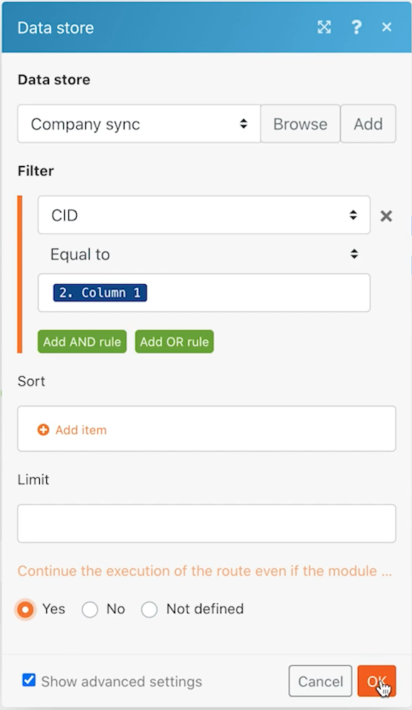

# データストア

2 つのシステム間で会社名を同期する方法を説明します。

## 演習の概要

これは、Workfrontや他のシステムにおける、企業の一方向の同期の最初の部分です。 現時点では、Fusion データストアとWorkfrontの間でのみ同期します。 データストアのテーブルでは、各会社のWorkfront ID(WFID) と CSV ファイル (CID) 内の会社 ID を追跡します。 これにより、将来のある時点で双方向の同期が可能になります。

## 従う手順

**Workfrontからファイルをダウンロードします。**

1. Workfront &quot;Fusion Exercise Files&quot;フォルダで、&quot;_Companies.csv&quot;を選択し、「ドキュメントの詳細」をクリックします。
1. URL アドレスから最初の ID 番号をコピーします。
1. Fusion で、「Using data stores to sync data」という新しいシナリオを作成します。
1. トリガーモジュールの場合は、「 Workfrontドキュメントのダウンロード」モジュールを選択します。
1. Workfront接続を設定し、Workfront URL からコピーしたドキュメント ID を含めます。
1. このモジュールに「Get companies file」という名前を付けます。
1. 次に、「 CSV を解析」モジュールを追加します。
1. 「列数」フィールドに「2」と入力します。
1. 「 CSV 」フィールドのドキュメントをダウンロードモジュールからデータをマッピングします。
1. このモジュールに「Parse companies file」という名前を付けます。
1. シナリオを保存し、「1 回実行」をクリックします。

   **データストアとデータ構造を作成します。**

1. データストアのレコード検索モジュールを追加します。
1. 「会社の同期」という名前の新しいデータストアを作成します。
1. データストア内に、「Company sync (struc)」という名前のデータ構造を作成します。
1. 4 つのフィールドを作成します。

   + CID - CSV ファイル内の会社 ID
   + 会社名
   + WFID - Workfront会社 ID
   + 作成日 — データタイプが日付であることを確認します。

   

1. データ構造の「保存」をクリックし、データストレージのサイズを 1 に設定して、データストアを保存します。
1. データストアモジュールを続けて、CID が CSV 解析モジュール（列 1）の会社の ID と等しいフィルターを設定します。
1. 「詳細設定を表示」をクリックし、「結果がない状態でこのモジュールが返された場合でも、シナリオまたはルートの実行を続行する」オプションを選択します。

   

1. このモジュールの名前を「一致する会社」に変更します。
1. Workfront Search レコードモジュールを追加します。
1. レコードタイプとして「会社」を選択します。
1. 検索条件は、Workfront内の会社名が CSV ファイル内の会社名と等しいです。
1. 出力の場合は、会社名と ID を選択します。

   

1. 「OK」をクリックし、このモジュールの名前を「Matching companies」に変更します。

   **会社がWorkfront内に存在するかデータストア内に存在するかに基づいて、異なるパスを作成します。**

   **ルーティングパス 1 — 会社を作成します。**

1. Workfront Search レコードモジュールの右側にルーターモジュールを追加します。
1. トップパスにWorkfrontレコード作成モジュールを追加します。
1. レコードのタイプを「会社」に設定します。
1. [ マップするフィールド ] から [ 名前 ] を選択します。 「 CSV を解析」モジュール（列 2）からの出力に、名前フィールドをマッピングします。
1. このモジュールの名前を「会社を作成」に変更します。

   

1. 発送担当の後にフィルターを追加して、まだWorkfrontにない場合にのみ会社を作成します。 「Workfrontにない」という名前を付けます。
1. 「条件」をWorkfront Search モジュールの ID に設定します。この ID は存在しません。

   

   **次のパスのデータストアを更新する準備をします。**

1. 最上部のパスの末尾に変数設定モジュールを追加します。
1. 変数名を「Workfront ID」に設定します。
1. 変数の値を、会社の作成モジュールから ID に設定します。
1. このモジュールの名前を「Workfront ID を設定」に変更します。

   **ルーティングパス 2 — データストアを更新します。**

1. ルーティングパス 2 にフィルタを作成します。 「データストアにない」という名前を付けます。

1. 「条件」をデータストアモジュールの「キー」に設定します。この条件は存在しません。

   

1. このパスの最初のモジュールは Get 変数モジュールです。
1. 変数名を「Workfront ID」に設定します。
1. このモジュールの名前を「Get Workfront ID」に変更します。
1. データストアアプリから別のモジュールを追加し、レコードを追加/置換します。
1. 「データストア」フィールドで、「会社との同期」を選択します。 これは前に作成したデータストアです。
1. 「キー」フィールドは空白のままにします。
1. 「 CSV 解析」モジュールの列 1 から CID フィールドをマッピングします。
1. 「 CSV を解析」モジュールの列 2 から会社名フィールドをマッピングします。
1. Get Workfront ID モジュールから WFID フィールドをマッピングします。
1. 「作成日」フィールドで、「日付と時刻」タブの formatDate 関数を使用して、現在の日付を MM/DD/YYYY という形式にします。

   

1. 「OK」をクリックし、このモジュールの名前を「会社エントリを作成」に変更します。

   **ルーティングパス 3 — システム間でデータストアを同期します。**

1. まず、ルーティングパス 3 にフィルタを作成します。 「会社が存在し、データストアに存在しない」という名前を付けます。
1. 「条件」を「データストア検索レコード」モジュールの「キー」に設定します。この条件は存在しません。
1. 「 AND ルールを追加」ボタンをクリックして、CSV ファイル（列 2）の会社名がWorkfront Search モジュールの会社名と同じであることを指定します。

   

1. 次に、ルーティングパス 2 の最後にあるレコードモジュールを複製して、別のレコードモジュールを追加/置換します。
1. 複製したモジュールを、ルーティングパス 3 の終点にドラッグします。 空のモジュールを削除します。
1. 複製したモジュールをクリックします。 WFID フィールドを除くすべてのフィールドは同じままです。 一致する会社の検索モジュールからマッピングします。

   

1. 「OK」をクリックし、このモジュールの名前を「会社エントリを作成」に変更します。
