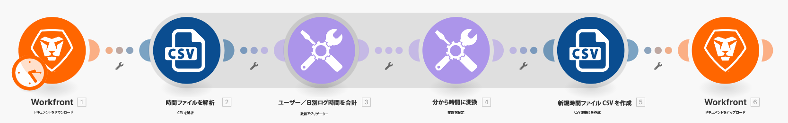
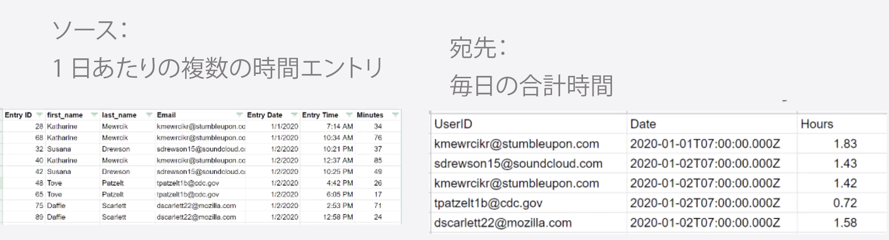
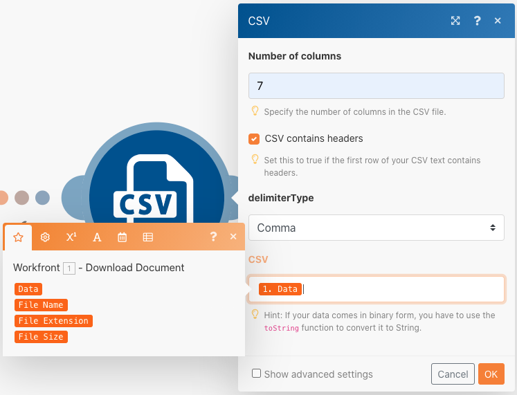
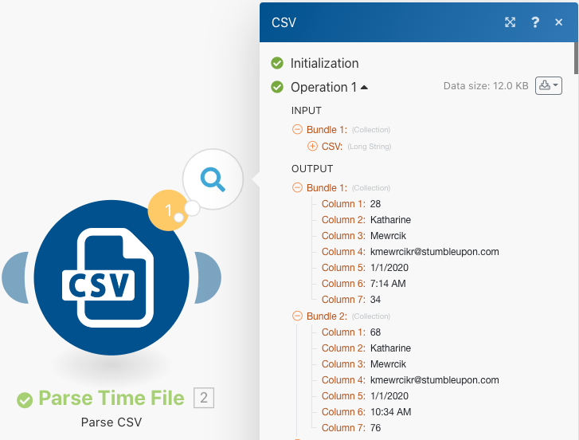
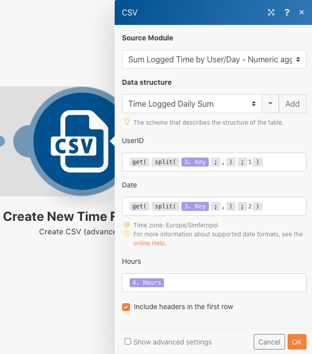

# データ構造

ソースファイルのデータを宛先ファイルに変換します。

## 演習の概要

時間エントリのリストを含む CSV ファイルを開きます。これらの時間エントリは、複数のユーザーによって特定の日にログ記録された分です。目標は、この情報を取得して、各ユーザーが毎日ログ記録した合計時間を時間単位で示す新しい CSV を作成することです。

このシナリオでは、日時、入力された時間数、入力者の電子メールアドレスなど、分の作業時間のリストを含むファイルを開きます。 100 回のエントリがあり、同じ個人が作ったものもあれば、同じ日に作られたものもあります。

各個人の 1 日の合計作業時間（時間単位）を示すファイルを作成するには、次の手順に従います。

1. トリガーモジュールで、 Workfrontフォルダーからファイルを取得します。 ファイルをダウンロードします。
1. 最初の CSV モジュールでは、時間エントリデータを解析して、時間エントリごとに 1 つのバンドルを出力します。 これは反復子です。
1. 1 つ目の「ツール」モジュールは数値集約です。 これにより、すべての分を合計し、E メールアドレス、日付順に行をグループ化します。 結果は、E メールアドレス別の 1 日の合計作業時間（分）です。
1. 2 つ目のツールモジュールは、変数設定モジュールです。 分を 60 で除算し、2 の桁数に丸めるには、このオプションを使用します。
1. 2 つ目の CSV モジュールで、出力ファイルを設定します。
1. 最終モジュールで、CSV ファイルをWorkfrontにアップロードします。

## 手順

**Workfront からファイルをダウンロードします。**

1. Workfrontの「Fusion Exercise Files」フォルダで、「_Fusion1.0JanTime.csv」を選択し、「ドキュメントの詳細」をクリックします。
1. URL アドレスから最初の ID 番号をコピーします。
1. 新しいシナリオを作成します。 「データ構造の作成と使用」という名前を付けます。
1. まず、Workfront アプリから「ドキュメントをダウンロード」モジュールを起動します。
1. Workfront 接続を設定し、Workfront URL からコピーしたドキュメント ID を含めます。

   

   **時間入力データを解析します。**

1. 「CSV を解析」を選択して、別のモジュールを追加します。
1. 7 列用に「CSV を解析」を設定します。「CSV にヘッダーを含む」ボックスをオンにします。Comma delimiterType を選択し、「 CSV 」フィールドにデータを入力します。

   

1. 「1 回実行」をクリックして出力を表示します。
1. 実行インスペクターを開いて、「CSV を解析」モジュールの入力と出力を確認します。 入力として 1 つのバンドル（CSV ファイル）、出力として複数のバンドル（CSV ファイルの各レコードに 1 つのバンドル）があります。次のようになります。

   

   **次に、データを目的の出力フォームに変換し、合計時間を分ではなく時間で表します。**

1. 数値集積ツールモジュールを追加します。
1. 「 CSV を解析」モジュールであるソースモジュールを選択します。
1. 集計関数に SUM を選択します。
1. 「値」フィールドは CSV ファイルの列 7 です。 これは、各ユーザーが記録した分です。
1. フィールドをグループごとに合計するには、「詳細設定」をクリックし、「グループ化の基準」を email （列 4）、日付（列 5）に設定します。

   + これは、E メールと日付の組み合わせごとに合計されます。 列 4 と列 5 の間には必ずコンマを入れてください。 これは、後で区切り文字として使用されます。

   **マッピングパネルは次のようになります。**

   

1. 「1 回実行」をクリックして、集計の出力を確認します。

   **出力バンドルは次のようになります。**

   

   **集計した分を時間に変換します。**

1. 「変数を設定」を選択して、別のツールモジュールを追加します。
1. 変数に「Hours」という名前を付けます。
1. 変数の値を formatNumber(result/60;2;) に設定します。;,)

   **マッピングパネルは次のようになります。**

   

   **次に、出力ファイル用に設定された値を取得します。 グループ化に使用する userID と日付値が必要です。 また、計算された時間も必要です。**

1. 集約を使用して別のモジュール — CSV モジュールを追加します。 CSV を作成（詳細）。
1. ソース・モジュールは、「ツール」 — 「数値」集約です。
1. 「データ構造」フィールドで「追加」をクリックし、データ構造に「Time Logged Daily Sum」という名前を付けます。
1. 「項目を追加」をクリックして、最初の項目を作成します。
1. 項目に「UserID」という名前を付け、タイプを「Text」に設定します。 「追加」をクリックします。
1. 「項目を追加」を再度クリックして、2 番目の項目を作成します。
1. アイテムに「Date」という名前を付け、タイプを「Date」に設定して、「Add」をクリックします。
1. 「項目の追加」をもう一度クリックします。
1. アイテムに「Hours」という名前を付け、タイプを「Number」に設定して、「Add」をクリックします。

   **データ構造は次のようになります。**

   

1. 「保存」をクリックして、 Time Logged Daily Sum データ構造を終了します。

   **次に、作成した 3 つのフィールドの値を指定します。 これら 3 つのフィールドが CSV マッピングパネルに表示されます。**

1. 「ユーザー ID 」フィールドをクリックし、「一般関数」タブからGETを選択します。 最初のパラメータで、SPLIT を「テキストとバイナリ関数」タブに配置します。 SPLIT 関数の最初のパラメータは、キーフィールドです。 コンマを区切り文字として、1 をインデックスとして追加します。 これは、GETに対して、Key 配列の最初のフィールドを取得する必要があることを示しています。
1. この式を「日付」フィールドにコピーします。 インデックスを 1 から 2 に変更し、配列の 2 番目の値のGETに変更します。
1. 「時間」フィールドで、変数の設定ツールの「時間」フィールドを追加します。

   **CSV マッピングパネルは次のようになります。**

   

   **このシナリオを今すぐ実行すると、次の出力が表示されます。**

   

   **次に、この出力を取得するモジュールを追加し、それをドキュメントとしてWorkfrontの既存のプロジェクトにアップロードします。**

1. Workfrontでプロジェクトを開き、URL からプロジェクト ID をコピーします。
1. Fusion のシナリオに戻り、別のモジュール (Workfrontアプリから Upload Document モジュール ) を追加します。
1. プロジェクト ID を「関連レコード ID 」フィールドに貼り付けます。
1. 「関連レコード・タイプ」で「プロジェクト」を選択します。
1. ソースファイルの「マップ」オプションを選択します。
1. 「ドキュメント名」には、ダウンロードしたファイル名を使用し、その前に「更新済み」を追加します。
1. ファイルコンテンツには、 CSV を作成モジュールのテキスト出力を使用します。

   **マッピングパネルは次のようになります。**

   

1. 「 OK 」をクリックし、シナリオを保存します。
1. 「 1 回実行」をクリックして、シナリオを実行します。

   **ドキュメントのアップロードモジュールの実行検査を調べて、ドキュメントがアップロードされたことを確認します。**

   
