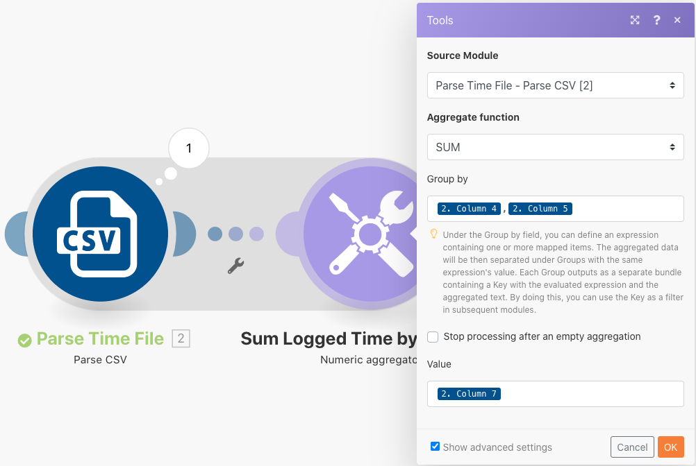

# データ構造の演習

ソースファイルのデータを宛先ファイルに変換します。

## 演習の概要

時間エントリのリストを含む CSV ファイルを開きます。これらの時間エントリは、複数のユーザーによって特定の日にログ記録された分です。目標は、この情報を取得して、各ユーザーが毎日ログ記録した合計時間を時間単位で示す新しい CSV を作成することです。

このシナリオでは、日時、入力された分単位の時間数、入力者のメールアドレスなど、分単位の作業時間エントリのリストを含んだファイルを開きます。100 回のエントリがありますが、同じユーザーが作ったものもあれば、同じ日に他のユーザーによって作られたものもあります。

各個人の 1 日の合計作業時間（時間単位）を示すファイルを作成するには、次の手順に従います。

1. トリガーモジュールで、Workfront フォルダーからファイルを取得します。ファイルをダウンロードします。
1. 最初の CSV モジュールでは、時間エントリデータを解析して、時間エントリごとに 1 つのバンドルを出力します。これはイテレータです。
1. 1 つ目のツールモジュールは数値アグリゲータです。これにより、すべての時間（分）を合計（SUM）し、メールアドレス順に続いて日付順に行をグループ化します。結果は、メールアドレス別の 1 日の合計作業時間（分）です。
1. 2 つ目のツールモジュールは、変数設定モジュールです。分を 60で割り、小数第 2 位まで四捨五入するには、これを使用します。
1. 2 つ目の CSV モジュールで、出力ファイルを設定します。
1. 最終モジュールで、CSV ファイルを Workfront にアップロードします。

## 手順

**Workfront からファイルをダウンロードします。**

1. Workfront の「Fusion Exersice Files」フォルダーで「_Fusion1.0JanTime.csv」を選択し、「ドキュメントの詳細」をクリックします。
1. URL アドレスから最初の ID 番号をコピーします。
1. 新規シナリオを作成します。「データ構造の作成と使用」という名前を付けます。
1. まず、Workfront アプリから「ドキュメントをダウンロード」モジュールを起動します。
1. Workfront 接続を設定し、Workfront URL からコピーしたドキュメント ID を含めます。

   

   **時間エントリデータを解析します。**

1. 「CSV を解析」を選択して、別のモジュールを追加します。
1. 7 列用に「CSV を解析」を設定します。「CSV にヘッダーを含む」ボックスをオンにします。コンマ区切りタイプを選択し、「CSV」フィールドにデータを入力します。

   

1. 「1 回実行」をクリックして出力を表示します。
1. 実行インスペクターを開いて、CSV 解析モジュールの入力と出力を表示します。入力として 1 つのバンドル（CSV ファイル）、出力として複数のバンドル（CSV ファイルの各レコードに 1 つのバンドル）があります。次のようになります。

   

   **次に、データを目的の出力フォームに変換し、合計時間を分ではなく時間で表します。**

1. 数値アグリゲータツールモジュールを追加します。
1. CSV 解析モジュールであるソースモジュールを選択します。
1. 集計関数については SUM を選択します。
1. 値フィールドは CSV ファイルの 7 列目です。これは、各ユーザーが記録した分です。
1. フィールドをグループごとに合計するには、「詳細設定」をクリックし、「グループ化」をメール（4 列目）、日付（5 列目）に設定します。

   + これは、メールと日付の組み合わせごとに合計されます。4 列目と 5 列目の間には必ずコンマを入れてください。これは、後で区切り文字として使用されます。

   **マッピングパネルは次のようになります。**

   

1. 「1 回実行」をクリックして、集計出力を確認します。

   **出力バンドルは次のようになります。**

   

   **集計した分を時間に変換します。**

1. 「変数を設定」を選択して、別のツールモジュールを追加します。
1. 変数に「時間数」という名前を付けます。
1. 変数の値を次のように設定します。formatNumber(result/60;2;.;,)

   **マッピングパネルは次のようになります。**

   

   **次に、出力ファイル用に設定された値を取得します。グループ化に使用する userID と日付値が必要です。また、計算された時間数も必要です。**

1. アグリゲータ「CSV を作成」（詳細）を使用して、別のモジュール（CSV モジュール）を追加します。
1. ソースモジュールは、ツールモジュール（数値アグリゲータ）です。
1. 「データ構造」フィールドで「追加」をクリックし、データ構造に「毎日の記録時間合計」という名前を付けます。
1. 「項目を追加」をクリックして、最初の項目を作成します。
1. 項目に「UserID」という名前を付け、タイプを「テキスト」に設定します。「追加」をクリックします。
1. 「項目を追加」を再度クリックして、2 番目の項目を作成します。
1. 項目に「日付」という名前を付け、タイプを「日付」に設定して、「追加」をクリックします。
1. 「項目を追加」をもう一度クリックします。
1. 項目に「時間」という名前を付け、タイプを「数値」に設定して、「追加」をクリックします。

   **データ構造は次のようになります。**

   

1. 「保存」をクリックして、毎日の記録時間合計のデータ構造を完成させます。

   **次に、作成した 3 つのフィールドの値を指定します。これら 3 つのフィールドが CSV マッピングパネルに表示されます。**

1. 「ユーザー ID 」フィールドをクリックし、「一般関数」タブから「GET」を選択します。最初のパラメーターで、「テキストとバイナリ関数」タブから「SPLIT」を指定します。SPLIT 関数の最初のパラメーターは、「キー」フィールドです。区切り文字としてコンマおよびインデックスとして 1 を追加します。これは、GET でキー配列の最初のフィールドを取得することを示しています。
1. この式を「日付」フィールドにコピーします。インデックスを 1 から 2 に変更して、配列の 2 番目の値を取得します。
1. 「時間」フィールドには、変数の設定ツールの「時間」フィールドを追加します。

   **CSV マッピングパネルは次のようになります。**

   

   **このシナリオを今すぐ実行すると、次の出力が表示されます。**

   

   **次に、この出力を取得してドキュメントとして Workfront の既存のプロジェクトにアップロードするモジュールを追加します。**

1. Workfront でプロジェクトを開き、URL からプロジェクト ID をコピーします。
1. Fusion のシナリオに戻り、Workfront アプリから別のモジュール（「ドキュメントをアップロード」モジュール）を追加します。
1. プロジェクト ID を「関連レコード ID」フィールドに貼り付けます。
1. 「関連レコードタイプ」に「プロジェクト」を選択します。
1. ソースファイルの「マップ」オプションを選択します。
1. 「ドキュメント名」には、ダウンロードしたファイル名を使用し、その前に「更新済み」を追加します。
1. 「ファイルコンテンツ」には、「CSV を作成」モジュールからのテキスト出力を使用します。

   **マッピングパネルは次のようになります。**

   

1. 「OK」をクリックして、シナリオを保存します。
1. 「1 回実行」をクリックして、シナリオを実行します。

   **「ドキュメントをアップロード」モジュールの実行インスペクターを調べて、ドキュメントがアップロードされたことを確認します。**

   
