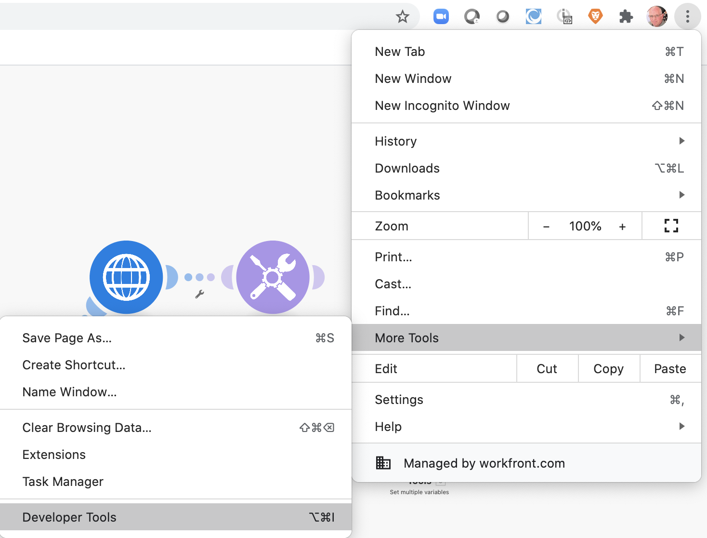

# 開発ツール

開発ツールを使用して、シナリオのトラブルシューティングと複雑な設定の簡単化の能力を高めます。

## 演習の概要

Workfront Dev ツールの様々な領域をインストールして使用し、おこなわれたリクエストと応答、および高度なシナリオ設計のテクニックをさらに掘り下げます。

>[!NOTE]
>
>Workfront Fusion Dev ツールは、Chrome ブラウザーで ( [Chrome 開発者ツール](https://developer.chrome.com/docs/devtools/).

## 従う手順

**開発ツールをインストールします。**

1. テストドライブの Fusion Exercise Files フォルダにある&quot;workfront-fusion-devtool.zip&quot;ドキュメントをダウンロードします。
1. Zip ファイルをフォルダーに展開します。
1. Chrome でタブを開き、と入力します。 **chrome://extensions**.
1. 右上のスイッチを使用して開発者モードを切り替え、左上に表示される「パック化されていない状態でロード」ボタンをクリックします。 開発ツールを含むフォルダー（ここで解凍した場所）を選択します。

   

1. パックが解除されると、開発ツールが他の拡張機能の中に表示されます。

   

   **ライブストリームを使用します。**

1. まず、「データストアを使用してデータを同期する」シナリオを開きます。
1. F12 または関数 F12 と入力して開発ツールを開きます。 または、Chrome アドレスバーの 3 ドットメニューをクリックして、開発者ツールに移動できます。

   

1. 「 Workfront Fusion 」タブをクリックし、左側のリストから「ライブストリーム」を選択します。
1. 「1 回実行」をクリックすると、発生したイベントが表示されます。
1. イベントをクリックすると、右側に「リクエストヘッダー」、「リクエスト本文」、「応答ヘッダー」および「応答本文」のタブが表示されます。

   

   **シナリオデバッガーの使用**

1. 「シナリオデバッガー」を選択し、モジュールをクリックして、そのモジュールの操作に関する情報を表示します。

   

1. 「履歴」タブに移動します。 実行の「詳細」をクリックして、特定の実行のモジュール操作の詳細を確認します。

   

   **ツールの使用**

1. シナリオデザイナーに戻り、開発ツールで「ツール」を選択します。 使用可能なツールが表示されます。

   

+ モジュールをフォーカスする — モジュール ID を使用して、モジュールをすばやく見つけて開きます。
+ マッピングによるモジュールの検索 — キーワードを使用してシナリオを検索し、モジュール内のマッピングされた値やキーを検索します。
+ アプリのメタデータの取得 — シナリオで選択したアプリのメタデータを表示します。
+ Copy Mapping — あるモジュールから別のモジュールにマッピングをコピーします。 デザイナーでモジュールのクローンを作成することもできます。
+ フィルターをコピー — フィルターをコピーします。 フィルターは、常に右側のモジュールに割り当てられます。
+ 接続のスワップ — ツールは、選択したモジュールから接続を取得し、シナリオ内の同じアプリのすべてのモジュールに同じ接続を設定します。 これは、完了したシナリオ全体で接続を変更する必要がある場合に役立ちます。 このツールを使用して、すべてのマッピングが失われて時間を節約します。
+ Swap Variable — シナリオ全体、または 1 つのモジュール内で、特定の変数についてすべての出現箇所を検索し、それらを新しい変数に置き換えます。 ワイルドカードはサポートされていません。 シナリオ全体で誤って値をマッピングした場合は、正しい値と簡単に入れ替えることができます。
+ アプリをスワップ — 特定のアプリを別のアプリにスワップします。
+ Base 64 — 入力したデータを Base 64 または Base 64 にエンコードします。 エンコードされたリクエスト内の特定のデータを検索する場合に役立ちます。
+ モジュール名をコピー — 選択したモジュール名をクリップボードにコピーします。
+ ソースを再マッピング — マッピングソースをモジュール間で変更します。 最初に、シナリオでルートのソースモジュールとして使用するモジュールを追加する必要があります。
+ OS の移行 — Googleシート（レガシー）モジュールを最新のGoogleシートバージョンにアップグレードすることを目的としておこなわれました。 シナリオルート内のモジュールのレガシーバージョンの直後に、新しいバージョンのモジュールが追加されます。
