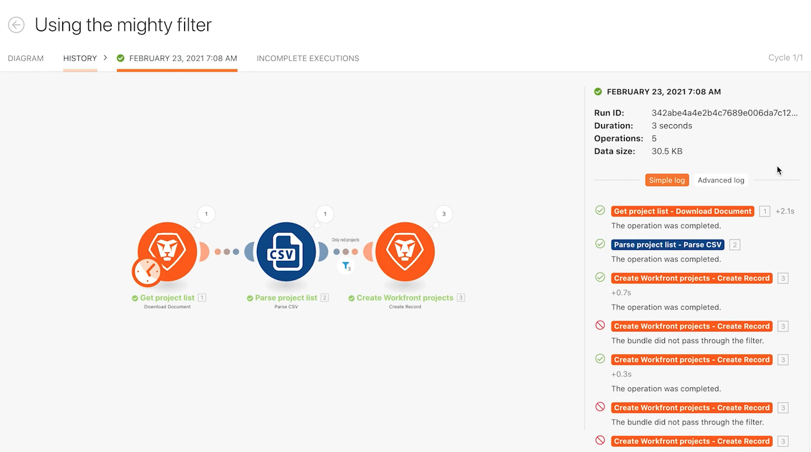
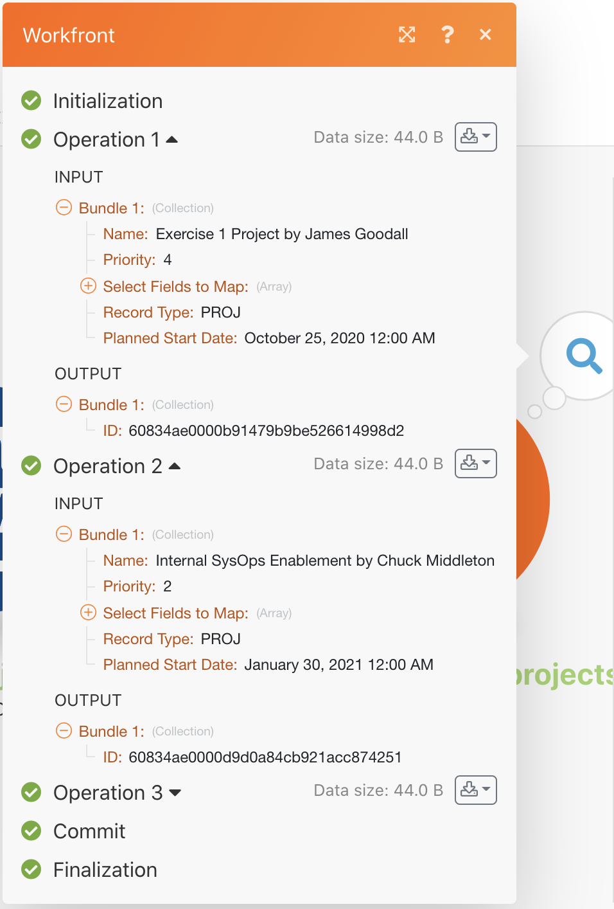

# 実行履歴の演習

過去の実行とシナリオ設定の詳細を確認および監査します。

## 演習の概要

「強力なフィルターの使用」シナリオの実行履歴を確認して、実行時に何が起こったのか、どのような構造で実行されたのかを理解します。

## 手順

1. 「強力なフィルターの使用」シナリオを開きます。
1. 概要ページで「履歴」タブ（上部のシナリオ名の下）をクリックします。

   

1. 実行を見つけ、「詳細」ボタンをクリックしてページを開くと、右側のパネルに実行された（または実行されなかった）特定の操作が表示されます。左側のパネルでは、実行時のシナリオを確認できます。

   

1. シナリオパネルでモジュールをクリックすると、モジュールインスペクターのパネルが表示され、モジュールの設定に関する情報が表示されます。モジュールまたはフィルターの横にある実行インスペクターをクリックすると、実行された情報のバンドルを確認できます。

   

   

1. 右側のパネルで「シンプル」ログをスクロールするかクリックすると、実行の「実況」が詳しく表示されます。

   + モジュールでの操作が完了した日時や、バンドルがフィルターを通過した（または通過しなかった）日時を確認できます。

   

   + ログ項目をクリックして、シナリオパネルの操作パネルを開きます。ログは、発生した時点の時系列で表示されます。

   

1. 詳細ログには、同様の情報が表示されます。ただし、1 回の実行で実行されたサイクル数の詳細を提供し、各サイクルで処理された情報のバンドルを詳しく調べることができます。

