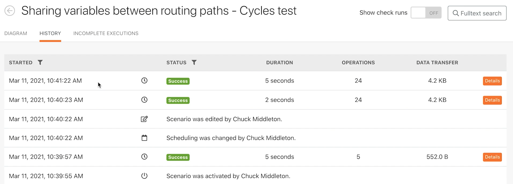

# 実行、サイクル、バンドルの調査

シナリオの実行履歴を使用して、実行、サイクル、バンドルがどのように動作するかを理解します。

## 演習の概要

実行とサイクルを使用して調べる様々なシナリオ設定を実習します。

## 従う手順

1. 「ルーティングパス間での変数の共有」というシナリオを複製します。 新しいシナリオに「ルーティングパス間での変数の共有 — サイクルテスト」という名前を付けます。
1. このテストでは不要なので、「 Send an email 」モジュールを削除します。

   **1 回の実行で 3 サイクルを処理するようにシナリオを設定します。 各サイクルで 5 つのプロジェクトを処理します。**

1. [トリガー] モジュールをクリックし、[ 最大 ] フィールドを [5] に変更します。これにより、各サイクルで処理されるプロジェクトは 5 つだけです。
1. 検索条件で、検索を 1 つのプロジェクトに制限する 2 番目のフィルターを削除します。
1. 「OK」をクリックします。

1. Fusion ツールバーで、シナリオ設定を開き、「最大サイクル数」フィールドを 1 から 3 に変更します。
1. 「OK」をクリックします。

   

   **1 分ごとに実行するようにシナリオをスケジュールします。**

1. [トリガー] モジュールの時計アイコンをクリックし、[ 分 ] フィールドを 1 分に変更します。

   

1. 次に、「1 回実行」ボタンの下の「スケジュール設定」切り替えを「オン」に切り替えます。 シナリオを保存します。

   

1. シナリオの実行履歴に移動し、次の分以内に新しい履歴レコードが表示されるのを確認します。 ページの更新が必要になる場合があります。

   

1. 実行の「詳細」ボタンをクリックします。 Workfront Fusion トレーニングの実行履歴の部分と同様、右側のパネルのシンプルログをクリックします。
1. 処理された操作の記録は、サイクルに分割されます。

   

1. ウィンドウの右上にあるドロップダウンメニューを使用すると、毎回実行するように設定した 3 つのサイクルのいずれかを選択できます。

   
