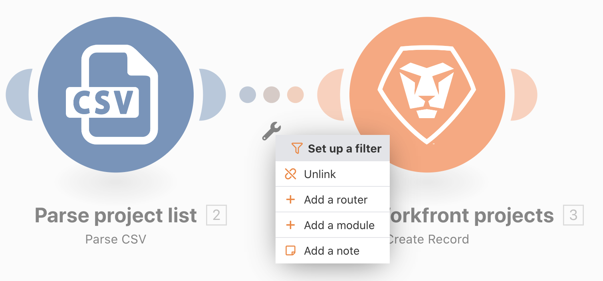

# フィルターの演習

モジュール間のフィルターを使用して、特定のタイプのバンドルのみを通過させる方法について説明します。

## 演習の概要

「基本マッピングを超える」シナリオの 2 つのモジュール間にフィルターを追加して、CSV ファイルでプロジェクトカラーが「赤」のプロジェクトのみを作成します。

## 手順

1. 「基本マッピングを超える」シナリオのクローンを作成し、「強力なフィルターの使用」という名前を付けます。

   **Workfront を作成プロジェクトモジュールの前にフィルターを追加して、赤いプロジェクトのみを作成できるようにします。**

   

1. フィルターを追加するには、モジュール間を結ぶ点線をクリックするか、レンチをクリックして「フィルターを設定」を選択します。
1. 「ラベル」フィールドを使用して、フィルターに「赤のプロジェクトのみ」という名前を付けます。
1. 「条件」フィールドで、「プロジェクトカラー」フィールド（CSV ファイルの列 3）をマッピングします。 次と等しい（大文字と小文字を区別しない）演算子を選択し、「赤」と入力します。
1. 「OK」をクリックします。

   

   **フィルターをテストし、結果を確認します。**

1. 「保存」をクリックしてシナリオを保存し、「1 回実行」をクリックします。
1. フィルターの実行インスペクターをクリックして、各バンドルがフィルターによってどのように検査され、Workfront を作成プロジェクトモジュールに移動するために成功したか失敗したかを確認します。

   

1. Workfront インスタンスで作成したプロジェクトを検索します。
